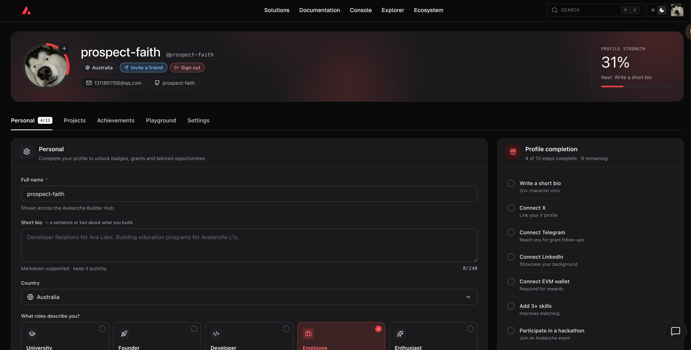

# Task 1：第一章 Avalanche 零基础入门知识

> 对应课程：第一章  
> 截止提交：9 月 6 日 24:00:00（UTC+8）

## 任务完成情况

### 1. Builder Hub 注册

完成注册后，将截图保存为 `task1-prospect-faith-builderhub.png` 并放入本目录。

### 2. 转发课程报名信息

完成转发后，将截图保存为 `task1-prospect-faith-share.png` 并放入本目录。

## 提交说明

- GitHub 用户名：`prospect-faith`
- PR 标题：`[Task1] prospect-faith`
