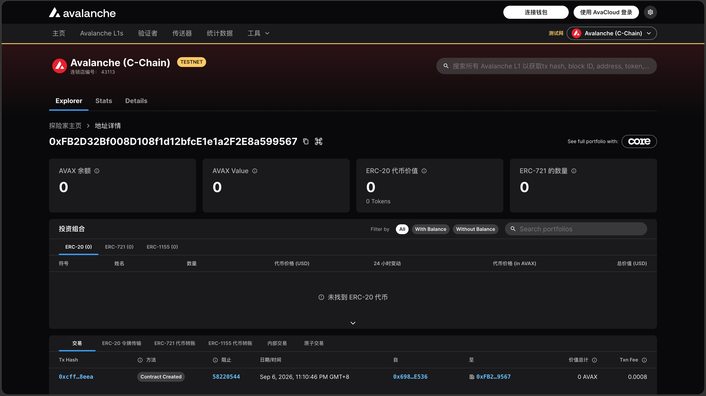

# Task 2：第二章 Vibe Coding 开发你的第一个 DApp

> 对应课程：第二章  
> 截止提交：9 月 6 日 24:00:00（UTC+8）

## 任务成果

使用 Scaffold-ETH 2 和 OpenZeppelin，在 Avalanche Fuji 测试网部署 ERC20 合约。

| 项目 | 内容 |
| --- | --- |
| 网络 | Avalanche Fuji Testnet（Chain ID `43113`） |
| 合约名 | `ProspectToken` |
| 代币名称 | Prospect Token（PST） |
| 初始供应量 | 1,000,000 PST（18 位小数） |
| 合约地址 | [`0xfb2d32bf008d108f1d12bfce1e1a2f2e8a599567`](https://explorer-test.avax.network/c-chain/address/0xfb2d32bf008d108f1d12bfce1e1a2f2e8a599567) |
| 部署交易 | [`0xcffa570fd4a52f043d1830db8cc221ca42322587eded2cf356915df907578eea`](https://explorer-test.avax.network/c-chain/tx/0xcffa570fd4a52f043d1830db8cc221ca42322587eded2cf356915df907578eea) |
| 部署者 | `0x6984D2dEaF7BA438F32a050B62D9ffBa02c4E536` |

## 合约功能

- 部署时向部署者铸造 1,000,000 PST；
- 合约所有者可以增发 PST；
- 持币者可以销毁自己的 PST。

## 部署成功截图

部署完成后，将截图保存为 `task2-prospect-faith-deployment.png` 并放入本目录。



## 链上核验

交易回执状态为成功（`0x1`），合约已部署在 Fuji C-Chain；链上部署事件向部署账户铸造了初始供应量。

```text
name: Prospect Token
symbol: PST
totalSupply: 1000000000000000000000000
owner: 0x6984D2dEaF7BA438F32a050B62D9ffBa02c4E536
```
