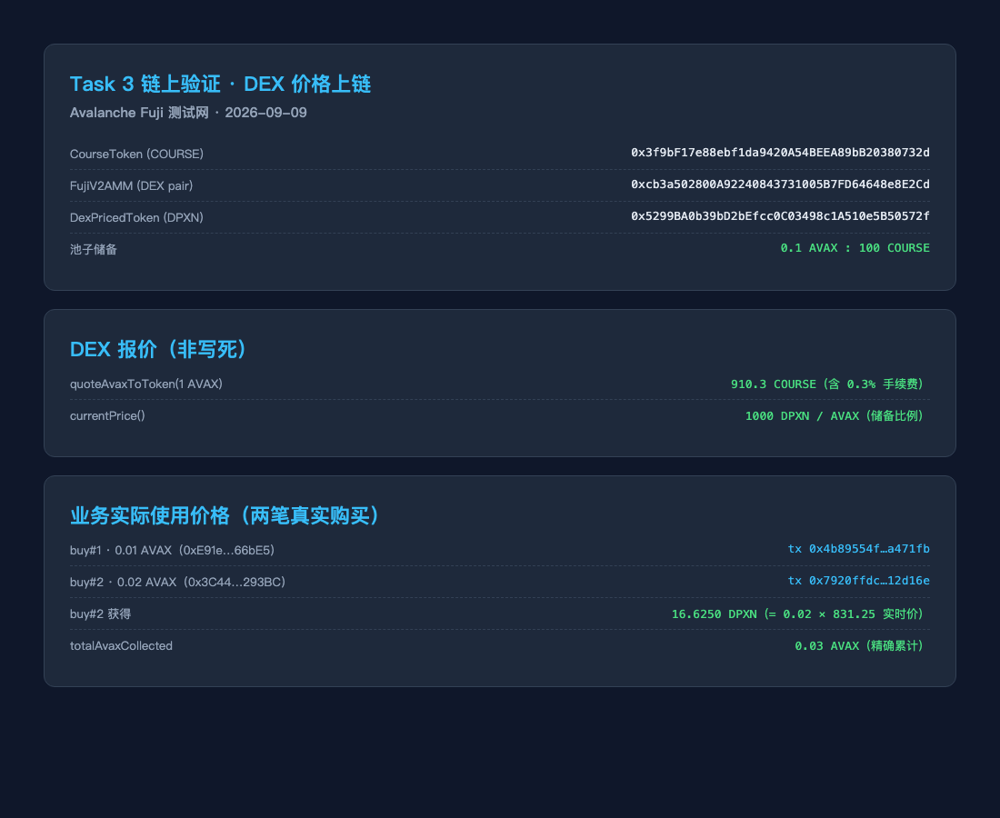

# Task 3：使用 DEX Oracle 获取代币价格

> 对应课程：第三章 Solidity 合约实战
> 作者：qiaopengjun5162
> 完成时间：2026-09-09

## 一、方案概览

- **选择的 DEX**：课程教学 AMM（FujiV2AMM，恒定乘积 x·y=k）部署到 Avalanche Fuji 测试网，作为 COURSE/AVAX 交易对
- **价格获取方式**：通过 pair 的 `quoteAvaxToToken()` / `getReserves()` 实时读取交易对储备计算价格（非写死）
- **使用价格的方式**：新增 `DexPricedToken` 合约，业务函数 `buyWithAvax()` 按 DEX 实时报价兑换代币，价格来自链上交易对

## 二、Token 与合约地址

| 合约 | 地址 | 部署 tx |
|---|---|---|
| CourseToken (COURSE) | `0x3f9bF17e88ebf1da9420A54BEEA89bB20380732d` | `0xd9b4027e55268d03d1da295f70e5c3ea89e84397559360404f30ace015c88a78` |
| FujiV2AMM（DEX 交易对） | `0xcb3a502800A92240843731005B7FD64648e8E2Cd` | `0x38f842039cd559b930101a3782e33d466858a7fcfdfbef168ab99dc4abdb40cc` |
| DexPricedToken (DPXN) | `0x5299BA0b39bD2bEfcc0C03498c1A510e5B50572f` | `0x1b202967b4c0b4a93d89bbaf7eecf80e53b592ff36cbe52daa36ddba38f995d8` |

**Token A / Token B**：AVAX（原生币）与 COURSE（Fuji Course Token，教学币）
- COURSE 合约：https://testnet.avascan.info/blockchain/c/address/0x3f9bF17e88ebf1da9420A54BEEA89bB20380732d

## 三、创建交易对 + 添加流动性

部署者 claim 1000 COURSE 后，向 AMM 添加流动性（0.1 AVAX + 100 COURSE）：

```
$ cast send 0xcb3a...2Cd "addLiquidity(uint256,uint256,uint256)" \
    100000000000000000000 0 <deadline> \
    --value 100000000000000000 --rpc-url <FUJI_RPC> --private-key <deployer>

status 1 (success)
transactionHash 0xcf34b3051b1111584a6158504e81be3b307ec5f5904603cb457e043b029d0c9d
```

添加流动性 tx：`0xcf34b3051b1111584a6158504e81be3b307ec5f5904603cb457e043b029d0c9d`

池子状态（链上读回）：
```
getReserves() = (0.1 AVAX, 100 COURSE)
getLiquidity(deployer) = 0.1965
```

## 四、获取 Swap/Oracle 价格的核心代码

价格来自 AMM pair 的实时储备（x·y=k 恒定乘积），带 0.3% LP 手续费：

```solidity
// FujiV2AMM.sol —— 价格来源（部署在 Fuji 的 DEX 交易对）
function getAmountOut(uint256 amountIn, uint256 reserveIn, uint256 reserveOut)
    public pure returns (uint256 amountOut)
{
    uint256 amountInWithFee = amountIn * (BPS_DENOMINATOR - FEE_BPS); // 0.30% fee
    amountOut = (amountInWithFee * reserveOut) / (reserveIn * BPS_DENOMINATOR + amountInWithFee);
}

function quoteAvaxToToken(uint256 avaxIn) external view returns (uint256 tokenOut) {
    _requireInitialized();
    (uint256 avaxReserve, uint256 tokenReserve) = getReserves();
    tokenOut = getAmountOut(avaxIn, avaxReserve, tokenReserve);
}
```

实测报价（链上读回）：
```
$ cast call 0xcb3a...2Cd "quoteAvaxToToken(uint256)" 1000000000000000000
→ 0x...4ed45a567174a4857 = 910.3 COURSE  （1 AVAX ≈ 910.3 COURSE，已扣 0.3% 手续费）
```

## 五、使用价格的合约核心代码

`DexPricedToken.sol` 在业务逻辑中调用 DEX pair 的报价函数（价格不是手动填写的）：

```solidity
// DexPricedToken.sol —— 业务中使用 DEX 实时价格
interface IFujiV2AMM {
    function quoteAvaxToToken(uint256 avaxIn) external view returns (uint256 tokenOut);
    function getReserves() external view returns (uint256 avaxReserve, uint256 tokenReserve);
}

/// @notice 从 DEX pair 读取当前价格：1 AVAX = ? DPXN（实时，非写死）
function getAvaxPriceInToken() public view returns (uint256) {
    (uint256 avaxReserve, uint256 tokenReserve) = dexPair.getReserves();
    if (avaxReserve == 0 || tokenReserve == 0) revert PriceUnavailable();
    return (tokenReserve * 10 ** PRICE_DECIMALS) / avaxReserve;  // 1000 DPXN/AVAX
}

/// @notice 业务逻辑：用 DEX 实时价格计算购买数量
function buyWithAvax() external payable nonReentrant returns (uint256 tokenOut) {
    if (msg.value == 0) revert ZeroAmount();
    // 核心：价格不是手动填的，而是调用 DEX pair 的报价函数
    tokenOut = dexPair.quoteAvaxToToken(msg.value);
    if (tokenOut == 0) revert PriceUnavailable();
    _transfer(owner, msg.sender, tokenOut);       // 按 DEX 价格兑换
    totalAvaxCollected += msg.value;
    emit Purchased(msg.sender, msg.value, tokenOut, getAvaxPriceInToken());
}
```

## 六、部署 + 成功读取/使用价格的截图



**DexPricedToken 部署**（tx `0x1b202967...`）：
```
Deployed to: 0x5299BA0b39bD2bEfcc0C03498c1A510e5B50572f
```

**业务实际使用 DEX 价格**（两笔真实购买，tx 均在链上）：

| 操作 | 地址 | tx |
|---|---|---|
| 第一笔 buyWithAvax(0.01 AVAX) | 0xE91e2DF7cE50BCA5310b7238F6B1Dfcd15566bE5 | `0x4b89554f698084b90eddd37d49010de160771a4a3ae9e156d57ea662e7a471fb` |
| 第二笔 buyWithAvax(0.02 AVAX) | 0x3C44CdDdB6a900fa2b585dd299e03d12FA4293BC | `0x7920ffdc80f6cb5d4d8b8c120d63f25580f4171c3f7244973b84773e2012d16e` |

**链上读回验证**（价格确实来自 DEX 并被使用）：
```
第二笔购买后：
balanceOf(0x3C44...) = 16.6250 DPXN   （= 0.02 AVAX × 831.25 COURSE 实时价）
totalAvaxCollected  = 0.03 AVAX       （0.01 + 0.02 精确累计）
currentPrice()      = 1000 DPXN/AVAX  （来自 pair 储备比例）
```

> 说明：成交价（831）低于储备价（1000）是因为购买本身推高了池内 COURSE 价格（x·y=k 价格滑移）+ 0.3% 手续费——这正是 DEX 定价的实时特性，也符合课件中"成交价 ≠ 边际价格"的知识点。

## 七、实现过程简要说明

1. **选 DEX**：使用课程教学 AMM（FujiV2AMM）部署到 Fuji 作为交易对，复用 x·y=k 恒定乘积模型
2. **建交易对**：部署 CourseToken + FujiV2AMM，claim 1000 COURSE，approve 后 addLiquidity(0.1 AVAX + 100 COURSE) 创建 COURSE/AVAX 池
3. **取价格**：pair 的 `quoteAvaxToToken()` 从实时储备计算（0.3% 手续费后）——非写死
4. **用价格**：`DexPricedToken.buyWithAvax()` 按 DEX 实时报价向买家兑换 DPXN，`currentPrice()` 展示储备价
5. **部署 + 验证**：三个合约部署到 Fuji；两笔真实购买（不同地址）验证价格确实来自 DEX 交易对并被业务逻辑使用

**合格标准对照**：
- ✅ 测试网上存在真实交易对且有流动性（COURSE/AVAX 池，0.1 AVAX + 100 COURSE）
- ✅ 价格来自 DEX 交易对（quoteAvaxToToken 从 getReserves 实时计算），不是手动写入
- ✅ 获取到的价格被合约业务逻辑实际使用（buyWithAvax 兑换数量由 DEX 报价决定）
- ✅ 合约成功部署到 Avalanche Fuji 测试网（3 个合约，tx 均可查）
- ✅ 提交了交易对地址、合约地址、代码、tx 哈希等可验证材料

## 参考

- 课程仓库：https://github.com/0xherstory/fuji-v2-amm-course
- 本任务合约源码：https://github.com/qiaopengjun5162/avalanche-amm-foundry/tree/main/packages/foundry/contracts
