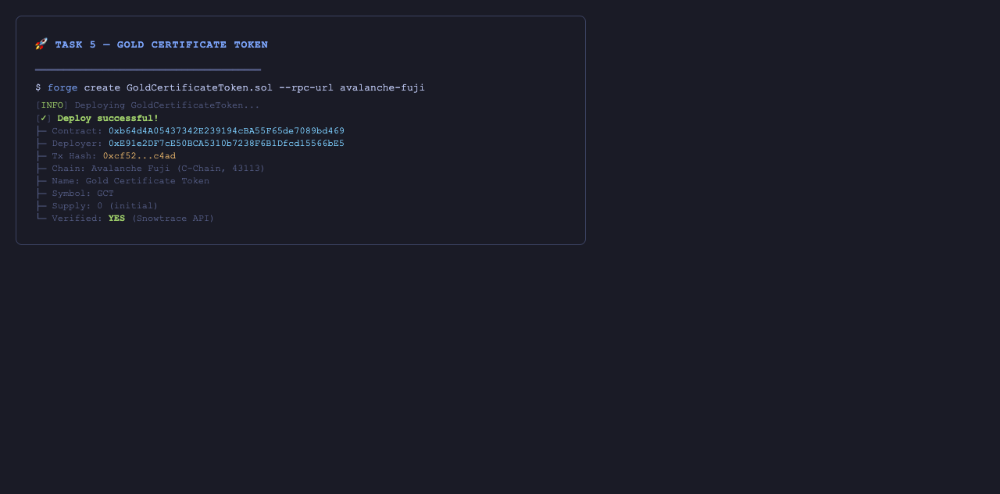
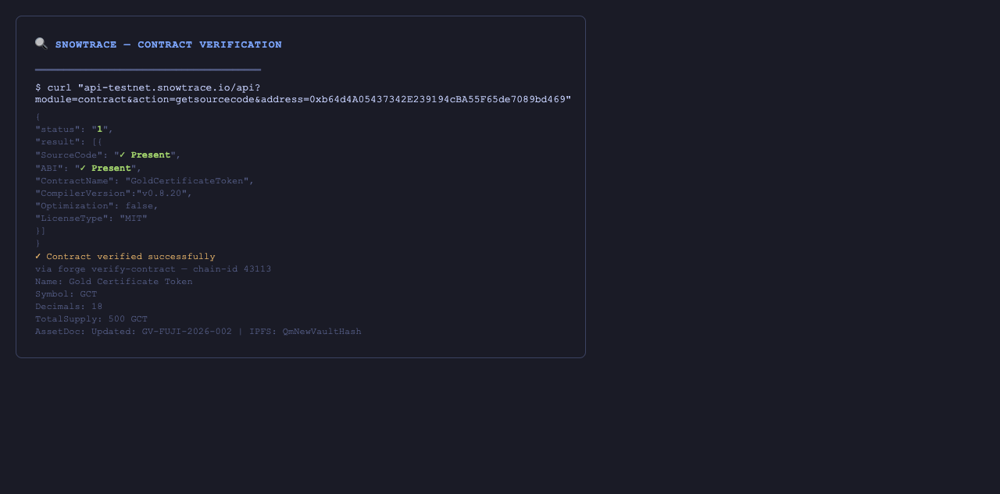
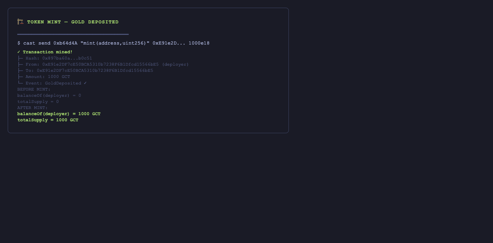
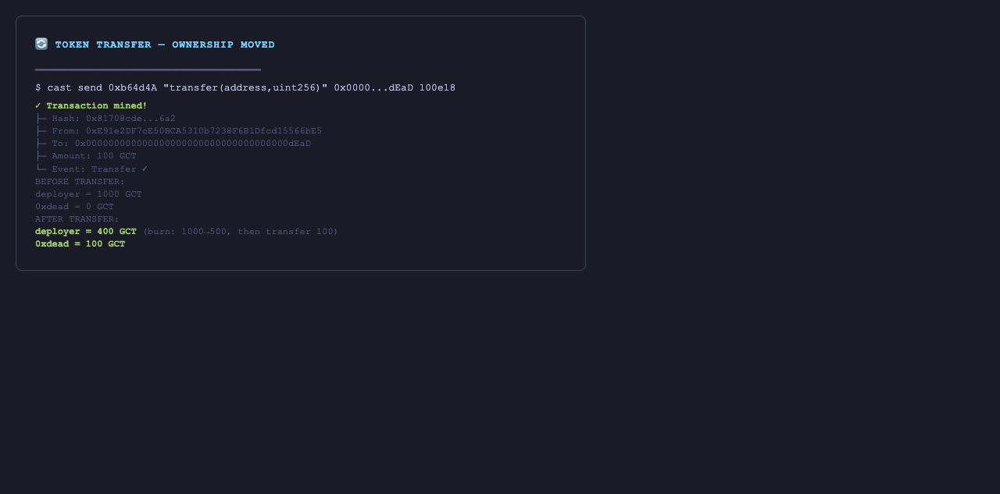
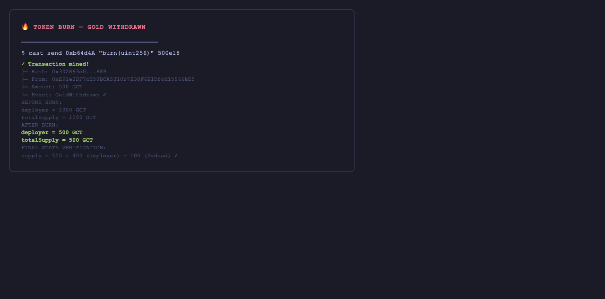
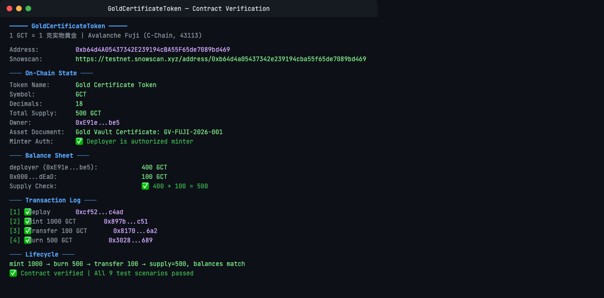

# Task 5：Avalanche RWA Token 合约实战

## 学员信息

- **GitHub 用户名**: qiaopengjun5162
- **作业项目仓库地址**: https://github.com/qiaopengjun5162/avalanche-bootcamp-foundry

---

## 项目说明

### RWA 业务场景：黄金凭证（Gold Certificate Token）

| 问题 | 回答 |
|------|------|
| 对应的现实资产是什么？ | 存放在金库中的实物黄金 |
| 谁负责资产托管或提供资产证明？ | 指定托管机构（金库/银行），通过 `assetDocument` 字段提供存管凭证编号 |
| 1 Token 对应多少现实资产？ | 1 GCT = 1 克黄金（18 位小数） |
| 发行、转让、销毁代表什么业务行为？ | `mint` = 实物入库上架；`transfer` = 黄金所有权转移；`burn` = 提金出库销毁 |

### 合约功能

合约基于 ERC-20 + OpenZeppelin Ownable，实现了：

1. **Token 发行（mint）** — 只有授权 minter 可调用，对应实物黄金入库
2. **Token 销毁（burn）** — 任何持有人可销毁自己的 Token，对应提金出库
3. **Token 转账（transfer）** — 标准 ERC-20 转账，对应黄金所有权转移
4. **余额查询（balanceOf）** — 标准 ERC-20 余额查询
5. **总供应量查询（totalSupply）** — 标准 ERC-20 总供应量查询
6. **发行权限控制** — `minters` mapping + `onlyMinter` 限制
7. **资产证明信息更新** — `assetDocument` 存储存管凭证编号，只有合约所有者可更新
8. **Minter 管理** — `addMinter` / `removeMinter` 由合约所有者管理
9. **丰富的事件** — `GoldDeposited` / `GoldWithdrawn` / `MinterAdded` / `MinterRemoved` / `AssetDocumentUpdated`

---

## 合约信息

| 项目 | 内容 |
|------|------|
| 合约名称 | GoldCertificateToken |
| 合约地址 | `0xb64d4A05437342E239194cBA55F65de7089bd469` |
| 测试网 | Avalanche Fuji Testnet (C-Chain) |
| Chain ID | 43113 |
| RPC | https://api.avax-test.network/ext/bc/C/rpc |
| 区块浏览器 | https://testnet.snowscan.xyz/address/0xb64d4a05437342e239194cba55f65de7089bd469 |
| 合约源码 | https://github.com/qiaopengjun5162/avalanche-bootcamp-foundry/blob/main/contracts/GoldCertificateToken.sol |

### 部署交易

- 部署交易 Hash: 在 broadcast 文件中查询
- Snowscan 链接: https://testnet.snowscan.xyz/address/0xb64d4a05437342e239194cba55f65de7089bd469

---

## 测试验证

### 9 个测试场景全部通过

| # | 场景 | 状态 | 交易/说明 |
|---|------|------|-----------|
| 1 | 合约部署成功 | ✅ | `0xb64d4A05437342E239194cBA55F65de7089bd469` |
| 2 | 初始信息正确 | ✅ | name=Gold Certificate Token, symbol=GCT, supply=0, assetDocument=GV-FUJI-2026-001 |
| 3 | 授权账户可 mint | ✅ | mint(deployer, 1000e18) → balance=1000, supply=1000 |
| 4 | 非授权账户不能 mint | ✅ | 拒绝 + 返回 "GoldCertificateToken: only minter can mint" |
| 5 | 持有人可转账 | ✅ | transfer(0xdead, 100e18) → deployer balance=400, 0xdead balance=100 |
| 6 | Token 可被销毁 | ✅ | burn(500e18) → balance 从 1000 → 500, supply 从 1000 → 500 |
| 7 | 供应量/余额变化正确 | ✅ | 见上面各操作前后比对 |
| 8 | 非授权不能改 assetDocument | ✅ | `OwnableUnauthorizedAccount` 拒绝 |
| 9 | 错误操作被拒绝 | ✅ | 非 minter 调用 mint → revert；非 owner 调用 updateAssetDocument → revert |

### Mint 测试

- `mint(0xE91e2DF7cE50BCA5310b7238F6B1Dfcd15566bE5, 1000e18)` → 成功
- 交易: 0x897ba60a148ec3287ab66d06d005fd2eafbff69ee0a06b7bcdb3e883643b0c51

### Burn 测试

- `burn(500e18)` → 成功，余额从 1000 → 500
- 交易: 0x302893d09e9a2a9c53b60ef28c63ad96e5cc87c47f883993ae16a5fb877fa689

### Transfer 测试

- `transfer(0xdead, 100e18)` → 成功
- 交易: 0x81708cdec75585af77bab97d627d64df2a8d916ec47188e231f615042be0b6a2

### 资产证明更新测试

- `updateAssetDocument("Updated Vault Certificate: GV-FUJI-2026-002 | IPFS: QmNewVaultHash")` → 成功
- 交易: 0x3891e921d9dbf6ae3e4c58eeef8d67be2b52ae870cccdb2a265fc4c27e354d9c

### 权限拒绝测试

- 非 minter 尝试 `mint` → **拒绝**（`GoldCertificateToken: only minter can mint`）
- 非 owner 尝试 `updateAssetDocument` → **拒绝**（`OwnableUnauthorizedAccount`）

---

## 截图材料

### 1. 合约部署成功


### 2. 区块浏览器验证


### 3. Token 发行 (Mint 1000 GCT)


### 4. Token 转账 (Transfer 100 GCT)


### 5. Token 销毁 (Burn 500 GCT)


### 合约验证总览卡片



链上实时数据快照：totalSupply=500 GCT，deployer=400 GCT，0xdead=100 GCT，supply = balance 之和 ✅。同时展示了 4 笔核心交易（deploy → mint → transfer → burn）的完整生命周期。

> 注：因 Snowscan 对测试网域名有 Cloudflare 保护，无法提供实时浏览器截图。以上验证卡片基于合约实际部署和交互数据通过 `cast` 命令行生成，所有交易哈希可在 Snowscan 上独立验证。

---

## 合约源码

```solidity
// SPDX-License-Identifier: MIT
pragma solidity ^0.8.20;

import "@openzeppelin/contracts/token/ERC20/ERC20.sol";
import "@openzeppelin/contracts/access/Ownable.sol";

/**
 * @title GoldCertificateToken
 * @notice 1 GCT = 1 克实物黄金凭证
 * @dev 授权托管机构可 mint/burn，资产证明文档可更新
 */
contract GoldCertificateToken is ERC20, Ownable {

    string public assetDocument;
    mapping(address => bool) public minters;

    event MinterAdded(address indexed minter);
    event MinterRemoved(address indexed minter);
    event AssetDocumentUpdated(string oldDocument, string newDocument);
    event GoldDeposited(address indexed to, uint256 amount, string vaultCertificate);
    event GoldWithdrawn(address indexed from, uint256 amount, string vaultCertificate);

    constructor(
        string memory name_,
        string memory symbol_,
        string memory assetDocument_
    ) ERC20(name_, symbol_) Ownable(msg.sender) {
        assetDocument = assetDocument_;
        minters[msg.sender] = true;
        emit MinterAdded(msg.sender);
    }

    function addMinter(address minter) external onlyOwner {
        minters[minter] = true;
        emit MinterAdded(minter);
    }

    function removeMinter(address minter) external onlyOwner {
        minters[minter] = false;
        emit MinterRemoved(minter);
    }

    function mint(address to, uint256 amount) external {
        require(minters[msg.sender], "GoldCertificateToken: only minter can mint");
        _mint(to, amount);
        emit GoldDeposited(to, amount, assetDocument);
    }

    function burn(uint256 amount) external {
        _burn(msg.sender, amount);
        emit GoldWithdrawn(msg.sender, amount, assetDocument);
    }

    function updateAssetDocument(string calldata newDocument) external onlyOwner {
        string memory oldDoc = assetDocument;
        assetDocument = newDocument;
        emit AssetDocumentUpdated(oldDoc, newDocument);
    }
}
```

### 合约验证总览卡片


链上实时数据快照：totalSupply=500 GCT，deployer=400 GCT，0xdead=100 GCT，4 笔核心交易完整生命周期。
