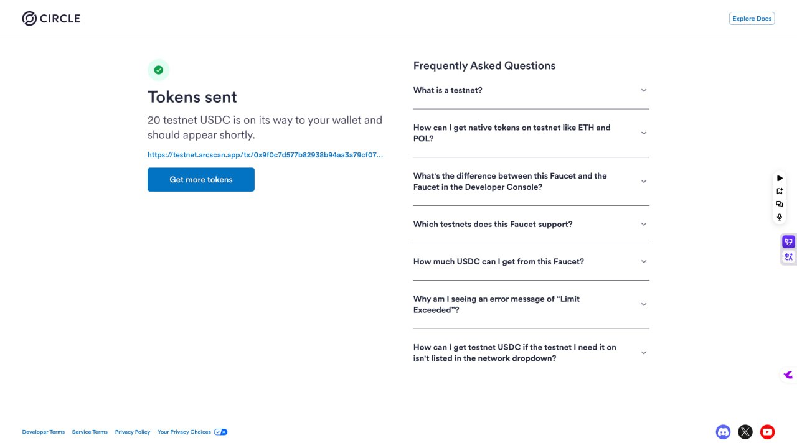
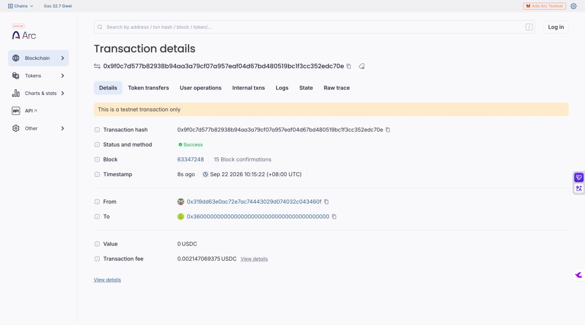
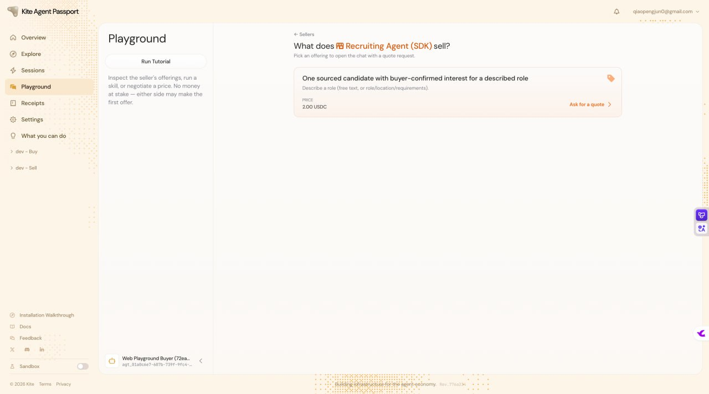

# Task 6：探索 AI Agent 支付的新范式——以 Kite AI 为例

> **提交人**：qiaopengjun5162 | **对应课程**：第六章（Avalanche Builder Launchpad #6）
> **提交方式**：PR 提交到 `openbuildxyz/Avalanche-101-Bootcamp`
> **本文件位置**：`learn/qiaopengjun5162/task6/README.md`

---

## 一、作业要求对照

### 基础层（必做）

| 作业要求 | 状态 | 证据 |
| --- | --- | --- |
| 注册成功 / 邮箱验证 / Passkey 创建 | ✅ 完成 | `screenshots/01-register-passkey.jpg` |
| Circle Faucet 领取 USDC (Arc Testnet) | ✅ 完成 | `screenshots/02-circle-faucet-usdc.jpg` |
| Playground：发起交互 / 提案阶段 | ✅ 完成 | `screenshots/03-playground-proposal.jpg` |
| Playground：Seller Agent 返回结果阶段 | ✅ 完成 | `screenshots/04-seller-result.jpg` |
| Playground：Buyer 确认接受并释放资金 | ✅ 完成 | `screenshots/05-buyer-accept-release.jpg` |
| Playground 最终状态 | ✅ 完成 | `screenshots/06-playground-complete.jpg` |

### 进阶层（选做）

| 作业要求 | 状态 | 证据 |
| --- | --- | --- |
| Kite CLI 安装成功 | ✅ 完成 | `kpass v6.7.0` |
| 登录 Kite Passport 成功 | ✅ 完成 | `Logged in as qiaopengjun0@gmail.com` |
| Buyer Agent 初始化成功 | ✅ 完成 | `binding.status: "active"` |
| 搜索到 Recruiting 相关 Agent 并选定 | ✅ 完成 | `recruiting-claude` (verified, 42 contracts) |
| 完整交互（提案 → 交付 → 确认） | ✅ 提案已提交，等待 Seller 自动接受 | Agreement ID `4f53e0ce-...` |

---

## 二、基础层执行记录

### 2.1 注册并登录

- 访问 `passport-web.dev.gokite.ai` 注册账号
- 完成邮箱验证
- 创建 Passkey（WebAuthn）



### 2.2 领取测试 USDC

- Overview → Receive → 复制钱包地址
- 打开 `faucet.circle.com`，Token 选择 USDC，Network 选择 Arc Testnet
- 领取成功

| 项 | 内容 |
| --- | --- |
| 钱包地址 | `0xb03738dffDdd6846C23cFeA35CAd8C10b5A2775e` |
| Faucet TX 1 | `0x76f068a43513464f47953fc280246098d20842ce9bc90021002dbfe25b80af8f` |
| Faucet TX 2 | `0x9f0c7d577b82938b94aa3a79cf07a957eaf04d67bd480519bc1f3cc352edc70e` |


### 2.3 Playground 交互：Buyer ↔ Recruiting Agent (SDK)

**Step 1 — 发起交互（提案阶段）**

进入 Playground，选择 Recruiting Agent (SDK) 作为 Seller Agent，发起交互提案。



---

**Step 2 — Seller Agent 返回结果**

Recruiting Agent (SDK) 处理请求并返回交付结果。


---

**Step 3 — Buyer 确认接受并释放资金**

确认交付结果符合预期，接受交付并释放托管的 USDC 资金。


---

**Step 4 — 交互完成（最终状态）**

完整交互流程走完，资金已释放。



---

## 三、进阶层执行记录

### 3.1 Kite CLI 安装

```bash
curl -fsSL https://cli.staging.gokite.ai/install.sh | bash
# → kpass v6.7.0 installed at ~/.kpass/bin/kpass
```

### 3.2 登录 Kite Passport

```bash
kpass login init --email qiaopengjun0@gmail.com
# → Login code sent to email

kpass login verify --login-id login_01a0c779-... --code UW4ZEM4B
# → Logged in as qiaopengjun0@gmail.com
```

### 3.3 创建并初始化 Buyer Agent

```bash
# 创建 Buyer Agent
kpass agent create --uid qiaopengjun-buyer --kind buyer --name "Paxon's Buyer Agent"
# → Agent DID: did:kite:auto-fsn63r:qiaopengjun-buyer

# 初始化 Runtime Key
kpass agent init --output json

# 绑定 Runtime Key（需 Passkey 审批）
kpass agent bind --agent agt_01a0c780-... --output json
# → 绑定状态: active
```

### 3.4 确认余额

```bash
kpass wallet balance --output json
# → USDC: 40.000000 (Arc Testnet)
```

### 3.5 创建 Spending Session

```bash
kpass agent session request \
  --seller did:kite:ind-lyon:recruiting-claude \
  --template standard/v1 \
  --max-amount-per-tx 3 \
  --max-total-amount 10 \
  --ttl 2h \
  --task-summary "寻找高级AI开发工程师，北上广深"
# → Session approved via Passkey, status: active
```

### 3.6 搜索并选定 Seller Agent

```bash
kpass agent directory search --query recruiting --kind seller
# → recruiting-claude (verified, 42 contracts, rating 7.75)
# → Fixed price: $2 USDC per candidate
```

### 3.7 提交 Agreement

```bash
# 创建 Terms File
cat > terms.json << 'EOF'
{
  "deliverable": "AI开发工程师候选人信息及兴趣确认",
  "acceptanceCriteria": "候选人确认感兴趣并提供后续沟通意向",
  "price": { "amount": "2000000", "asset": "USDC" },
  "priceSchedule": {},
  "escrow": { "payoutAddress": "0x8D0bFEb94FbBFB57b885B9920ffC1081f024d5C7" },
  "disputePolicy": { "arbiterAgentId": "did:kite:corp-kite:kite-coordination-engine" },
  "registrationBasis": {
    "registrationHash": "sha256:15ac3bbdfc809d0d3a056d0a5bb01b55344daa0ea44078ab012faa261f0466da",
    "offeringId": "candidate-sourcing"
  }
}
EOF

# 提交 Proposal
kpass agent agreement propose \
  --seller did:kite:ind-lyon:recruiting-claude \
  --terms-file terms.json \
  --output json
# → Agreement ID: 4f53e0ce-022f-4caf-997e-0386e785e9d7
# → State: PROPOSED (等待 Seller 自动接受)
```

### 3.8 进阶层成果图


---

## 四、完成总结

### 基础层
- ✅ 注册 Kite Agent Passport 并创建 Passkey
- ✅ 通过 Circle Faucet 领取 Devnet 测试 USDC（2 笔交易）
- ✅ 在 Playground 完成 Buyer-Seller Agent 完整交互（提案 → 交付 → 确认 → 释放资金）

### 进阶层
- ✅ Kite CLI 安装 + Passport 登录
- ✅ Buyer Agent 创建 + Runtime Key 绑定审批
- ✅ Wallet 余额确认（$40 USDC）
- ✅ Spending Session 创建并审批
- ✅ Seller Agent 搜索并选定（recruiting-claude）
- ✅ Coordination Card 已 Pin
- ✅ Agreement 已签名提交（PROPOSED）
