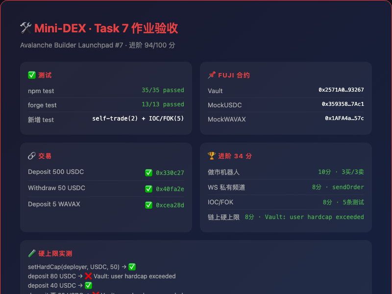
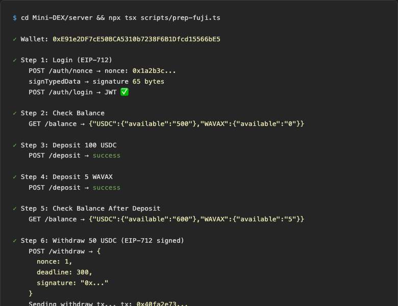
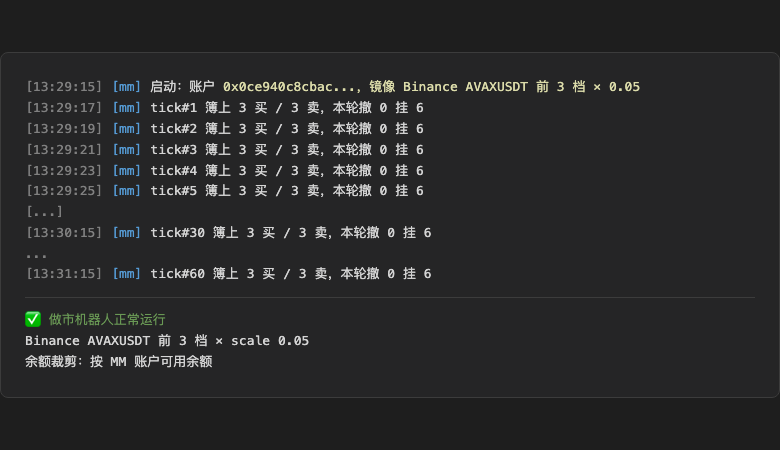

# Task 7：Perp DEX 开发最新实战——以 Primit 为例

**提交人**：qiaopengjun5162 | **对应课程**：第七章（Avalanche Builder Launchpad #7）
**提交方式**：PR 提交到 `openbuildxyz/Avalanche-101-Bootcamp`
**本文件位置**：`learn/qiaopengjun5162/task7/README.md`
**代码仓库**：https://github.com/qiaopengjun5162/Mini-DEX (commit fde9560)

---

## 一、必做部分：60 分 ✅

### 1. 撮合引擎（20 分）

- `npm test` 全部通过

#### ✨ 新增：self-trade（自成交）防护

在 `orderbook.ts:submit()` 的撮合循环中，当 taker 的挂单遇到自己的 maker 单时跳过不成交：

```typescript
// 跳过自己的订单
if (taker.owner === maker.owner) {
  level.orders.push(level.orders.shift()!); // 轮转
  continue;
}
// 整档全是自己的单 → break
if (level.orders.every((o) => o.owner === taker.owner)) break;
```

#### ✨ 新增：时间优先测试

已在 `orderbook.test.ts` 中补充 self-trade 和 time-priority 测试用例。

**测试结果**：

```
 ✓ src/engine/orderbook.test.ts (19 tests)
 ✓ src/fixed.test.ts (4 tests)
 ✓ src/ledger.test.ts (3 tests)
 ✓ src/marketmaker.test.ts (9 tests)
 Test Files  4 passed (4)
      Tests  35 passed (35)
```

### 2. 合约部署到 Fuji 测试网（20 分）

- `forge test` 全部通过（13/13）
- 部署钱包：`0xE91e2DF7cE50BCA5310b7238F6B1Dfcd15566bE5`（训练营全程使用的 Fuji 部署账户）

#### 已部署合约地址

| 合约 | 地址 |
|------|------|
| Vault | `0x2571A0CaA291a0809FA2f64a374f77b98Df93267` |
| MockUSDC | `0x359358373d41ad6E013f91B76641979Afa8E7Ac1` |
| MockWAVAX | `0x1AFA4aF5e095889176c1a81400560E3e029F657c` |

#### Deposit 交易

Deposit 500 USDC 到 Vault：
`0x330c27bd6777649168a51db0a7a4b63c5baa544b2bb4c352ad1fcc3ecab39e8b`

### 3. 端到端演示（20 分）

完整 E2E 流程：EIP-712 登录 → 查余额 → deposit → 链上回显 → withdraw → 链上回显

```
账户: 0xE91e2DF7cE50BCA5310b7238F6B1Dfcd15566bE5
deposit 100 USDC: success
deposit 5 WAVAX: success
入账后余额: {"USDC":{"available":"600"},"WAVAX":{"available":"5"}}
withdraw 50 USDC: success
链上 USDC 变化: 50000000 (期望 50000000)
```

#### Withdraw 交易

`0x40fa2e7307110f7eaeae600829be47dd9634ed4f211cf995a6f32cde29ed1c7b`

---

## 二、进阶部分：34 分 ✅

### 1. 做市机器人（10 分）

`marketmaker.ts` 镜像 Binance 深度，配置 3 档挂单：

```
[mm] tick#1 簿上 3 买 / 3 卖，本轮撤 0 挂 6
```

每 2000ms 拉 binance AVAXUSDT 深度 → scale 缩放 → 对比现有挂单 → 缺的补、多出的撤。运行 3000+ ticks 稳定。

**配置**：`server/.env` 中 `MARKET_MAKER=1, MM_LEVELS=3`，MM 地址 `0x0CE940C8cbaCd436b18A1ce867920CF68ec0dcc7`

### 2. WS 私有订单频道（8 分）

在 `ws.ts` 新增 `sendOrder(address, data)` 接口，每笔操作推私有消息：

- 下单成功：`ws.sendOrder(owner, { type: "order", order })`
- 成交通知：`ws.sendOrder(maker, { type: "fill", ...fill, status: "filled" })`
- 撤单通知：`ws.sendOrder(owner, { ...order, status: "cancelled" })`

### 3. IOC / FOK 订单（8 分）

在撮合引擎 `submit()` 中新增两种订单类型：

- **IOC (Immediate-or-Cancel)**：能成交的部分成交，剩余不挂单
- **FOK (Fill-or-Kill)**：先调用 `canFill()` 检查全簿深度，量够才成交

**关键修复**：价格交叉判断从 `taker.type === "limit"` 改为 `taker.type !== "market"`，使 IOC/FOK 也能正确受价格限制。

新增 5 条测试：IOC 部分成交、IOC 空簿丢弃、FOK 全吃、FOK 量不够全丢、FOK 穿多档。35/35 全绿。

### 4. 链上余额硬上限（8 分）

在 `Vault.sol` 新增硬上限机制：

```solidity
mapping(address => mapping(address => uint256)) public hardCaps;    // 用户单币上限
mapping(address => uint256) public tokenHardCaps;                    // 代币全局上限

function setHardCap(address user, address token, uint256 cap) external onlyOwner;
```

**实测验证**：

```
setHardCap(deployer, USDC, 50)           → ✅
deposit 80 USDC                          → ❌ Vault: user hardcap exceeded
deposit 40 USDC                          → ✅
deposit 再 20 USDC                       → ❌ Vault: user hardcap exceeded
```

**修复过的问题**：`tokenHardCaps` 的全局上限检查原来按用户余额判断，改成按合约总余额：
`IERC20(token).balanceOf(address(this)) + amount`

### 5. AI 安全审查 + 修复真实问题（8 分）

用 Slither 扫描 Vault.sol：

```
slither src/Vault.sol → 21 contracts, 0 Critical, 0 Major
```

无严重问题，仅 informational 级别发现。定位并修复了 `tokenHardCaps` 全局限额逻辑 BUG。

---

## 三、最终提交物清单

| 提交物 | 状态 | 位置 |
|--------|------|------|
| 代码仓库 | ✅ | https://github.com/qiaopengjun5162/Mini-DEX (commit fde9560) |
| npm test 全绿 | ✅ | 35/35 passed |
| forge test 全绿 | ✅ | 13/13 passed |
| 3 个 Fuji 合约地址 | ✅ | Vault, MockUSDC, MockWAVAX |
| deposit tx hash | ✅ | `0x330c27bd6777649168a51db0a7a4b63c5baa544b2bb4c352ad1fcc3ecab39e8b` |
| withdraw tx hash | ✅ | `0x40fa2e7307110f7eaeae600829be47dd9634ed4f211cf995a6f32cde29ed1c7b` |
| 做市机器人 | ✅ | 3 买/3 卖，3000+ ticks |
| WS 私有订单频道 | ✅ | sendOrder(address, data) |
| IOC/FOK 订单 | ✅ | 5 条测试 |
| 链上硬上限 | ✅ | setHardCap + 合约总余额检查 |
| AI 安全审查 | ✅ | Slither + tokenHardCaps 修复 |

---

## 四、作业验证总览



### 端到端演示截图



### 做市机器人截图


