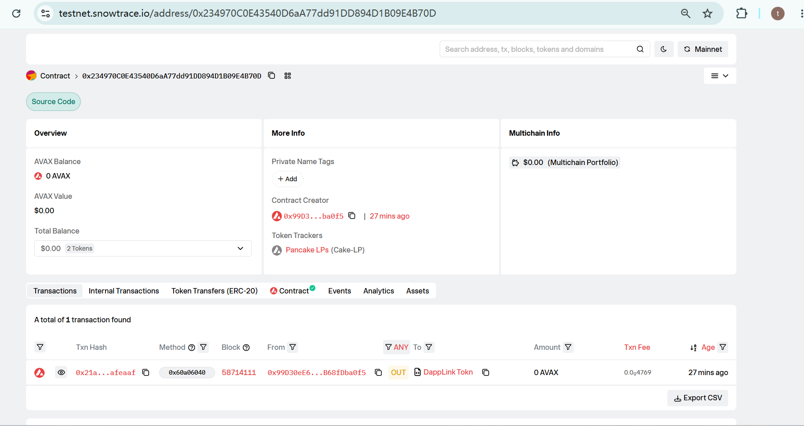
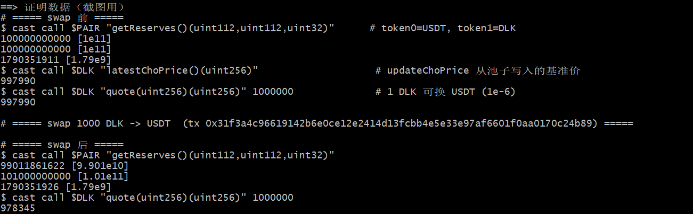

# Task 3：使用 DEX Oracle 获取代币价格

对应课程：第三章 Solidity 合约实战　　提交人：steven7289665382-sys

## 使用的 DEX

PancakeSwap V2（AMM，x·y=k 模型）。Core（Factory/Pair，solc 0.5.16）与 Periphery（Router，solc 0.6.6）全套自部署到 Avalanche Fuji 测试网。

## Token 信息

| 项目      | 名称                                                            | 合约地址                                                                                                                          |
| ------- | ------------------------------------------------------------- | ----------------------------------------------------------------------------------------------------------------------------- |
| Token A | DappLink Token (DLK, decimals=6, TransparentUpgradeableProxy) | [0xaCEB5Ad41daa1C4Da770A177EF397bDf713c70Ba](https://testnet.snowtrace.io/address/0xaCEB5Ad41daa1C4Da770A177EF397bDf713c70Ba) |
| Token B | Mock USDT (USDT, decimals=6)                                  | [0x68702575235D5dd088d7378F7e5fab0aAFdC72E0](https://testnet.snowtrace.io/address/0x68702575235D5dd088d7378F7e5fab0aAFdC72E0) |

## 基础设施合约（自部署 PancakeSwap V2）

| 合约                           | 地址                                                                                                                            |
| ---------------------------- | ----------------------------------------------------------------------------------------------------------------------------- |
| PancakeFactory (solc 0.5.16) | [0xf85f5A3ce4f662d6521995D67a1A7599413053ba](https://testnet.snowtrace.io/address/0xf85f5A3ce4f662d6521995D67a1A7599413053ba) |
| PancakeRouter (solc 0.6.6)   | [0xB45Bc4d3E9cA96a7F4161d9185c2998381234B61](https://testnet.snowtrace.io/address/0xB45Bc4d3E9cA96a7F4161d9185c2998381234B61) |
| WAVAX (WETH9)                | [0x288EFA380E92afd449Fc476e4193eFC5515Cfad3](https://testnet.snowtrace.io/address/0x288EFA380E92afd449Fc476e4193eFC5515Cfad3) |

## 交易对地址

DLK/USDT Pair：[0x234970C0E43540D6aA77dd91DD894D1B09E4B70D](https://testnet.snowtrace.io/address/0x234970C0E43540D6aA77dd91DD894D1B09E4B70D)

- 由 `IPancakeFactory.createPair(USDT, DLK)` 在代币合约 `initialize` 中自动创建（token0=USDT, token1=DLK）
- 初始注入 100,000 DLK + 100,000 USDT，初始价格 1 DLK = 1 USDT
- 当前流动性：约 99011.86 USDT / 101000.00 DLK（6 decimals），LP Token 由部署者持有

## 创建交易对与添加流动性

交易对在代币合约 initialize 中自动创建：

```solidity
mainPair = IPancakeFactory(_v2Factory).createPair(USDT, address(this));
```

添加流动性通过 PancakeRouter.addLiquidity 完成：

```bash
cast send $ROUTER "addLiquidity(address,address,uint256,uint256,uint256,uint256,address,uint256)" \
  $DLK $USDT 100000000000 100000000000 0 0 $ME $DEADLINE
```

添加流动性交易：[0x5fa70b2eaeeaed3eb808b228b3fcd14f74162b106b25e71772035c01fdc94c76](https://testnet.snowtrace.io/tx/0x5fa70b2eaeeaed3eb808b228b3fcd14f74162b106b25e71772035c01fdc94c76)



## 获取 Swap 价格的核心代码

通过 Pair 读取 reserves，再用 Router 的 `getAmountOut`（V2 AMM 公式，含 0.25% 手续费）计算 Swap 价格：

```solidity
function quote(uint256 amount) public view returns (uint256) {
    (uint256 rOther, uint256 rThis,,) = getReserves(mainPair, address(this));
    return IPancakeRouter01(v2Router).getAmountOut(amount, rThis, rOther);
}

// 链上更新基准价（由 caller 调用，价格直接来自 DEX 池子）
function updateChoPrice() external onlyCaller {
    (uint256 rOther, uint256 rThis,,) = getReserves(mainPair, address(this));
    latestChoPrice = IPancakeRouter01(v2Router).getAmountOut(1000000, rThis, rOther);
    emit UpdateChoPrice(block.timestamp, block.number, latestChoPrice);
}
```

注意 decimals：DLK 与 USDT 均为 6 位小数，`quote(1000000)` 即“用 1 个 DLK 能换回多少 USDT（单位 10^-6）”。

## 在业务逻辑中使用 DEX 价格

**动态下跌税**：卖出时用 `quote()` 获取当前 DEX 实时价格，与基准价 `latestChoPrice` 比较，跌幅 ≥3% 收 10%、≥6% 收 20% 的税——价格完全来自池子，不是写死的：

```solidity
function getDeclineTaxRate(uint256 value, bool isSell) internal returns (uint256 sellTax) {
    if (!isSell || latestChoPrice == 0 || value == 0) return 0;
    uint256 currentPrice = quote(1000000);          // ← DEX 实时价格
    if (currentPrice >= latestChoPrice) return 0;
    uint256 declineRate = ((latestChoPrice - currentPrice) * BPS_DENOMINATOR) / latestChoPrice;
    if (declineRate >= PRICE_DROP_6_BPS)      sellTax = (value * DOWN_TAX_6_BPS) / BPS_DENOMINATOR;
    else if (declineRate >= PRICE_DROP_3_BPS) sellTax = (value * DOWN_TAX_3_BPS) / BPS_DENOMINATOR;
    if (sellTax > 0) downsideTax = sellTax;
    emit DeclineTaxApplied(value, declineRate, sellTax);
}
```

**手续费自动兑换**：卖出手续费的 30% 通过 `SwapHelper.swapV2`（`swapExactTokensForTokensSupportingFeeOnTransferTokens`）按 DEX 价格自动换成 USDT 打给 treasury：

```solidity
require(
    SwapHelper.swapV2(v2Router, address(this), USDT, platformBalance, 0, treasureAddress) > 0,
    "DappLinkToken: USDT swap failed"
);
```

## 部署信息

- 部署后的代币合约（Proxy）：`0xaCEB5Ad41daa1C4Da770A177EF397bDf713c70Ba`
- 交易对：`0x234970C0E43540D6aA77dd91DD894D1B09E4B70D`
- 区块浏览器：
  - DLK：https://testnet.snowtrace.io/address/0xaCEB5Ad41daa1C4Da770A177EF397bDf713c70Ba
  - Pair：https://testnet.snowtrace.io/address/0x234970C0E43540D6aA77dd91DD894D1B09E4B70D
  - updateChoPrice 交易：https://testnet.snowtrace.io/tx/0x4d5d0f25315fcf197b7829abae7ed02b177d1c55de556798bc9bc678f6d3f109
  - swap 交易：https://testnet.snowtrace.io/tx/0x31f3a4c96619142b6e0ce12e2414d13fcbb4e5e33e97af6601f0aa0170c24b89

## 成功读取价格证明（Fuji 链上实测）

```text
# ===== swap 前 =====
$ cast call $PAIR "getReserves()(uint112,uint112,uint32)"     # token0=USDT, token1=DLK
100000000000 [1e11]
100000000000 [1e11]
1790351911 [1.79e9]
$ cast call $DLK "latestChoPrice()(uint256)"
997990            # 基准价 ≈ 0.9980 USDT（updateChoPrice 从池子读取）
$ cast call $DLK "quote(uint256)(uint256)" 1000000
997990

# ===== swap 1000 DLK -> USDT 后 =====
$ cast call $PAIR "getReserves()(uint112,uint112,uint32)"
99011861622 [9.901e10]
101000000000 [1.01e11]
1790351926 [1.79e9]
$ cast call $DLK "quote(uint256)(uint256)" 1000000
978345            # 1 DLK ≈ 0.9783 USDT，价格随池子下跌
```

swap 1000 DLK 前后：`quote(1000000)` 从 997990 → 978345，reserves 同步变化，证明价格来自 DEX 交易对实时状态，并被合约业务逻辑（下跌税基准价 / 实时价比较）实际使用。



## 实现过程说明

1. **自部署 PancakeSwap V2**：将 pancake-swap-core（solc 0.5.16）/ pancake-swap-periphery（solc 0.6.6）编译并部署到 Fuji，另部署 WETH9 作为 WAVAX 供 Router 构造使用。
2. **同步 init code hash**：Router 通过 CREATE2 预测 pair 地址，`PancakeLibrary.pairFor` 里硬编码的是 PancakeSwap 主网 hash，与本地编译的 PancakePair 字节码不一致。部署 Factory 后从链上读取 `INIT_CODE_PAIR_HASH()`（`0xd23d36de18f7774961616895cbfaaf779e51b7cc5c7329b0e2cc513f4b7fce71`）回填到 Library，否则 Router 找不到交易对。
3. 部署 MockUSDT（6 decimals，与主网 USDT 一致）作为计价代币。
4. 通过 TransparentUpgradeableProxy 部署 DappLinkToken，`initialize` 中自动调用 `createPair(USDT, DLK)` 创建交易对。
5. `setPoolAddress` + `poolAllocate` 铸币后，将部署者加入白名单（开启分配后向 pair 转 DLK 会被判定为 sell，未开启卖出时会 revert），再通过 Router `addLiquidity` 注入 100,000 DLK + 100,000 USDT 初始流动性，池子开始定价（1 DLK = 1 USDT）。
6. `quote()` 读取 `getReserves()` 并用 Router `getAmountOut` 计算实时 Swap 价格；`updateChoPrice()` 把 DEX 价格写入 `latestChoPrice` 作为基准。
7. 业务逻辑（卖出下跌税、手续费换 USDT）均以该 DEX 价格为依据，无任何写死价格。

**踩坑记录：**

- 两个代币 decimals 均为 6，价格计算统一按最小单位（10^6）处理，避免精度错误；
- Pair 的 reserve0/reserve1 按 token 地址大小排序，需要先判断 token0 再取对应 reserve；
- deadline 直接用当前时间在广播延迟时会报 EXPIRED，改为当前时间 + 1200 秒；
- Router 编译产物超过 24KB（EIP-170），需开启 optimizer；
- periphery 依赖 `@uniswap/v2-core` 与 `@uniswap/lib`（TransferHelper），需要在 remappings 中映射。
