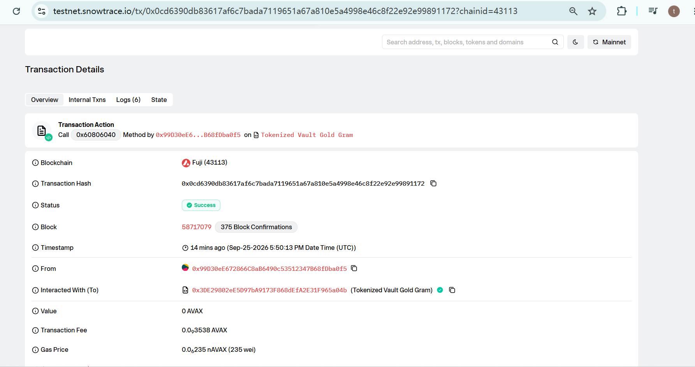
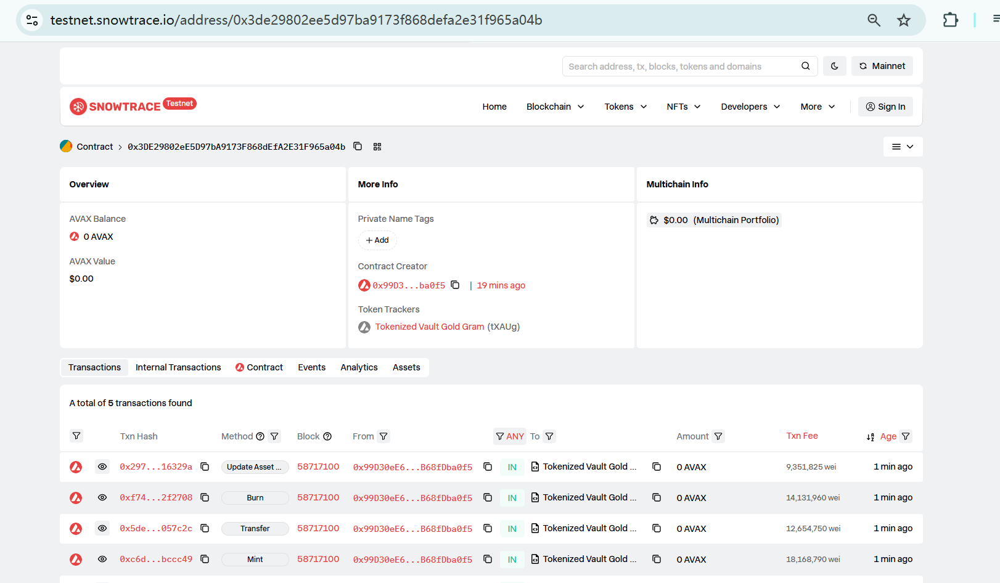
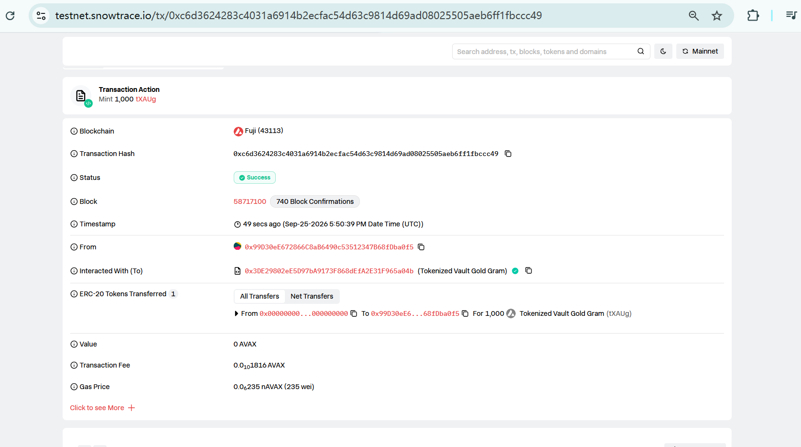
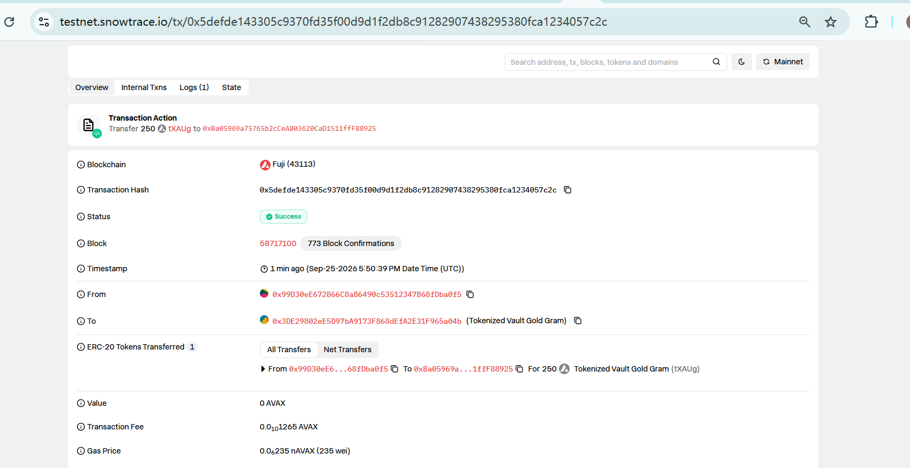
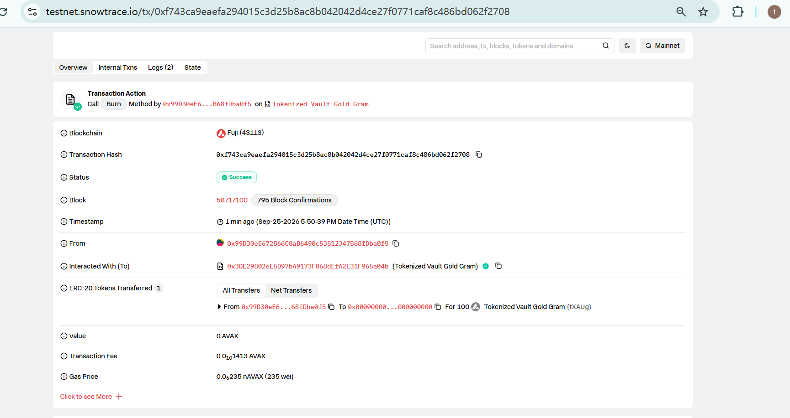
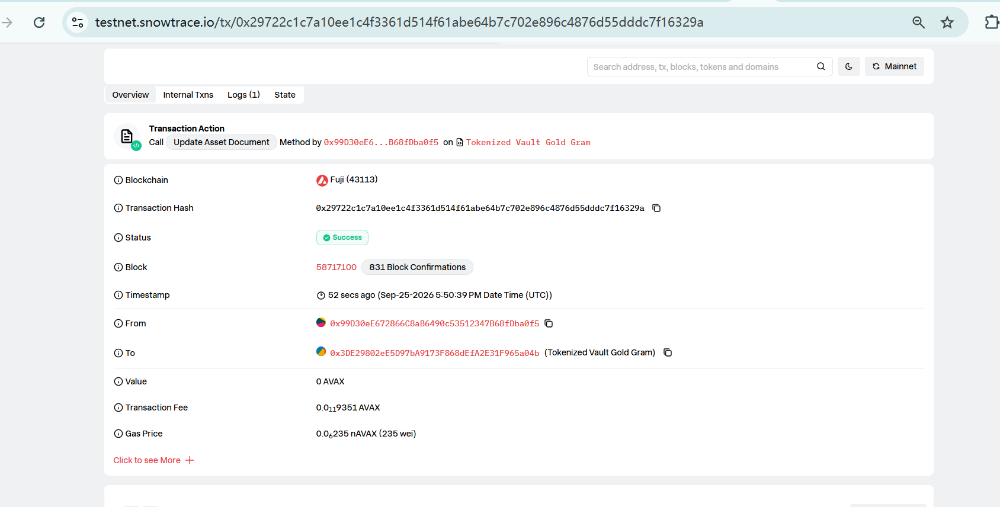
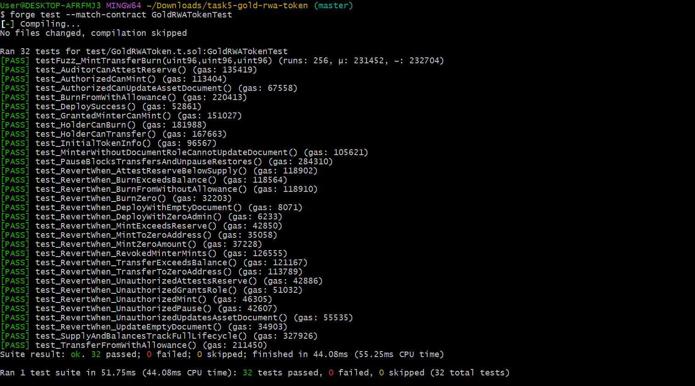

# Task 5 Avalanche RWA Token 合约实战 —— 金库黄金凭证 tXAUg

> 本作业仅用于技术学习和业务模拟，不涉及真实资产募集、投资建议或金融产品发行。

---

## 1. 学员信息

| 项目           | 内容                                                                             |
| ------------ | ------------------------------------------------------------------------------ |
| GitHub 用户名   | `steven7289665382-sys`                                                         |
| 作业项目仓库地址     | https://github.com/steven7289665382-sys/gold-rwa-token                         |
| 智能合约代码仓库地址   | https://github.com/steven7289665382-sys/gold-rwa-token/src/GoldRWAToken.sol    |
| 智能合约代码单元测试地址 | https://github.com/steven7289665382-sys/gold-rwa-token/test/GoldRWAToken.t.sol |
| 提交日期         | 2026-09-26                                                                     |

---

## 2. 项目说明

### 2.1 RWA 业务场景：黄金凭证（Tokenized Vault Gold）

一家（模拟的）贵金属托管机构在新加坡自由港金库中存放 LBMA 认证的 999.9 标准金条。投资者买入黄金后，托管方把金条的**实物所有权**以链上 Token 的形式登记给投资者。持有人可以在链上自由转让黄金权益（秒级结算、7×24、可拆分到 0.000…1 克），需要时再把 Token 交回、提取实物金条或按金价换回法币。

传统黄金凭证/纸黄金的痛点：交易时间受限、跨机构转让慢、最小单位大、库存对投资者不透明。上链后的改进：

- **可拆分、可组合**：18 位精度，1 克金条可以被拆成任意份额；Token 是标准 ERC-20，可直接接入钱包、DEX、借贷协议；
- **可验证的储备**：金库库存和审计报告哈希写在链上，任何人都能核对“流通 Token ≤ 金库库存”；
- **可追溯**：每一次发行、转让、赎回都有链上事件，托管方和审计方可以据此自动对账。

### 2.2 现实资产介绍

| 维度            | 设计                                                                   |
| ------------- | -------------------------------------------------------------------- |
| 底层资产          | 存放在托管金库中的 LBMA Good Delivery 999.9 金条（模拟）                            |
| Token 名称 / 符号 | Tokenized Vault Gold Gram / `tXAUg`                                  |
| 精度            | 18（`1e18` 最小单位 = 1 克）                                                |
| 发行上限          | 不设固定上限，**动态上限 = 审计师证明的金库库存**（合约强制 `totalSupply ≤ attestedReserve`）   |
| 初始储备证明        | 10,000 克（10 kg），报告编号 `VAULT-SG-2026Q3-AUDIT-REPORT`，其 keccak256 写入链上 |

### 2.3 作业要求回答的 4 个问题

**① 该 Token 对应的现实资产是什么？**
托管金库中的实物黄金（999.9 金条）。Token 代表的是**对特定数量实物黄金的所有权/提取权**，不是黄金价格的衍生品，也不是收益权。

**② 谁负责资产托管或提供资产证明？**

| 角色        | 现实中的主体（模拟）                                | 链上对应                                        |
| --------- | ----------------------------------------- | ------------------------------------------- |
| 发行方 / 托管方 | 持牌贵金属托管机构，负责金条入库、保管、出库交付                  | `MINTER_ROLE` —— 确认入库后发行 Token              |
| 资产证明方     | 独立第三方审计师（定期盘点金库、出具库存报告），以及托管方提供的金条清单      | `DOCUMENT_ROLE` —— 更新资产证明文件 URI、写入储备克数和报告哈希 |
| 风控 / 合规方  | 发行方合规部门                                   | `PAUSER_ROLE` —— 出现盗窃、审计异常、监管要求时暂停          |
| 超级管理员     | 发行方多签钱包（生产环境应是 Gnosis Safe 多签 + Timelock） | `DEFAULT_ADMIN_ROLE` —— 授予/撤销上述角色           |

角色拆分的目的是**职责分离**：发行方不能自己给自己写资产证明，审计方也不能随意发行 Token（测试 `test_MinterWithoutDocumentRoleCannotUpdateDocument` 验证了这一点）。

**③ 一个 Token 对应多少现实资产？**
**1 tXAUg = 1 克 999.9 金**。合约里的 `attestedReserve`（金库库存）与 Token 使用同一精度，所以链上可以直接比较：

```
可继续发行额度 availableToMint() = attestedReserve − totalSupply()
```

**④ 发行、转让、销毁分别代表什么业务行为？**

| 链上操作                        | 业务含义                                    | 线下动作                                                           | 链上事件                                                                             |
| --------------------------- | --------------------------------------- | -------------------------------------------------------------- | -------------------------------------------------------------------------------- |
| `mint(to, amount)`          | **入库发行**：投资者付款买金，托管方将对应克数的金条入库并登记到投资者名下 | 金条入库、登记编号、纳入下次审计盘点                                             | `TokensMinted(operator, to, amount)` + `Transfer(0x0, to, amount)`               |
| `transfer(to, amount)`      | **所有权转让**：黄金权益从一个持有人转给另一个持有人（买卖、赠与、抵押）  | 金条不动，仍在金库；托管方以链上余额为准认定所有权                                      | `Transfer(from, to, amount)`                                                     |
| `burn(amount)`              | **赎回注销**：持有人申请提取实物金条或按金价兑回法币，凭证被永久注销    | 托管方监听 `TokensRedeemed` 事件，按赎回单号 `redemptionId` 办理出库/结算，审计时下调库存 | `TokensRedeemed(holder, amount, redemptionId)` + `Transfer(holder, 0x0, amount)` |
| `burnFrom(account, amount)` | 经纪商/平台在获得授权后代客户批量赎回                     | 同上                                                             | 同上                                                                               |

---

## 3. 合约信息

| 项目          | 内容                                                                                                 |
| ----------- | -------------------------------------------------------------------------------------------------- |
| 合约名称        | `GoldRWAToken`                                                                                     |
| 代码仓库        | https://github.com/steven7289665382-sys/gold-rwa-token                                             |
| 合约部署地址      | `0x3de29802ee5d97ba9173f868defa2e31f965a04b`                                                       |
| 部署账户（Admin） | `0x99D30eE672866C8aB6490c53512347B68fDba0f5`                                                       |
| 测试网网络名称     | **Avalanche Fuji C-Chain Testnet**                                                                 |
| Chain ID    | **43113**                                                                                          |
| RPC         | `https://api.avax-test.network/ext/bc/C/rpc`                                                       |
| 区块浏览器       | https://testnet.snowtrace.io                                                                       |
| 合约浏览器链接     | https://testnet.snowtrace.io/address/0x3de29802ee5d97ba9173f868defa2e31f965a04b                    |
| 部署交易链接      | https://testnet.snowtrace.io/tx/0x0cd6390db83617af6c7bada7119651a67a810e5a4998e46c8f22e92e99891172 |
| 编译器         | Solidity 0.8.24，optimizer 200 runs，EVM shanghai                                                    |
| 依赖          | OpenZeppelin Contracts v5.1.0（ERC20 / ERC20Burnable / ERC20Pausable / AccessControl）               |
| 开发框架        | Foundry（forge / cast / anvil）                                                                      |

### 3.1 链上交互交易

| 操作     | 说明                                                                            | 交易链接                                                                                               |
| ------ | ----------------------------------------------------------------------------- | -------------------------------------------------------------------------------------------------- |
| 部署     | 部署合约，写入初始资产证明（10,000 g 储备）                                                    | https://testnet.snowtrace.io/tx/0x0cd6390db83617af6c7bada7119651a67a810e5a4998e46c8f22e92e99891172 |
| 发行     | `mint(deployer, 1000 tXAUg)` —— 入库 1,000 克                                    | https://testnet.snowtrace.io/tx/0xc6d3624283c4031a6914b2ecfac54d63c9814d69ad08025505aeb6ff1fbccc49 |
| 转账     | `transfer(0xBa05969a75765b2cCeA803620CaD1511ffF88925, 250 tXAUg)` —— 转让 250 克 | https://testnet.snowtrace.io/tx/0x5defde143305c9370fd35f00d9d1f2db8c91282907438295380fca1234057c2c |
| 销毁     | `burn(100 tXAUg)` —— 赎回 100 克，生成赎回单 #1                                        | https://testnet.snowtrace.io/tx/0xf743ca9eaefa294015c3d25b8ac8b042042d4ce27f0771caf8c486bd062f2708 |
| 更新资产证明 | `updateAssetDocument("ipfs://…2026q4auditreport/…")`                          | https://testnet.snowtrace.io/tx/0x29722c1c7a10ee1c4f3361d514f61abe64b7c702e896c4876d55dddc7f16329a |

交互完成后的链上状态：`totalSupply = 900 tXAUg`，部署者余额 `650`，接收方余额 `250`，`redemptionCount = 1`，`availableToMint = 9,100`。

---

## 4. 功能说明

### 4.1 接口一览

| 功能                 | 函数                                                                                  | 权限                   | 事件                                                          |
| ------------------ | ----------------------------------------------------------------------------------- | -------------------- | ----------------------------------------------------------- |
| Token 名称 / 符号 / 精度 | `name()` `symbol()` `decimals()`                                                    | 公开                   | —                                                           |
| Token 发行           | `mint(address to, uint256 amount)`                                                  | `MINTER_ROLE`        | `TokensMinted`, `Transfer`                                  |
| Token 销毁（赎回）       | `burn(uint256 amount)` / `burnFrom(address, uint256)`                               | 持有人 / 被授权人           | `TokensRedeemed`, `Transfer`                                |
| Token 转账           | `transfer` / `approve` / `transferFrom`                                             | 持有人                  | `Transfer`, `Approval`                                      |
| 余额查询               | `balanceOf(address)`                                                                | 公开                   | —                                                           |
| 总供应量查询             | `totalSupply()`                                                                     | 公开                   | —                                                           |
| 发行权限控制             | `grantRole` / `revokeRole` / `hasRole`                                              | `DEFAULT_ADMIN_ROLE` | `RoleGranted`, `RoleRevoked`                                |
| 资产证明查询             | `assetDocument()`                                                                   | 公开                   | —                                                           |
| 资产证明更新             | `updateAssetDocument(string calldata document)`                                     | `DOCUMENT_ROLE`      | `AssetDocumentUpdated(operator, old, new)`                  |
| 储备证明更新             | `attestReserve(uint256 reserve, bytes32 reportHash)`                                | `DOCUMENT_ROLE`      | `ReserveAttested(operator, reserve, reportHash, timestamp)` |
| 储备查询               | `attestedReserve()` `reserveReportHash()` `lastAttestationAt()` `availableToMint()` | 公开                   | —                                                           |
| 紧急暂停               | `pause()` / `unpause()`                                                             | `PAUSER_ROLE`        | `Paused`, `Unpaused`                                        |

### 4.2 关键设计

1. **储备约束发行（Proof of Reserve 的简化版）**：`mint` 会检查 `totalSupply + amount ≤ attestedReserve`，超发直接 revert `ExceedsAttestedReserve`。发行方即使私钥泄露，也无法凭空印出超过金库库存的 Token。
2. **储备不可低于流通量**：`attestReserve` 要求 `reserve ≥ totalSupply`，否则 revert `ReserveBelowSupply`——审计出库存不足时应先暂停、处理，而不是把“资不抵债”写上链。
3. **赎回单号**：每次 `burn` 自增 `redemptionCount` 并写进 `TokensRedeemed` 事件（indexed），托管方后台监听事件即可建立出库工单，链上与线下一一对应。
4. **最小权限 + 职责分离**：用 OpenZeppelin `AccessControl` 拆成 4 个角色，而不是一个 `Ownable` 管全部。
5. **自定义错误**：`ZeroAddress` / `ZeroAmount` / `EmptyDocument` / `ExceedsAttestedReserve` / `ReserveBelowSupply`，比 `require` 字符串省 gas，错误原因也更清晰。
6. **紧急暂停**：继承 `ERC20Pausable`，暂停后转账、发行、销毁全部冻结，用于金库被盗、审计异常、监管冻结等场景。

### 4.3 资产证明信息的作用

合约中保存了三类模拟的资产证明信息：

| 字段                                      | 示例值                                                           | 在真实 RWA 项目中的作用                                                                                                             |
| --------------------------------------- | ------------------------------------------------------------- | -------------------------------------------------------------------------------------------------------------------------- |
| `assetDocument`                         | `ipfs://bafybeigoldvault2026q3auditreport/gold-bar-list.json` | 指向 IPFS 上的金条清单（每根金条的冶炼厂、编号、成色、重量）、托管协议、审计报告 PDF。IPFS 的内容寻址保证文件一旦发布就不能被悄悄替换，换文件必须上链更新并留下 `AssetDocumentUpdated` 事件记录（含新旧值）。 |
| `reserveReportHash`                     | `keccak256("VAULT-SG-2026Q3-AUDIT-REPORT")`                   | 审计报告原文的哈希锚点。投资者拿到线下报告后自行计算哈希、与链上比对，就能确认报告没有被篡改。                                                                            |
| `attestedReserve` + `lastAttestationAt` | `10000e18`，时间戳                                                | 审计师证明的金库库存和证明时间。它是 `mint` 的硬上限，前端也可以据此展示“抵押率 = 库存 / 流通量”以及证明是否过期。生产环境可以换成 Chainlink Proof of Reserve 预言机自动喂价。              |

---

## 5. 测试

测试文件：`test/GoldRWAToken.t.sol`，共 **32 个测试用例（含 1 个 256 轮 Fuzz 测试），全部通过**。

```bash
forge test -vv
# Suite result: ok. 32 passed; 0 failed; 0 skipped
```

覆盖率（`forge coverage`）：

| File                 | % Lines         | % Statements   | % Branches   | % Funcs         |
| -------------------- | --------------- | -------------- | ------------ | --------------- |
| src/GoldRWAToken.sol | 100.00% (48/48) | 98.00% (49/50) | 88.89% (8/9) | 100.00% (12/12) |

作业要求的测试场景对应关系：

| 作业要求场景          | 对应测试用例                                                                                                                                                                                                                         |
| --------------- | ------------------------------------------------------------------------------------------------------------------------------------------------------------------------------------------------------------------------------ |
| 合约部署成功          | `test_DeploySuccess`、`test_RevertWhen_DeployWithZeroAdmin`、`test_RevertWhen_DeployWithEmptyDocument`                                                                                                                           |
| 初始 Token 信息正确   | `test_InitialTokenInfo`（名称、符号、精度、总量 0、资产证明、储备、未暂停）                                                                                                                                                                             |
| 授权账户可以发行 Token  | `test_AuthorizedCanMint`（含事件校验）、`test_GrantedMinterCanMint`                                                                                                                                                                    |
| 非授权账户不能发行 Token | `test_RevertWhen_UnauthorizedMint`、`test_RevertWhen_RevokedMinterMints`                                                                                                                                                        |
| 持有人可以转账         | `test_HolderCanTransfer`、`test_TransferFromWithAllowance`                                                                                                                                                                      |
| Token 可以被销毁     | `test_HolderCanBurn`（含赎回事件与单号）、`test_BurnFromWithAllowance`                                                                                                                                                                    |
| 总供应量和账户余额变化正确   | `test_SupplyAndBalancesTrackFullLifecycle`、`testFuzz_MintTransferBurn`（256 组随机输入）                                                                                                                                              |
| 非授权账户不能修改资产证明信息 | `test_RevertWhen_UnauthorizedUpdatesAssetDocument`、`test_MinterWithoutDocumentRoleCannotUpdateDocument`、`test_RevertWhen_UnauthorizedAttestsReserve`；正向：`test_AuthorizedCanUpdateAssetDocument`、`test_AuditorCanAttestReserve` |
| 错误操作能够被合约拒绝     | 超储备发行、发行到零地址、发行 0、余额不足转账、转给零地址、销毁超余额、销毁 0、无授权 `burnFrom`、空资产文件、储备低于流通量、暂停后转账/发行、非授权暂停、非授权授予角色（共 13 个 `test_RevertWhen_*` / `test_Pause*`）                                                                                      |

---

## 6. 截图材料

截图放在 `screenshots/` 目录：

| #   | 截图内容                                  | 文件                                                |
| --- | ------------------------------------- | ------------------------------------------------- |
| 1   | 合约部署成功（终端 `forge script` 输出 / 部署交易详情） |               |
| 2   | 测试网区块浏览器中的合约页面                        |  |
| 3   | Token 发行（mint 交易）                     |                   |
| 4   | Token 转账（transfer 交易）                 |           |
| 5   | Token 销毁（burn 交易）                     |                   |
| 6   | 资产证明更新（updateAssetDocument 交易）        |         |
| 7   | 单元测试全部通过                              |            |

---

## 7. 如何运行

```bash
# 1. 安装依赖
forge install foundry-rs/forge-std
forge install OpenZeppelin/openzeppelin-contracts@v5.1.0

# 2. 编译 & 测试
forge build
forge test -vv
forge coverage

# 3. 部署到 Fuji（先在 https://core.app/tools/testnet-faucet 领取测试 AVAX）
forge script script/Deploy.s.sol:Deploy --rpc-url fuji --broadcast --private-key $PRIVATE_KEY

# 4. 业务流程演示：发行 -> 转账 -> 销毁 -> 更新资产证明
TOKEN=<合约地址> RECEIVER=<接收地址> \
forge script script/Interact.s.sol:Interact --rpc-url fuji --broadcast --private-key $PRIVATE_KEY

# 5. 命令行查询
cast call <合约地址> "totalSupply()(uint256)" --rpc-url fuji
cast call <合约地址> "assetDocument()(string)" --rpc-url fuji
```

Windows 下可直接运行一键脚本 `deploy.ps1`（依次完成安装、编译、测试、部署、Snowtrace 验证、业务交互，并自动把合约地址和交易哈希填进本文档）。

项目结构：

```
gold-rwa-token/
├── src/GoldRWAToken.sol          # RWA Token 合约
├── test/GoldRWAToken.t.sol       # 32 个测试用例
├── script/Deploy.s.sol           # Fuji 部署脚本
├── script/Interact.s.sol         # 发行/转账/销毁/更新资产证明演示
├── deploy.ps1                    # Windows 一键部署脚本
├── foundry.toml                  # 编译器、Fuji RPC、Snowtrace 验证配置
└── docs/                         # 测试输出、覆盖率、文档模板
```

---

## 8. 风险边界与思考

链上合约只能保证“账本规则”被执行，**无法保证链下的黄金真实存在**。这个项目里仍然需要信任的环节：

1. **托管方信用风险**：金条是否真的在金库里、是否被重复质押，最终取决于托管方和审计师。链上的 `attestedReserve` 只是审计师的“签名声明”，不是物理证明。
2. **预言机 / 数据源风险**：储备数据由 `DOCUMENT_ROLE` 手动写入，存在人为错误或串通的可能。改进方向是接入 Chainlink Proof of Reserve、多审计师多签确认、定期强制证明（超期自动暂停发行）。
3. **私钥与权限风险**：`DEFAULT_ADMIN_ROLE` 权力很大。生产环境应使用多签钱包 + Timelock，并考虑 `AccessControlDefaultAdminRules` 让管理员变更有延迟。
4. **法律确权风险**：链上余额能否在法律上等同于黄金所有权，取决于发行地法规和用户协议。赎回时还涉及 KYC/AML、最小提金单位（例如整根 1 kg 金条）、运费保险等链下流程。
5. **合规风险**：真实项目通常需要白名单/KYC 转账限制（如 ERC-3643）、制裁地址冻结、Travel Rule 等功能，本作业只实现了全局暂停。
6. **赎回流动性**：burn 只是链上注销，实物交付存在时间差；若大量集中赎回而托管方无法及时交付，会出现链上与链下的不一致。

**免责声明**：本项目中的托管机构、金库、审计报告、IPFS 链接均为虚构的模拟数据，仅用于技术学习，不构成任何投资建议或金融产品发行。
