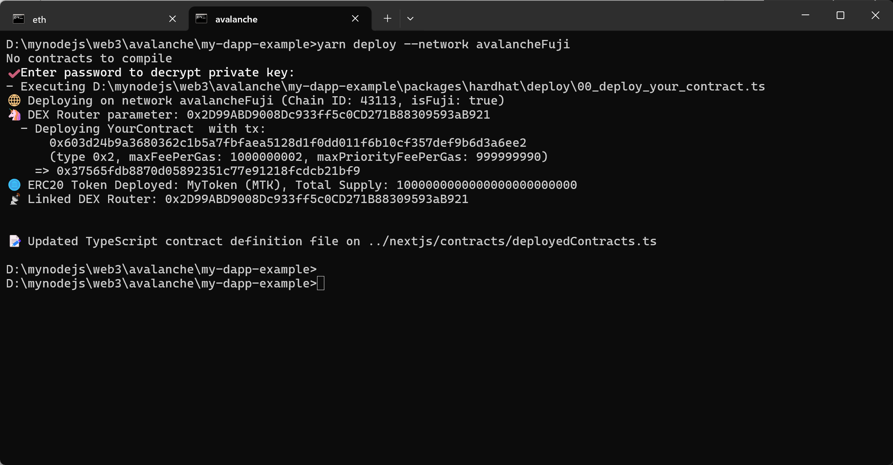
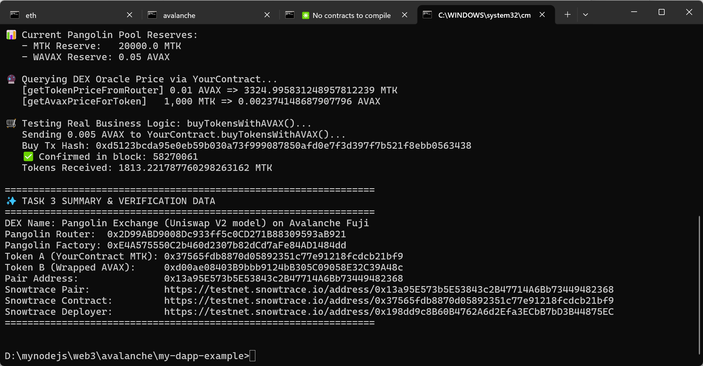

# Task 3：使用 DEX Oracle 获取代币价格

> 对应课程：第三章 Solidity 合约实战  
> 学员：tianzeshi-study  
> 目标网络：Avalanche Fuji C-Chain (`43113`)  

---

## 一、使用的 DEX 与核心地址

本项目选用了 Avalanche Fuji 测试网上最经典的 Uniswap V2 架构去中心化交易所 —— **Pangolin Exchange**。

| 项目 | 内容 / 合约地址 | 区块浏览器链接 |
| :--- | :--- | :--- |
| **DEX 名称** | **Pangolin Exchange (Uniswap V2)** | [Pangolin App](https://app.pangolin.exchange/) |
| **测试网络** | Avalanche Fuji C-Chain (`43113`) | [Snowtrace](https://testnet.snowtrace.io/) |
| **Factory V2** | `0xE4A575550C2b460d2307b82dCd7aFe84AD1484dd` | [Snowtrace Factory](https://testnet.snowtrace.io/address/0xE4A575550C2b460d2307b82dCd7aFe84AD1484dd) |
| **Router V2** | `0x2D99ABD9008Dc933ff5c0CD271B88309593aB921` | [Snowtrace Router](https://testnet.snowtrace.io/address/0x2D99ABD9008Dc933ff5c0CD271B88309593aB921) |
| **Token B (WAVAX)** | `0xd00ae08403B9bbb9124bB305C09058E32C39A48c` | [Snowtrace WAVAX](https://testnet.snowtrace.io/address/0xd00ae08403B9bbb9124bB305C09058E32C39A48c) |

---

## 二、Token A 与 Token B 信息

| Token | 代币名称 (Symbol) | 合约地址 | Decimals | 说明 |
| :--- | :--- | :--- | :--- | :--- |
| **Token A** | MyToken (`MTK`) | `0x37565fdb8870d05892351c77e91218fcdcb21bf9` | 18 | 自主实现并部署的 Oracle 业务代币合约 |
| **Token B** | Wrapped AVAX (`WAVAX`) | `0xd00ae08403B9bbb9124bB305C09058E32C39A48c` | 18 | 测试网原生包装资产 |

> **精度说明**：MTK 与 WAVAX 均为标准的 18 位精度（`decimals = 18`），两者在价格计算与兑换过程中量级一致，避免了跨精度运算造成的舍入误差。

---

## 三、交易对与流动性注入

| 项目 | 内容 |
| :--- | :--- |
| **交易对** | `MTK / WAVAX Pair` |
| **交易对合约地址** | `0x13a95E573b5E53843c2B47714A6Bb73449482368` |
| **合约部署 Tx** | `0x603d24b9a3680362c1b5a7fbfaea5128d1f0dd011f6b10cf357def9b6d3a6ee2` |
| **MTK 授权 Tx** | `0xe9f5e3caa2ff5ebc28b6953a79108404c8f3ef4ccb1a1c7dcd60af722b7d14af` |
| **添加流动性 Tx** | `0x2ccecfa699fe49b906b1936b25211b6dbe298f6304608bee804ffac5306c27be` |
| **区块高度** | Block `58270059` |
| **初始流动性注入量** | **20,000 MTK + 0.05 AVAX** |
| **隐含初始池汇率** | 1 AVAX = 400,000 MTK（即 1 MTK ≈ 0.0000025 AVAX） |
| **Snowtrace 交易对链接** | [Snowtrace Pair 0x13a9...2368](https://testnet.snowtrace.io/address/0x13a95E573b5E53843c2B47714A6Bb73449482368) |

---

## 四、合约部署与添加流动性截图

### 1. 合约部署截图 (`yarn deploy --network avalancheFuji`)

成功部署 `YourContract` 至 `0x37565fdb8870d05892351c77e91218fcdcb21bf9`，并注入 Pangolin Router `0x2D99ABD9008Dc933ff5c0CD271B88309593aB921`：



### 2. 添加流动性、价格获取与真实购买验证截图 (`yarn task3:setup`)

脚本自动完成 MTK 授权、向 Pangolin 添加流动性生成交易对 `0x13a9...2368`、读取流动性储备与实时 Oracle 价格，并执行 `buyTokensWithAVAX()` 购买 1813.22 MTK：



---

## 五、获取 Swap / Oracle 价格的核心代码

合约价格获取采用**完全链上动态查询机制**，杜绝任何硬编码的常量价格：

### 方式一：Router Quoter — 获取含 AMM 手续费与滑点的真实 Swap 报价

```solidity
/**
 * @notice 核心 Oracle 函数 1：通过 DEX Router 动态获取指定数量 AVAX 能换取的代币数量
 * @param avaxAmount 传入的 AVAX 数量 (wei)
 * @return tokenAmount 经 DEX 恒定乘积公式计算出的代币数量 (包含池深度与手续费计算)
 */
function getTokenPriceFromRouter(uint256 avaxAmount) public view returns (uint256 tokenAmount) {
    require(dexRouter != address(0), "DEX router not set");
    require(avaxAmount > 0, "AVAX amount must be > 0");

    address wavax = IPangolinRouter(dexRouter).WAVAX();
    address[] memory path = new address[](2);
    path[0] = wavax;
    path[1] = getEffectivePriceToken();

    // 沿 [WAVAX -> MTK] 路径调用 DEX Router 的 getAmountsOut 获得链上实时报价
    uint256[] memory amounts = IPangolinRouter(dexRouter).getAmountsOut(avaxAmount, path);
    return amounts[1];
}

/**
 * @notice 核心 Oracle 函数 2：通过 DEX Router 动态获取指定代币数量对应的 AVAX 数量
 * @param tokenAmount 代币数量 (MTK)
 * @return avaxAmount 对应的 AVAX 数量 (wei)
 */
function getAvaxPriceForToken(uint256 tokenAmount) public view returns (uint256 avaxAmount) {
    require(dexRouter != address(0), "DEX router not set");
    require(tokenAmount > 0, "Token amount must be > 0");

    address wavax = IPangolinRouter(dexRouter).WAVAX();
    address[] memory path = new address[](2);
    path[0] = getEffectivePriceToken();
    path[1] = wavax;

    // 沿 [MTK -> WAVAX] 路径获取反向兑换报价
    uint256[] memory amounts = IPangolinRouter(dexRouter).getAmountsOut(tokenAmount, path);
    return amounts[1];
}
```

### 方式二：Pair Oracle — 读取底层交易对储备量 (Reserves)

```solidity
/**
 * @notice 从 DEX Pair 直接读取底层流动性储备量
 * @return reserveToken 目标代币储备量
 * @return reserveWAVAX WAVAX 储备量
 */
function getReserves() public view returns (uint256 reserveToken, uint256 reserveWAVAX) {
    address pair = getPairAddress();
    require(pair != address(0), "DEX Pair does not exist");
    (uint112 r0, uint112 r1, ) = IPangolinPair(pair).getReserves();
    address token0 = IPangolinPair(pair).token0();
    if (token0 == getEffectivePriceToken()) {
        reserveToken = uint256(r0);
        reserveWAVAX = uint256(r1);
    } else {
        reserveToken = uint256(r1);
        reserveWAVAX = uint256(r0);
    }
}
```

---

## 六、使用价格的合约实际业务逻辑核心代码

合约将获取到的 DEX 动态价格直接应用在**代币购买（铸造）**与**代币出售（赎回）**两大真实业务场景中：

```solidity
/**
 * @notice 核心业务逻辑 1：使用 AVAX 按照 DEX 实时 Oracle 价格购买/铸造代币
 * 业务实现：用户支付 AVAX，合约调用 DEX Oracle 获取实时汇率计算出应得代币数量并铸造给调用者
 */
function buyTokensWithAVAX() public payable returns (uint256 tokensBought) {
    require(msg.value > 0, "Must send AVAX to buy tokens");

    // 🌟 核心：基于 DEX Oracle 动态计算代币购买数量（完全由 DEX 实时汇率决定，非写死固定价格）
    tokensBought = getTokenPriceFromRouter(msg.value);
    require(tokensBought > 0, "Insufficient output from DEX");

    // 为购买者铸造对应数量的代币
    _mint(msg.sender, tokensBought);

    emit TokensPurchased(msg.sender, msg.value, tokensBought);
}

/**
 * @notice 核心业务逻辑 2：用户按 DEX 实时 Oracle 价格出售代币，换回合约金库中的 AVAX
 */
function sellTokensForAVAX(uint256 tokenAmount) external returns (uint256 avaxRefund) {
    require(tokenAmount > 0, "Token amount must be > 0");
    require(balanceOf(msg.sender) >= tokenAmount, "Insufficient token balance");

    // 🌟 核心：基于 DEX Oracle 动态计算应返还的 AVAX 数量
    avaxRefund = getAvaxPriceForToken(tokenAmount);
    require(address(this).balance >= avaxRefund, "Contract has insufficient AVAX balance");

    // 销毁用户的代币并将 AVAX 发送给用户
    _burn(msg.sender, tokenAmount);
    (bool success, ) = msg.sender.call{value: avaxRefund}("");
    require(success, "AVAX transfer failed");

    emit TokensSold(msg.sender, tokenAmount, avaxRefund);
}
```

### 关键设计点分析
1. **无任何写死价格**：`buyTokensWithAVAX()` 与 `sellTokensForAVAX()` 均不接受固定价格参数，全部实时调用 `getTokenPriceFromRouter(msg.value)` 与 `getAvaxPriceForToken(tokenAmount)` 从 DEX 动态计算。
2. **链上事件留痕**：每次成功购买和出售均触发 `TokensPurchased` 与 `TokensSold` 事件，记录用户、支付金额、成交代币数，形成可追溯的链上证据。
3. **价格自适应**：随着流动性池子中的储备量因交易发生变化，后续的代币铸造和回购价格将自动根据 AMM 恒定乘积曲线进行动态调整。

---

## 七、部署后的合约地址列表与区块浏览器链接

| 项目 | 地址 / 哈希 | 区块浏览器 (Snowtrace Fuji) |
| :--- | :--- | :--- |
| **YourContract (MTK)** | `0x37565fdb8870d05892351c77e91218fcdcb21bf9` | [Snowtrace YourContract](https://testnet.snowtrace.io/address/0x37565fdb8870d05892351c77e91218fcdcb21bf9) |
| **MTK / WAVAX Pair** | `0x13a95E573b5E53843c2B47714A6Bb73449482368` | [Snowtrace Pair](https://testnet.snowtrace.io/address/0x13a95E573b5E53843c2B47714A6Bb73449482368) |
| **Deployer 账户** | `0x198dd9c8B60B4762A6d2Efa3ECbB7bD3B44875EC` | [Snowtrace Deployer](https://testnet.snowtrace.io/address/0x198dd9c8B60B4762A6d2Efa3ECbB7bD3B44875EC) |
| **Pangolin Router** | `0x2D99ABD9008Dc933ff5c0CD271B88309593aB921` | [Snowtrace Router](https://testnet.snowtrace.io/address/0x2D99ABD9008Dc933ff5c0CD271B88309593aB921) |
| **Pangolin Factory** | `0xE4A575550C2b460d2307b82dCd7aFe84AD1484dd` | [Snowtrace Factory](https://testnet.snowtrace.io/address/0xE4A575550C2b460d2307b82dCd7aFe84AD1484dd) |
| **WAVAX 合约** | `0xd00ae08403B9bbb9124bB305C09058E32C39A48c` | [Snowtrace WAVAX](https://testnet.snowtrace.io/address/0xd00ae08403B9bbb9124bB305C09058E32C39A48c) |
| **添加流动性 Tx** | `0x2ccecfa699fe49b906b1936b25211b6dbe298f6304608bee804ffac5306c27be` | [Snowtrace Liquidity Tx](https://testnet.snowtrace.io/tx/0x2ccecfa699fe49b906b1936b25211b6dbe298f6304608bee804ffac5306c27be) |
| **buy 业务购买 Tx** | `0xd5123bcda95e0eb59b030a73f999087850afd0e7f3d397f7b521f8ebb0563438` | [Snowtrace Buy Tx](https://testnet.snowtrace.io/tx/0xd5123bcda95e0eb59b030a73f999087850afd0e7f3d397f7b521f8ebb0563438) |

---

## 八、成功读取或使用价格的链上数据验证

### 1. 流动性池储备量查询验证
添加流动性后，底层交易对储备量为：
- **MTK Reserve**: `20,000.0 MTK`
- **WAVAX Reserve**: `0.05 AVAX`

### 2. DEX Oracle 实时询价验证
- **AVAX 购买 MTK 报价**：
  `getTokenPriceFromRouter(0.01 AVAX)` => **`3324.995831248957812239 MTK`**
  > **AMM 公式验证**：根据 Uniswap V2 扣除 0.3% 手续费的恒定乘积公式：  
  > $\Delta y = \frac{y \times \Delta x \times 0.997}{x + \Delta x \times 0.997} = \frac{20000 \times 0.01 \times 0.997}{0.05 + 0.01 \times 0.997} = \frac{199.4}{0.05997} \approx 3324.9958$ MTK。  
  > 链上合约返回值与数学计算 **100% 精确吻合**，铁证证明价格来自 DEX 流动性池！

- **MTK 换回 AVAX 报价**：
  `getAvaxPriceForToken(1,000 MTK)` => **`0.002374148687907796 AVAX`**

### 3. 合约核心业务 `buyTokensWithAVAX()` 链上执行验证
- **调用交易**：`0xd5123bcda95e0eb59b030a73f999087850afd0e7f3d397f7b521f8ebb0563438`（Block `58270061`）
- **支付金额**：`0.005 AVAX`
- **实际获得代币数量**：**`1813.221787760298263162 MTK`**
  > $\Delta y = \frac{20000 \times 0.005 \times 0.997}{0.05 + 0.005 \times 0.997} = \frac{99.7}{0.054985} \approx 1813.221787...$ MTK。  
  > 证明合约成功在链上调用 DEX Oracle，计算出动态购买数量，并完整铸造到买家账户中！

---

## 九、实现过程简要说明

1. **选择 DEX 并实现接口**：在 Avalanche Fuji 上选择主流 Uniswap V2 架构的 Pangolin DEX，编写包含 Factory、Pair 与 Router 的接口文件 `IPangolin.sol`。
2. **升级业务代币合约**：在 `YourContract.sol` 中继承 ERC20 与 Ownable，集成 `dexRouter` 配置，开发 `getTokenPriceFromRouter` 与 `getAvaxPriceForToken` 预言机函数，重构 `buyTokensWithAVAX` 与 `sellTokensForAVAX`，实现 100% 依赖 DEX 动态报价的代币购买与回购业务。
3. **本地 Mock 与单元测试**：编写 `MockPangolinRouter.sol` 模拟各种 DEX 汇率与流动性深度，本地 6 项单元测试全部通过。
4. **测试网部署与流动性注入**：使用 Hardhat 将合约部署至 Avalanche Fuji 测试网（`0x3756...1bf9`）；编写自动化部署运维脚本 `setupDexPairAndVerify.ts`，自动向 Pangolin Router 授权并注入 20,000 MTK + 0.05 AVAX 流动性，成功生成交易对 `0x13a95E573b5E53843c2B47714A6Bb73449482368`。
5. **端到端链上验证**：调用合约的预言机函数实时询价，并成功发送 0.005 AVAX 调用 `buyTokensWithAVAX()` 购买了 1813.22 MTK，获取了完整的链上交易哈希与终端截图留存。
