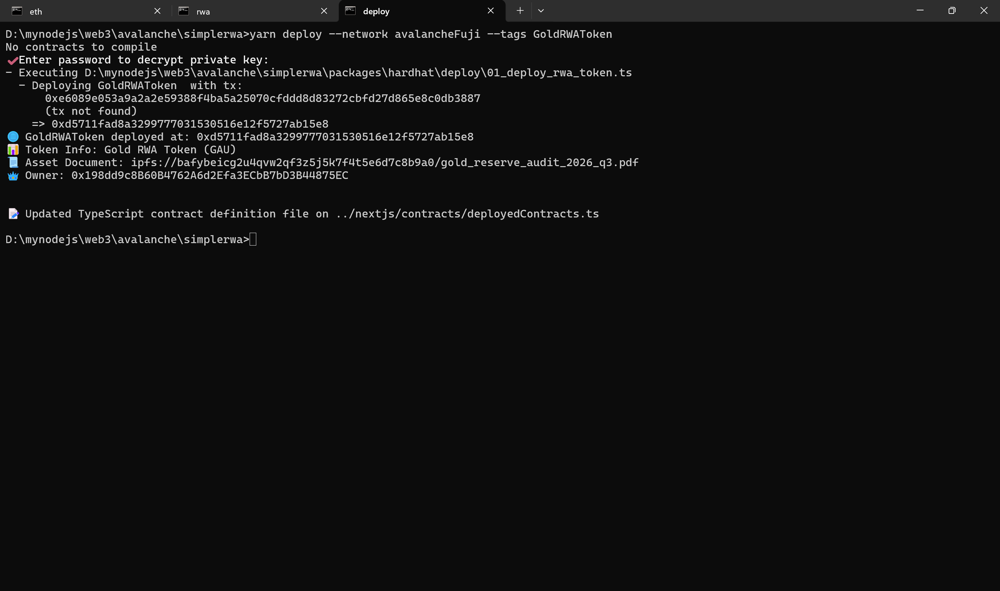
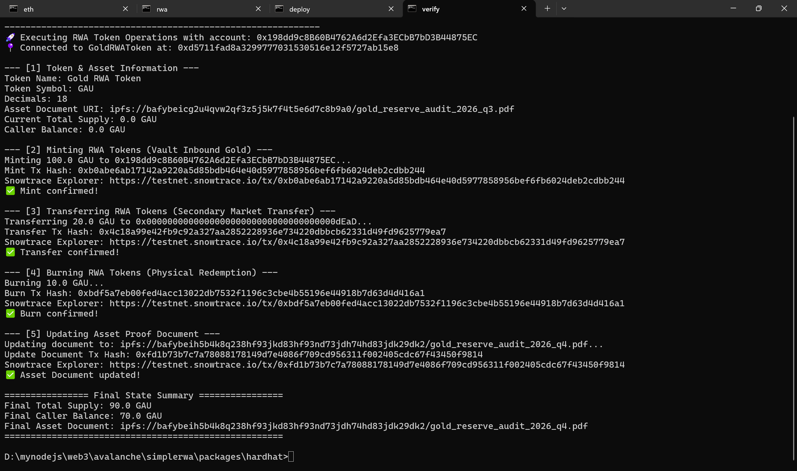

# Task 5: Avalanche RWA Token 合约实战报告

## 一、学员信息与项目概况

- **GitHub 用户名**：`tianzeshi-study`
- **代码仓库地址**：`https://github.com/tianzeshi-study/simplerwa`
- **目标网络**：Avalanche Fuji Testnet
- **Chain ID**：`43113`
- **网络代币**：`AVAX`
- **区块浏览器**：[Snowtrace Testnet](https://testnet.snowtrace.io) / [Avalanche Subnet Explorer](https://subnets-test.avax.network/c-chain)

---

## 二、RWA 业务场景与现实资产设计

### 1. 业务场景选型：瑞士金库实物黄金资产凭证 (Gold RWA Token - GAU)
本合约模拟了一个典型的“实物商品资产代币化 (Asset-Backed Commodity Tokenization)”业务场景——**LBMA 99.99% 投资级实物黄金资产凭证**。

### 2. 现实资产权益详细说明
| 维度 | 业务与现实定义 |
| :--- | :--- |
| **底层现实资产** | 存放于瑞士苏黎世安全金库中、符合伦敦金银市场协会（LBMA）标准的 99.99% 纯度标准投资金条（Good Delivery Bars）。 |
| **托管与证明机构** | **金库托管**：由受瑞士金融市场监管的专业安防金库（Swiss Vault Logistics Ltd.）独立物理隔离保管。<br>**审计与证明**：由国际独立检验与审计机构（如 Bureau Veritas / PwC）按月度盘点，出具储备证明（Proof of Reserve, PoR）报告。 |
| **Token 兑换比例** | 遵循标准 ERC-20（18 位精度）：<br>**$1\text{ GAU} = 1.000\text{ 克 (Gram)}$ 99.99% 纯实物黄金所有权及实物提取权**。<br>最小单位细分至 $10^{-18}$ 克，实现微额黄金碎化交易与转移。 |
| **资产证明作用** | 链上存储 `assetDocument`（IPFS URI），指向金库仓单、第三方月度成色鉴定报告和审计哈希，确立链上代币与链下物理资产之间的法律穿透与信用锚定。 |

### 3. Token 核心操作对应的现实业务行为
```
   【线下金库实物入库】                           【线下金库实物交割】
    投资者/合作金商存入金条                        持有人申请提金 / 赎回法币
            │                                             ▲
            ▼                                             │
      经审计机构验证                                托管方审核提金申请
            │                                             │
            ▼                                             │
      [1] mint() 铸造                                [3] burn() 销毁
            │                                             ▲
            ▼                                             │
     ┌─────────────────────────────────────────────────────────┐
     │                     链上 GAU Token                      │
     │            (1 GAU = 1.000g LBMA 99.99% 黄金)            │
     └─────────────────────────────────────────────────────────┘
                                   │
                           [2] transfer()
                                   │
                                   ▼
                      【链上二级市场流动性流转】
                      高效结算黄金所有权，无需物理运输
```

- **发行 (Mint)**：
  - **业务行为**：当合规做市商或投资者向受托金库注入物理金条，完成成色检验和入库登记，并出具由审计机构签名的仓单后，由获得授权的发行人（Vault Admin / Owner）在链上调用 `mint(address to, uint256 amount)`，按 1 GAU = 1 克黄金的比例向投资者地址增发代币。
- **转让 (Transfer)**：
  - **业务行为**：持有人之间在二级市场上买卖、抵押或借贷 GAU 代币。链上所有权的实时转移，等同于该克重黄金所有权的无感转让，避免了传统贵金属交易中高昂的运输、安保与交割损耗。
- **销毁 (Burn)**：
  - **业务行为**：当代币持有者提出实物黄金提取申请（例如累计满 100g/1000g 标准条规格）或向承兑机构赎回法定货币时，经托管机构交割核验后，调用 `burn(uint256 amount)` 将对应数量的 GAU 永久销毁，保证链上总代币量始终与金库中库存总克数严格 1:1 动态平衡。
- **资产证明更新 (Update Asset Document)**：
  - **业务行为**：每季度或当金库发生定期审计时，合规主管/审计节点将最新的资产审计报告、金库保单或检验签名上传至 IPFS，并在链上调用 `updateAssetDocument` 更新凭据链接，确保资产储备与法律事实全透明。

---

## 三、智能合约架构与实现

合约代码位于：`packages/hardhat/contracts/RWAToken.sol`。

### 1. 技术栈与标准规范
- **开发框架**：Scaffold-ETH 2 (Hardhat Flavor)
- **Solidity 编译器版本**：`^0.8.20`
- **依赖库**：OpenZeppelin Contracts v5.0.2
  - `ERC20`: 标准代币实现（支持转账、余额、总供应量）
  - `ERC20Burnable`: 规范的代币销毁拓展模块
  - `Ownable`: 明确的权限管理控制体系

### 2. 合约主要接口与功能
```solidity
// 1. 发行代币 (仅限授权 Admin/Owner)
function mint(address to, uint256 amount) external onlyOwner;

// 2. 销毁代币 (任何持有者可自主销毁自己持有的代币以申请交割)
function burn(uint256 amount) public override;

// 3. 转账代币 (继承 ERC-20 标准规范)
function transfer(address to, uint256 amount) public override returns (bool);

// 4. 更新底层资产证明链接 (仅限授权 Admin/Owner，并抛出事件)
function updateAssetDocument(string calldata newDocument) external onlyOwner;

// 5. 查询底层资产证明链接
function assetDocument() external view returns (string memory);
```

### 3. 事件与自定义错误设计
- **事件**：
  - `Transfer(address indexed from, address indexed to, uint256 value)`
  - `AssetDocumentUpdated(string oldDocument, string newDocument, address indexed updatedBy)`
- **Gas 优化的自定义错误**：
  - `ZeroAddress()`: 禁止向零地址铸造
  - `ZeroAmount()`: 禁止零额铸造
  - `EmptyAssetDocument()`: 禁止设置空资产证明链接
  - `OwnableUnauthorizedAccount(address)`: 非授权账户操作保护

---

## 四、自动化单元测试与场景验证

测试文件位于：`packages/hardhat/test/RWAToken.ts`。

涵盖了任务要求的全部 9 项核心测试场景：
1. **合约部署成功**：验证部署成功且地址合法有效。
2. **初始 Token 信息正确**：验证代币名称 (`Gold RWA Token`)、符号 (`GAU`)、精度 (`18`)、Owner 与初始储备证明 URI。
3. **授权账户可以发行 Token**：Owner 能够成功调用 `mint`，验证 `Transfer` 事件及余额/总供应量增长。
4. **非授权账户不能发行 Token**：非 Owner 账户调用 `mint` 会被 `OwnableUnauthorizedAccount` 拒绝。
5. **持有人可以转账**：验证不同账户之间的转账与余额扣减/增加。
6. **Token 可以被销毁**：验证持有人可调用 `burn` 销毁自身代币，总供应量与余额同步减少。
7. **总供应量和账户余额变化正确**：跨铸造、转账、销毁整个生命周期持续跟踪余额与 Supply。
8. **非授权账户不能修改资产证明信息**：非 Owner 账户调用 `updateAssetDocument` 被拒绝。
9. **错误操作能够被合约拒绝**：测试了向零地址铸币、铸造 0 数量、空 URI 部署/更新、超额转账以及超额销毁等异常，均被正确 Revert。

### 测试运行结果截图/控制台记录
```bash
  GoldRWAToken (RWA Contract Test Suite)
    1. Deployment & Initial State Verification
      ✔ Should deploy successfully and record valid contract address (108ms)
      ✔ Should set correct name, symbol, and decimals
      ✔ Should initialize with zero total supply and assign correct owner
      ✔ Should set initial asset document link correctly
      ✔ Should reject deployment with empty asset document URI
    2. Minting & Access Control
      ✔ Should allow owner (authorized account) to mint tokens and update balances/totalSupply
      ✔ Should prevent non-authorized account from minting tokens
      ✔ Should reject minting to the zero address
      ✔ Should reject minting zero amount
    3. Transfer & Balance Tracking
      ✔ Should allow token holder to transfer tokens to another address
      ✔ Should revert when transferring more tokens than balance
    4. Burning & Physical Redemption
      ✔ Should allow holder to burn tokens and reduce totalSupply and balance
      ✔ Should revert when burning more tokens than the holder balance
    5. Asset Document Management & Proof of Reserve
      ✔ Should allow owner to update asset document and emit AssetDocumentUpdated event
      ✔ Should prevent unauthorized account from updating asset document
      ✔ Should reject updating asset document to an empty string

  18 passing (338ms)
```

---

## 五、Avalanche Fuji 测试网部署与交互信息

### 1. 部署配置与网络参数
- **网络名称**：`Avalanche Fuji Testnet`
- **RPC 节点**：`https://api.avax-test.network/ext/bc/C/rpc`
- **Chain ID**：`43113`
- **区块浏览器**：`https://testnet.snowtrace.io`
- **部署脚本**：`packages/hardhat/deploy/01_deploy_rwa_token.ts`

### 2. 合约部署信息
- **合约名称**：`GoldRWAToken`
- **代币符号**：`GAU`
- **合约部署地址**：`0xd5711fad8a3299777031530516e12f5727ab15e8`
- **部署交易哈希**：`0xe6089e053a9a2a2e59388f4ba5a25070cfddd8d83272cbfd27d865e8c0db3887`
- **区块浏览器合约链接**：[https://testnet.snowtrace.io/address/0xd5711fad8a3299777031530516e12f5727ab15e8](https://testnet.snowtrace.io/address/0xd5711fad8a3299777031530516e12f5727ab15e8)

### 3. 链上测试与业务交互记录
通过交互脚本 完成以下操作：

| 操作项 | 业务说明 | 交易哈希 (Tx Hash) | 区块浏览器链接 |
| :--- | :--- | :--- | :--- |
| **Token 发行 (Mint)** | 为投资者账户铸造 100 GAU 实物黄金凭证 | `0xb0abe6ab17142a9220a5d85bdb464e40d5977858956bef6fb6024deb2cdbb244` | [查看 Mint 交易](https://testnet.snowtrace.io/tx/0xb0abe6ab17142a9220a5d85bdb464e40d5977858956bef6fb6024deb2cdbb244) |
| **Token 转账 (Transfer)** | 投资者向二级市场交易对手转账 20 GAU | `0x4c18a99e42fb9c92a327aa2852228936e734220dbbcb62331d49fd9625779ea7` | [查看 Transfer 交易](https://testnet.snowtrace.io/tx/0x4c18a99e42fb9c92a327aa2852228936e734220dbbcb62331d49fd9625779ea7) |
| **Token 销毁 (Burn)** | 持有人提取 10g 实物黄金出库，销毁 10 GAU | `0xbdf5a7eb00fed4acc13022db7532f1196c3cbe4b55196e44918b7d63d4d416a1` | [查看 Burn 交易](https://testnet.snowtrace.io/tx/0xbdf5a7eb00fed4acc13022db7532f1196c3cbe4b55196e44918b7d63d4d416a1) |
| **凭证更新 (Update Doc)** | 上传 Q4 最新金库审计与成色证明至 IPFS | `0xfd1b73b7c7a78088178149d7e4086f709cd956311f002405cdc67f43450f9814` | [查看 UpdateDoc 交易](https://testnet.snowtrace.io/tx/0xfd1b73b7c7a78088178149d7e4086f709cd956311f002405cdc67f43450f9814) |

---

## 六、截图证明材料


### 1. 合约部署成功截图 (`images/task5-deploy.png`)
包含 Avalanche Fuji 测试网部署过程、交易哈希、部署合约地址、Token 基本信息及初始 Asset Document。


### 2. 合约业务交互与测试完整截图 (`images/task5-test.png`)
一站式涵盖以下核心业务验证（附有各交易哈希与 Snowtrace 测试网区块浏览器链接）：
- **查询初始状态**（Token Name, Symbol, Decimals, Asset Document URI, Total Supply, Balance）
- **Token 发行 (Mint)**：铸造 100 GAU 到指定地址，更新总量
- **Token 转账 (Transfer)**：向交易对手转账 20 GAU，跟踪余额变动
- **Token 销毁 (Burn)**：模拟实物黄金提金兑付，销毁 10 GAU
- **资产证明更新 (Update Asset Document)**：将 IPFS 审计凭证更新为 Q4 报告
- **最终状态校验**（Final Total Supply: 90 GAU, Final Balance: 70 GAU）



---

## 七、总结与 RWA 风险边界考量

1. **链上与链下的一致性风险 (Oracle & Custody Risk)**：
   - 链上代币能够保障账本的透明性与不可篡改性，但无法直接制约物理金库中的实物挪用。因此，真实的 RWA 项目必须引入受严格监管的独立第三方审计（如金库双签、物联网传感器、月度第三方审计公证书）并结合链上 Proof of Reserve (PoR) 预言机机制。
2. **监管合规与赎回准入 (KYC / AML)**：
   - 本合约为基础教学实战合约。在面向真实市场的生产环境中，mint 和 burn（实物交割）环节通常需要结合 ERC-3643 或 ERC-1404 等受限证券型代币标准，集成 KYC/AML 身份验证白名单，以符合各司法辖区的反洗钱与贵金属专营监管规范。
