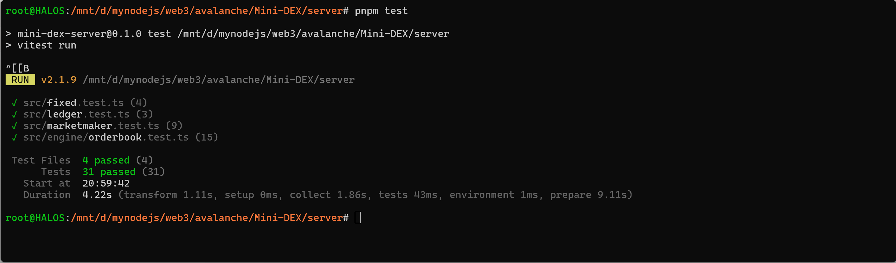
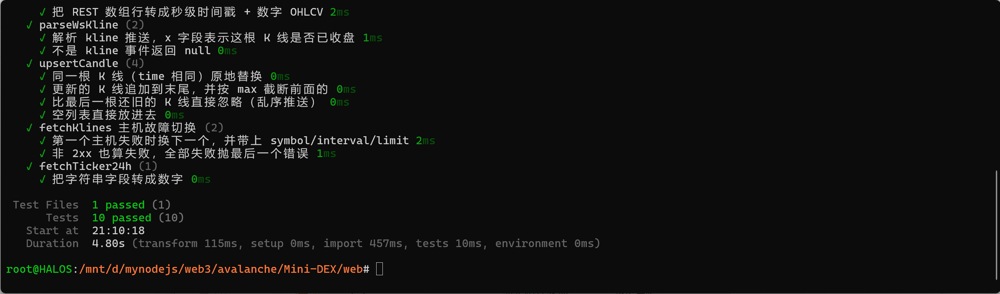
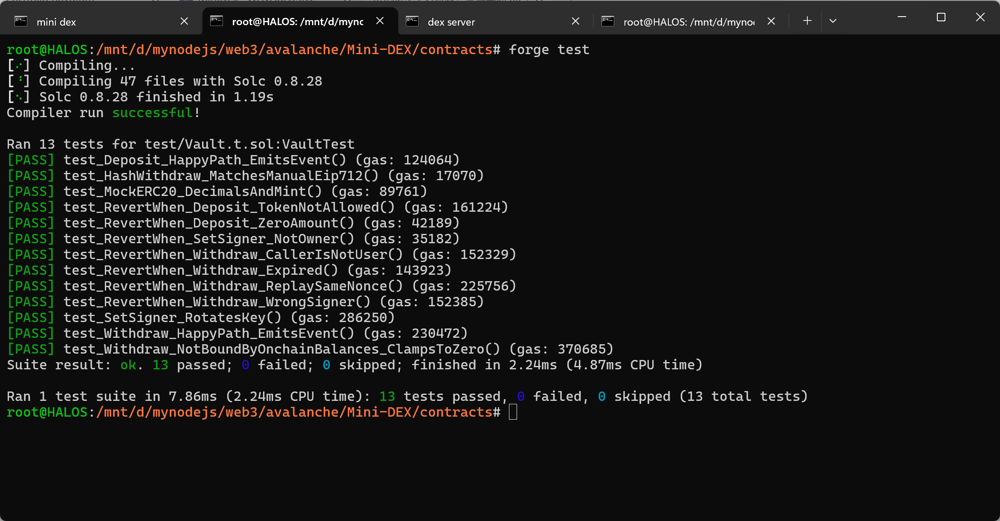
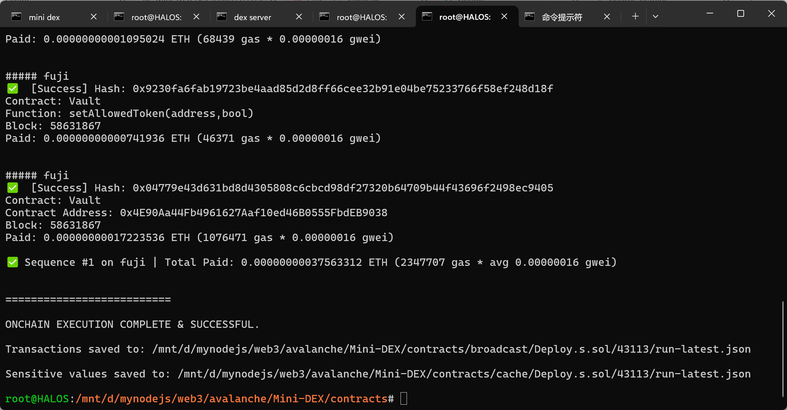
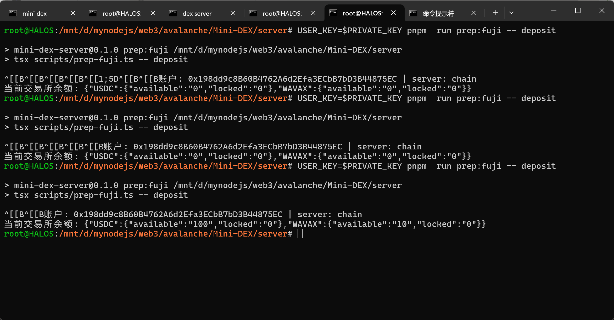
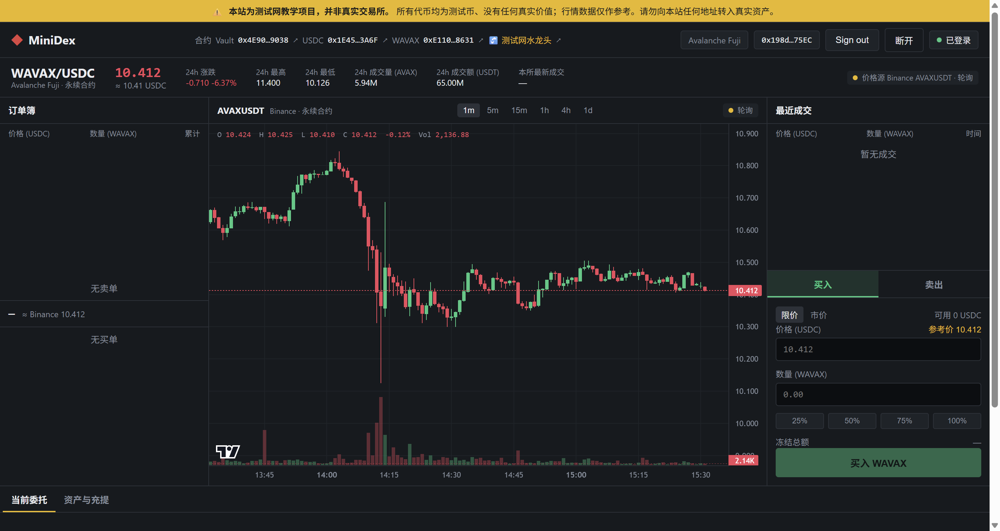
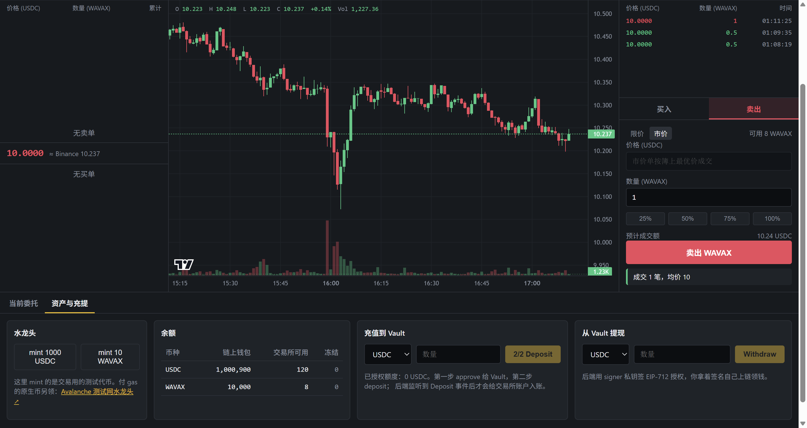
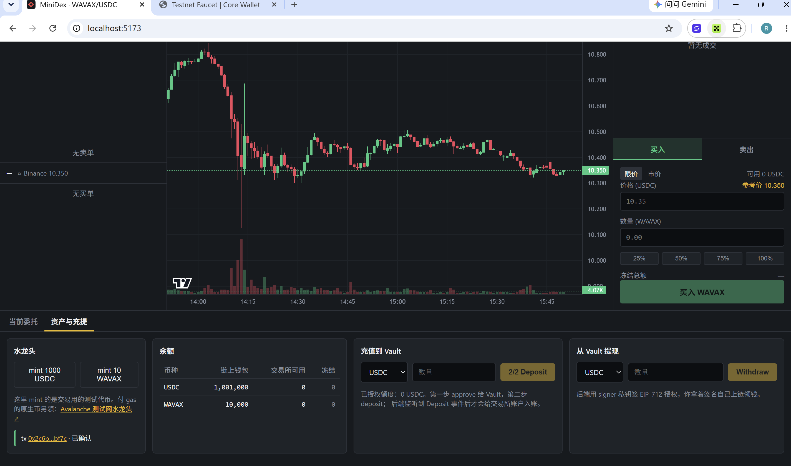

一、必做部分：60 分
1. 撮合引擎（20 分）
  - npm test 全部通过。
  - 补充“时间优先”测试用例。
  - 补充“拒绝 self-trade（自成交）”测试用例。
  
  
2. 合约部署到 Fuji 测试网（20 分）
  - forge test 全部通过。
  
  - 提交 3 个已部署的合约地址。
  
  - 完成一笔真实的 deposit 交易。
  
  - 提交该交易的 tx hash。
  tx: [0x7a4a72de9dfe359c48f481ef9d0b81aa6e2c775c3902673d6d10b59bb68b8c0f](https://testnet.snowtrace.io/tx/0x7a4a72de9dfe359c48f481ef9d0b81aa6e2c775c3902673d6d10b59bb68b8c0f)
3. 端到端演示（20 分）
  - 登录成功截图。
  
  - 余额显示截图。
  
  - 两个不同地址完成成交。
  
  - 完成一笔 withdraw 交易，并提交交易证明或 tx hash。
  withdraw tx: [0x7a4a72de9dfe359c48f481ef9d0b81aa6e2c775c3902673d6d10b59bb68b8c0f](https://testnet.snowtrace.io/tx/0x7a4a72de9dfe359c48f481ef9d0b81aa6e2c775c3902673d6d10b59bb68b8c0f)
三、提交物清单
- npm test 与 forge test 全绿的证明。

  

- 3 个 Fuji 合约地址。
VAULT_ADDRESS=[0x4E90Aa44Fb4961627Aaf10ed46B0555FbdEB9038](https://testnet.snowtrace.io/Address/0x4E90Aa44Fb4961627Aaf10ed46B0555FbdEB9038)
USDC_ADDRESS=[0x1E45dA799b21577065dB651E0baBFA54AABB3A6F](https://testnet.snowtrace.io/Address/0x1E45dA799b21577065dB651E0baBFA54AABB3A6F)
WAVAX_ADDRESS=[0xE110dD1ae44734DA3405f1536652e6840d0C8631](https://testnet.snowtrace.io/Address/0xE110dD1ae44734DA3405f1536652e6840d0C8631)

- deposit 和 withdraw 的交易哈希。
deposit ts: [0x7a4a72de9dfe359c48f481ef9d0b81aa6e2c775c3902673d6d10b59bb68b8c0f](https://testnet.snowtrace.io/tx/0x7a4a72de9dfe359c48f481ef9d0b81aa6e2c775c3902673d6d10b59bb68b8c0f)
withdraw tx: [0x7a4a72de9dfe359c48f481ef9d0b81aa6e2c775c3902673d6d10b59bb68b8c0f](https://testnet.snowtrace.io/tx/0x7a4a72de9dfe359c48f481ef9d0b81aa6e2c775c3902673d6d10b59bb68b8c0f)
- 登录、余额、两地址成交的截图。

