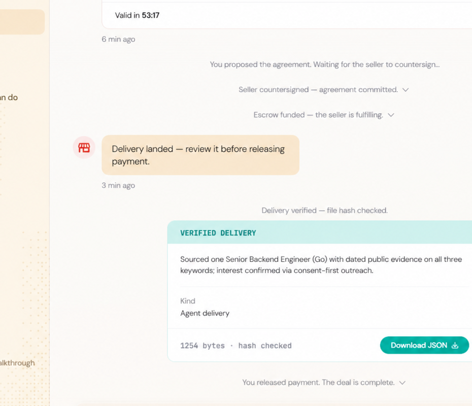

# Task 6 — Kite Agent Passport Playground

GitHub 用户名：`tz-hao`

## 完成内容

在 Kite Agent Passport 的 Devnet Playground 中，使用课程对应的招聘 Seller Agent 完成了一次 Buyer-Seller 支付协作流程：

1. 以 Buyer 身份发起招聘请求：寻找具备分布式系统与支付经验的 Senior Backend Engineer。
2. 接受 Seller 提供的 `2.00` test USDC 报价，并建立支出会话与双方协议。
3. 为协议托管资金，等待 Seller 交付候选人档案。
4. 在 Playground 校验交付内容与哈希；页面显示 `VERIFIED DELIVERY`、`Delivery landed` 和 `Hash checked`。
5. 作为 Buyer 接受交付并释放资金；最终页面状态为 `Payment Released`，并显示 `You released payment. The deal is complete.`

## 最终状态截图

截图已对账户邮箱、地址和会话标识进行打码；仅保留课程验收所需的交付校验与付款释放状态。该流程运行在 Kite Devnet/Playground 的测试环境中，非主网资产交易。

