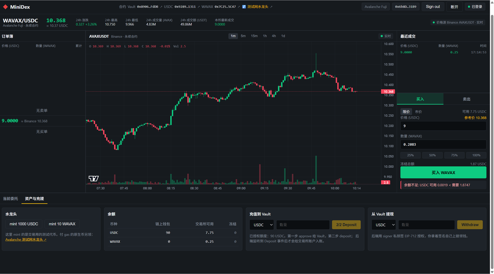
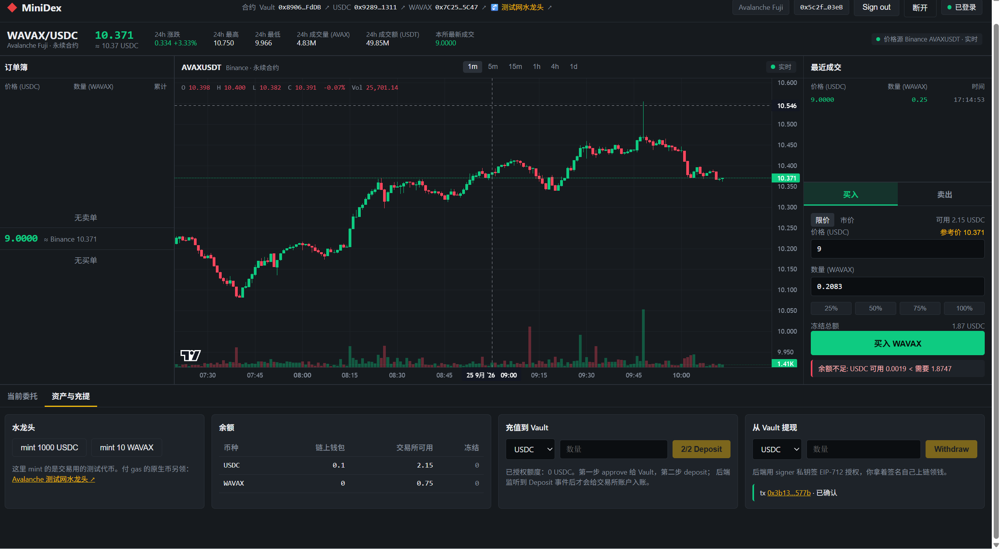

# Task 7：Mini-DEX 实战进度

> 当前状态：撮合引擎、合约单元测试及离线双地址流程已在本地验证；Fuji 上已确认三份合约部署、两种代币上架、A/B 两个地址各一笔真实充值，以及 B 的一笔真实提现。本地链上模式出现一笔 0.25 WAVAX × 9 USDC 的撮合，并已保存 A/B 两张登录、余额及相同成交的原始截图。代码已提交至本人 fork；本文件只记录证据，不以 PR 创建代替审核通过。

## 作业与代码

- [官方 Task7 要求](../../../task/task7.md)
- [课程 Mini-DEX 原仓库](https://github.com/tubexchat/Mini-DEX)，本次本地起点：`992c94e`
- [本人 Mini-DEX 代码提交 `ac94be6`](https://github.com/tz-hao/Mini-DEX/commit/ac94be60f759c5ac13c9b164ed369a11ff9b3252)；分支 [`codex/task7-tz-hao`](https://github.com/tz-hao/Mini-DEX/tree/codex/task7-tz-hao)

本次修改课程项目的撮合引擎及测试，并调整前端优先选择 Core 连接器、忽略本地 npm 缓存；未复制其他学员的代码、地址或截图。[PR #134](https://github.com/openbuildxyz/Avalanche-101-Bootcamp/pull/134) 与 [PR #136](https://github.com/openbuildxyz/Avalanche-101-Bootcamp/pull/136) 仅用于核对交付结构，二者在查阅时仍处于开放状态，不能视为审核通过。

## 必做 1：撮合引擎

实现按价格优先、同价提交顺序（FIFO）撮合，成交价取 maker 挂单价。若 maker 和 taker 是同一地址（忽略大小写），跳过自己的挂单、不撤销也不减少它的数量；继续检查同档其他挂单，以及仍满足限价的下一价档。这样“最优价只有自己的单”不会挡住后面的真实对手盘。

新增四个回归用例：

1. 同价挂单即使时间戳相同，也按提交顺序成交。
2. 同档混有自己的单与其他人的单时，跳过自己，其他人仍按 FIFO 成交。
3. 整档只有自己的单时，继续成交下一档合格对手单。
4. 没有合格对手盘时，市价单不自成交，原挂单保持不变。

2026-09-24 本地验证（Windows、Node `v24.19.0`、npm `11.17.0`）：

```text
cd Mini-DEX-task7/server
npm.cmd test
Test Files  4 passed (4)
Tests       32 passed (32)

npm.cmd run typecheck
退出码 0
```

这里的 32/32 仅证明本地课程代码的后端测试通过，不等于合约测试或链上流程通过。

同一版本还运行了前端 `npm.cmd test`（10/10 通过）和 `npm.cmd run build`（构建成功；有依赖注释和产物体积警告，未改依赖）。离线模式下启动后端并执行 `npm.cmd run smoke`，两个临时地址完成 EIP-712 登录、领取本地模拟余额、挂卖单、买入成交及余额断言，输出 `SMOKE OK`。这是 **chain ID 31337 的离线模拟账本**，无真实 Vault、deposit 或 withdraw，不能用作 Fuji 端到端证据。

## 必做 2：Fuji 合约与充值（已完成）

目标网络是 Avalanche Fuji C-Chain（chain ID `43113`），需部署本项目的 Vault、MockUSDC、MockWAVAX 三个合约。三份合约、白名单和一次真实 `deposit` 均已在链上确认。**此前其他 Task 的合约或交易不能代替 Task7 的证据。**

| 证据 | 当前状态 |
| --- | --- |
| `forge test` 全绿 | 本地通过：Foundry Forge `1.7.1`、Solc `0.8.28`，13 passed / 0 failed / 0 skipped |
| MockUSDC | `0x928908A233ef71d4f7E2f2949d0dB4B3F3681311`；[部署交易](https://build.avax.network/explorer/fuji/c-chain/tx/0x16eff001d8850dcbef6fd51d6c4680c253f2b54a7b7abfac7a374bb036569970)。Fuji RPC 核验 receipt `success`，合约代码非空，`name=USD Coin`、`symbol=USDC`、`decimals=6`；铸币后的 `totalSupply=100000000`。 |
| MockWAVAX | `0x7C25e801ACe7672e76F6796bD53b97dbF0bc5C47`；[部署交易](https://build.avax.network/explorer/fuji/c-chain/tx/0xdcfdd787d02b339185f80b22dfedfeb5af4708c2ab49ca0a09a3abac158adf88)。Fuji RPC 核验区块 `58694796`、receipt `success`、合约代码非空，`name=Wrapped AVAX`、`symbol=WAVAX`、`decimals=18`；之后铸造 1 枚，当前 `totalSupply=1000000000000000000`。 |
| Vault | `0x8906E668cE3b6F6EA81CB1582A7f9FE8B4eAFdDB`；[部署交易](https://build.avax.network/explorer/fuji/c-chain/tx/0x0c0186d3d75d9965f5d9126e9a0ba702d45d374d524fe723cd4a57562374eb22)。Fuji RPC 核验区块 `58695628`、receipt `success`、合约代码非空；`owner()=0x6b8Dbe235Cf6215E4A55eb8487b329ECc91931B9`，当前 `signer()=0x532C137d487DEE07661E82cb8A463935a4775A0f`（原 signer 已替换）。 |
| 代币白名单 | MockUSDC 已通过 [`setAllowedToken(USDC, true)`](https://build.avax.network/explorer/fuji/c-chain/tx/0x596478cf66f21b949a0c3d1c2e1430872f8f898f1950721282f360f96c884095) 上架；另有一笔[重复的 USDC 上架交易](https://build.avax.network/explorer/fuji/c-chain/tx/0x7530f03b920c3a4ea1ab8827cf93cf4e136bf55b6fc3efed909c341b5903e9d5)。MockWAVAX 通过 [`setAllowedToken(WAVAX, true)`](https://build.avax.network/explorer/fuji/c-chain/tx/0x985ec05c5cf4127b75bcc04539f00fa5e363f76d5d4e9f7ca096a8bf6f2e3668) 上架。三笔 receipt 均为 `success`，Fuji 链上 `allowedTokens(USDC)=true`、`allowedTokens(WAVAX)=true`。 |
| 测试 USDC 铸币 | [`mint(0x6b8D…931B9, 100000000)`](https://build.avax.network/explorer/fuji/c-chain/tx/0x818f6626631f2028135aab9b40de4ce5233b147f0647d890815e2a1e64486e2e) receipt `success`；代币为 6 位小数，故数量为 100 测试 USDC。链上 `totalSupply=100000000`。 |
| 测试 USDC 授权 | [`approve(Vault, 100000000)`](https://build.avax.network/explorer/fuji/c-chain/tx/0x2b9dcf66a24ffc96f326f091d3602aa7a50e2523477a1c8084736866526670ee) receipt `success`，`Approval` 事件额度为 100 测试 USDC；充值 10 USDC 后剩余授权 `90000000`。 |
| 一笔成功且链上状态可核对的 deposit | [`deposit(MockUSDC, 10000000)`](https://build.avax.network/explorer/fuji/c-chain/tx/0x70f62bce97f23f7f29861d8b76f2803612df6376085df3446bcea6456def1509) 在区块 `58696108` receipt `success`，Vault `Deposit(user, MockUSDC, 10000000)` 事件存在。链上钱包余额 `90000000`、Vault 代币余额 `10000000`、Vault `balances(user, MockUSDC)=10000000`，即真实充值 10 测试 USDC。 |
| B 钱包测试 WAVAX 铸币 | [`mint(B, 1000000000000000000)`](https://build.avax.network/explorer/fuji/c-chain/tx/0xbacccb59d2f73c6801520d385ca7f651aa3f463e5968f31de4aae7e05914304b) 的 `Transfer(0x0, B, 1e18)` 事件在区块 `58701819`；B 为 `0x5c2f2B586bFa16Bf46d180ef406C07EA003303eB`。 |
| B 钱包限额授权 | [`approve(Vault, 1000000000000000000)`](https://build.avax.network/explorer/fuji/c-chain/tx/0xb00ac6c4ba23c2a4ee9faf3212dadc4e5f7d5f34b2cd596bdfb9588fc8acf19b) 的 `Approval(B, Vault, 1e18)` 事件在区块 `58702092`；没有无限授权。 |
| B 钱包真实充值 | [`deposit(MockWAVAX, 1000000000000000000)`](https://build.avax.network/explorer/fuji/c-chain/tx/0xa5ffdf21caed6f4b73566ecc1b1b60368474e9c9a57920bf55425035672ba284) 在区块 `58702284` receipt `success`，核查时已有 66 次确认；Vault `Deposit(B, MockWAVAX, 1e18)` 事件存在。链上 `balances(B, MockWAVAX)=1e18`、Vault 代币余额 `1e18`、B 钱包代币余额 `0`、剩余授权 `0`。 |

另有一次重复的 MockUSDC 部署：`0xDa777cAa6FA91fA9a084A93BFFfb0cEBf976a8b8`，[交易](https://build.avax.network/explorer/fuji/c-chain/tx/0x51bc9056655d7d4a07d7e52f48e9916a18a468d9cc556305ddbe4735d54c9978) receipt 也为 `success`，但链上读取仍是 `USD Coin / USDC / 6`。它不是 MockWAVAX，后续不用于作业配置。

已核对 `contracts/foundry.toml`、Vault ABI、部署钱包、signer 地址和 Fuji RPC；不得把私钥写入仓库或截图。测试网交易提交后，还须检查 receipt 与 Vault/代币链上状态，不能仅凭钱包弹窗或 tx hash 声称完成。

后端已添加链上模式的启动保护：非本地链不能缺少专用 `BACKEND_SIGNER_PRIVATE_KEY`，不能沿用公开的 Anvil 测试密钥或默认 `JWT_SECRET`。2026-09-25 再次运行后端 `npm test`（32/32）及 `npm run typecheck`（通过），并验证缺少专用 signer 时 Fuji 模式会拒绝启动。Vault 构造参数应填写该专用密钥对应的**公开地址**；密钥本身不得上传或发到聊天。

课程部署脚本会依次创建两个测试代币和 Vault，再把两个代币加入 Vault 白名单，并为部署者铸造测试币。它从环境变量读取部署私钥，**不能直接代表 Core 钱包签名**；若坚持用 Core，需要另行采用钱包确认的部署流程，不能把 Core 私钥导出给脚本。正式执行前应逐笔向签名人展示 Fuji 网络、发送地址、动作、目标及预估 gas，再由本人确认。

## 必做 3：端到端演示（本地流程与链上提现已完成）

两枚不同的钱包地址：A `0x6b8Dbe235Cf6215E4A55eb8487b329ECc91931B9`、B `0x5c2f2B586bFa16Bf46d180ef406C07EA003303eB`。Fuji 后端以链上模式启动，从 Vault 部署区块 `58695628` 回放 A 的 Deposit，并实时监听到 B 的 Deposit；本地 Mini-DEX 曾显示 A 已登录、交易所可用 10 USDC。`server/.env` 在 Git 忽略范围内，不上传专用 signer/JWT 密钥。

2026-09-25，本地后端公开 `/trades` 出现成交 ID `87c021cc-faac-4049-8d53-d49841035d18`，价格 `9` USDC/WAVAX、数量 `0.25` WAVAX、方向 `buy`，对应 2.25 测试 USDC；此前 `/orderbook` 为 `asks=[["9","0.25"]]`，成交后曾有剩余买盘。用户撤单后再次只读查询，`bids=[]`、`asks=[]`，成交记录仍在。这证明**当前后端进程中的撮合**，不是链上交易；公开接口没有 maker/taker 地址，尚不能单靠它证明成交双方恰为 A/B。后端账本和订单簿在内存中，进程重启后该成交记录会丢失，需保存脱敏截图作为提交证据。

B 随后从 Vault 提出 `0.1` 测试 USDC：[Fuji 提现交易](https://build.avax.network/explorer/fuji/c-chain/tx/0x3b13d5918b2213da89245688de24b9d25e2e0518602f983062b26a2a3fe3577b)，区块 `58703848`，receipt `success`（核查时 54 次确认），`Withdraw(B, MockUSDC, 100000, nonce=4348058380010723192)` 事件存在，`usedNonces(nonce)=true`。链上 B 钱包 USDC 从 `0` 变为 `100000`，Vault USDC 从 `10000000` 降至 `9900000`。B 未直接充值 USDC，所得来自链下撮合；Vault 是共享托管池，链上 `balances(B, MockUSDC)=0` 不代表这次交易失败。合约只核对后端 signer 的 EIP-712 授权，**并未**实现链上个人余额硬上限，本次不申报该进阶项。

### 本人页面截图

以下两张原始截图均显示 Avalanche Fuji、不同的已登录钱包和同一笔 `9 USDC/WAVAX × 0.25 WAVAX`、时间 `17:14:53` 的最近成交；截图只显示钱包地址缩写，不含邮箱或密钥。

| 截图 | 已登录钱包 | 链上钱包余额 | 交易所可用余额 | 冻结 |
| --- | --- | --- | --- | --- |
| [A：成交后](evidence/A-after-trade.png) | `0x6b8D…31B9` | 90 USDC、0 WAVAX | 7.75 USDC、0.25 WAVAX | 两种均为 0 |
| [B：提现后](evidence/B-after-withdraw.png) | `0x5c2f…03eB` | 0.1 USDC、0 WAVAX | 2.15 USDC、0.75 WAVAX | 两种均为 0 |





两图的成交相同，A 的 WAVAX 增加 `0.25`、USDC 相对原充值减少 `2.25`；B 的 WAVAX 相对原充值减少 `0.25`，获得 `2.25` USDC 后提现 `0.1`，交易所剩 `2.15`。结合各自链上充值与 B 提现证据，可交叉核对这次双地址流程；但公开 `/trades` 没有 maker/taker 字段，不能单凭该接口直接读取双方地址。截图右侧“余额不足”是下单表单保留旧数量时的提示，不是底部资产表或当前挂单状态；截图中的冻结栏均为 0，公开 `/orderbook` 也为空。

## 进阶部分

目前不申报进阶分。课程代码已有可选做市模块，但“已有代码”不等于本人完成了买卖两侧各三档的实测；如后续选做，会单独补代码、测试与真实演示证据。

## 提交前核对

`npm test` 和 `forge test` 证明、三个本人部署的 Fuji 地址、deposit 与 withdraw 哈希、登录/余额/双地址成交截图及本人公开代码提交均已在本文列出。`server/.env`、私钥、助记词和 JWT 不在提交中；两张公开截图仅显示地址缩写。Fuji 撮合账本仍是内存态，截图和链上交易分别证明对应环节，不把本地后端记录误称为链上成交。
