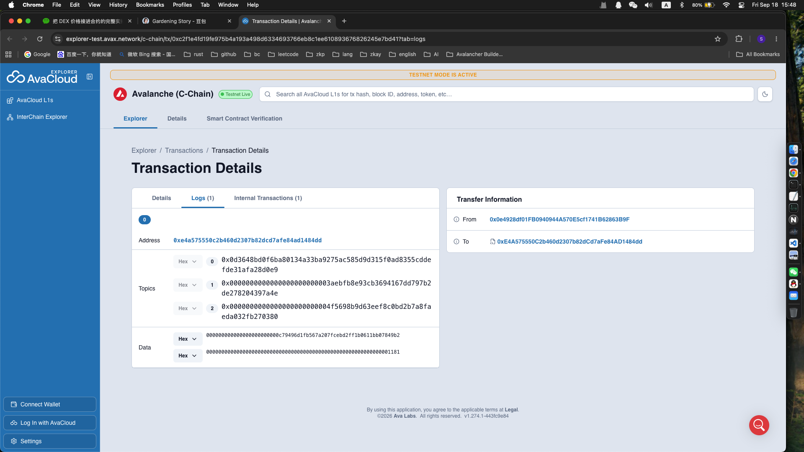
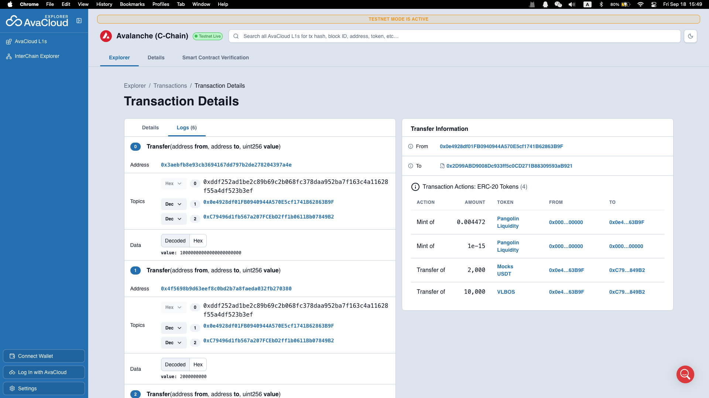
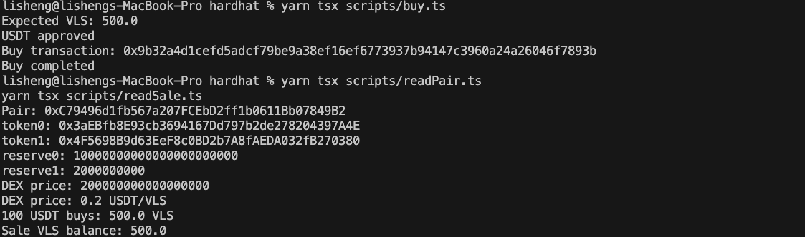

Task 3：使用 DEX Oracle 获取代币价格

对应课程：第三章 Solidity 合约实战

任务目标

学习如何通过测试网 DEX 的交易对获取代币价格，并将该价格应用到自己的智能合约业务中。

任务要求

1. 在 Avalanche 测试网选择一个 DEX。
2. 自行创建或添加一个 Token 交易对，并提供一定流动性。
3. 通过该交易对的 Oracle、Pair、Router 或 Quoter 等方式获取 Swap 价格。
4. 修改此前的代币合约，将原本手动填写或写死的价格改为使用 DEX 获取的价格。
5. 在合约的实际业务逻辑中使用该价格，例如：
  - 计算购买数量
  - 计算兑换数量
  - 计算支付金额
  - 作为代币出售或铸造的定价依据
6. 将修改后的合约部署到 Avalanche Fuji 测试网。
7. 提供能够证明价格来自 DEX、并被合约实际使用的材料。
  
# 我的提交内容

在 learn/vlbos/task3.md 中提交：

- 使用的 DEX 名称
    Pangolin V2
    The pair needs to be created through the Pangolin V2 factory.

    Your configured Fuji factory is:

    ```text
    0xE4A575550C2b460d2307b82dCd7aFe84AD1484dd
    ```

    and the Fuji router is:

    ```text
    0x2D99ABD9008Dc933ff5c0CD271B88309593aB921
    ```
- Token A 和 Token B 的名称及合约地址
VLS = SE2Token address  0x3aebfb8e93cb3694167dd797b2de278204397a4e
USDT = MockUSDT address 0x4f5698b9d63eef8c0bd2b7a8faeda032fb270380
- 交易对地址
    0xC79496d1fb567a207FCEbD2ff1b0611Bb07849B2
- 添加流动性或创建交易对的截图
**创建交易对**
 
**添加流动性**

- 获取 Swap/Oracle 价格的核心代码
```solidity
/*
     * Returns the DEX price of 1 VLS in USDT.
     *
     * Result uses 18 decimals.
     *
     * Example:
     *
     * 10,000 VLS
     * 2,000 USDT
     *
     * price = 0.2 USDT/VLS
     *
     * return = 200000000000000000
     */
    function getDEXPrice()
        public
        view
        returns (uint256)
    {
        (
            uint112 reserve0,
            uint112 reserve1,

        ) = pair.getReserves();

        require(
            reserve0 > 0 && reserve1 > 0,
            "empty pair"
        );

        address token0 = pair.token0();

        uint256 vlsReserve;
        uint256 usdtReserve;

        if (token0 == address(se2)) {
            vlsReserve = uint256(reserve0);
            usdtReserve = uint256(reserve1);
        } else {
            vlsReserve = uint256(reserve1);
            usdtReserve = uint256(reserve0);
        }

        /*
         * VLS = 18 decimals
         * USDT = 6 decimals
         *
         * Raw ratio:
         *
         * USDT raw / VLS raw
         *
         * Convert to an 18-decimal USDT/VLS price:
         *
         * reserveUSDT * 1e30 / reserveVLS
         */
        return
            (usdtReserve * 1e30)
            / vlsReserve;
    }
```

- 使用价格的合约核心代码
```solidity
function calculateSE2Amount(
        uint256 usdtAmount
    ) public view returns (uint256) {
        uint256 price = getDEXPrice();

        /*
         * Convert USDT from 6 decimals to 18 decimals.
         */
        uint256 usdt18 = usdtAmount * 1e12;

        /*
         * VLS amount = USDT value / VLS price.
         */
        return
            (usdt18 * PRICE_SCALE)
            / price;
    }

    /*
     * Buy VLS using MockUSDT.
     *
     * The amount of VLS is calculated from
     * the current Pangolin pair reserves.
     */
    function buySE2(
        uint256 usdtAmount
    ) external {
        require(
            usdtAmount > 0,
            "zero USDT amount"
        );

        uint256 se2Amount =
            calculateSE2Amount(usdtAmount);

        require(
            se2.balanceOf(address(this)) >= se2Amount,
            "insufficient VLS"
        );

        require(
            usdt.transferFrom(
                msg.sender,
                address(this),
                usdtAmount
            ),
            "USDT transfer failed"
        );

        require(
            se2.transfer(
                msg.sender,
                se2Amount
            ),
            "VLS transfer failed"
        );
    }
```
- 部署后的合约地址
``text
SE2_TOKEN_ADDRESS=0x3aebfb8e93cb3694167dd797b2de278204397a4e
MOCK_USDT_ADDRESS=0x4f5698b9d63eef8c0bd2b7a8faeda032fb270380
SE2_DEX_SALE_ADDRESS=0x1b7c0d22a12b755f95f833755b0146cd38fbabcf
PANGOLIN_VLS_USDT_PAIR=0xC79496d1fb567a207FCEbD2ff1b0611Bb07849B2
```

- 区块浏览器链接

**01-fuji-se2-deployed**
```text
SE2Token
https://explorer-test.avax.network/c-chain/tx/0x29f48a6f7ea2a59dcc573c3b936610fefdbe15fa779f56d289f64ee39b1af15f?tab=details
```
**fuji-usdt-deployed**

```text
MockUSDT
https://explorer-test.avax.network/c-chain/tx/0x3073bb222708232e5994c9a93a8f865b61c8f349ed8c67d001dedbaf5f1b4e60
```
**03-pangolin-pair**
Pangolin pair:

```text
VLS / USDT
https://explorer-test.avax.network/c-chain/tx/0xc2f1e4fd19fe975b4a193a498d6334693766eb8c1ee610893676826245e7bd41
```
**04-liquidity**

Liquidity transaction showing approximately:

```text
10,000 VLS
2,000 USDT
https://explorer-test.avax.network/c-chain/tx/0x1b3be32a01b538ff9095c70eaa2ac53000ead597a6826dea88fe612b7ab1a9fa?tab=logs
```


- 成功读取或使用价格的截图


- 对实现过程的简要说明
  
 Final architecture

```text
Avalanche Fuji C-Chain
        │
        ├── SE2Token
        │     VLS / 18 decimals
        │
        ├── MockUSDT
        │     USDT / 6 decimals
        │
        ├── Pangolin V2 Factory
        │       │
        │       └── VLS/USDT Pair
        │              │
        │              └── reserves
        │
        └── SE2DexSale
                │
                ├── getDEXPrice()
                ├── calculateSE2Amount()
                └── buySE2()
```

The important evidence chain for your assignment is:

```text
Pangolin Pair reserves
       ↓
getDEXPrice()
       ↓
calculateSE2Amount()
       ↓
buySE2()
       ↓
user receives VLS
```

合格标准

满足以下条件即可视为完成：

- 测试网上存在真实交易对，并且有可用流动性
- 价格来自 DEX 交易对或相关 Oracle 机制，而不是手动写入
- 获取到的价格被合约的实际业务逻辑使用
- 合约成功部署到 Avalanche Fuji 测试网
- 提交交易对地址、合约地址、代码或截图等可验证材料
  
注意事项

- 不允许仅在合约中写死一个固定价格。
- 不允许只在前端展示模拟价格而不在合约中使用。
- 请注意 Token decimals 对价格计算的影响。
- 如果交易对没有流动性，无法正常获取价格，需要先添加流动性。
- 可以自由选择 DEX 和具体实现方式。