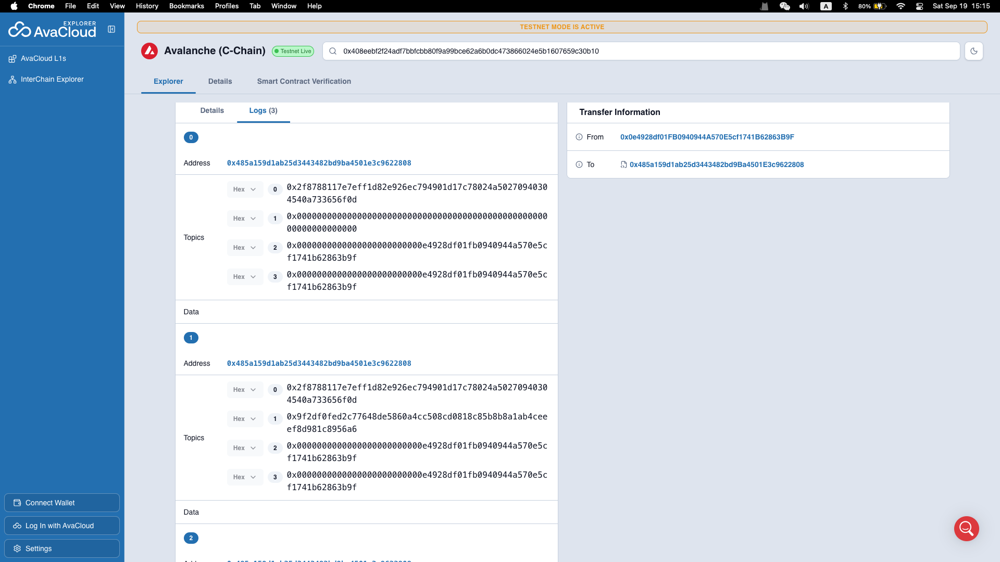
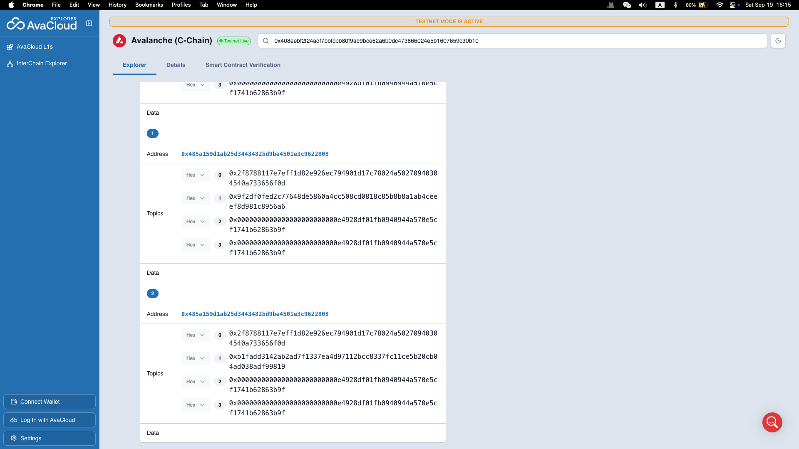
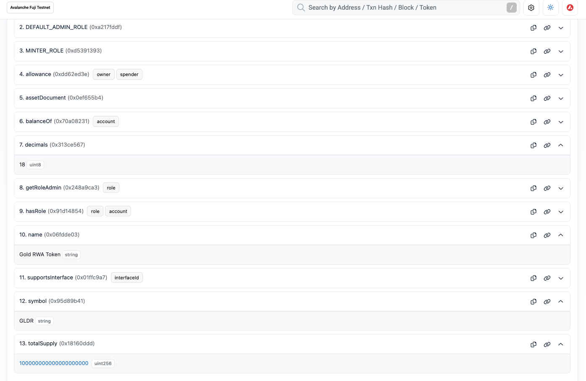
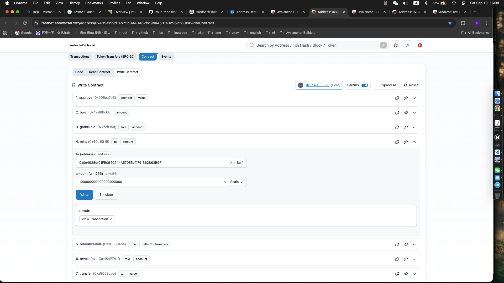
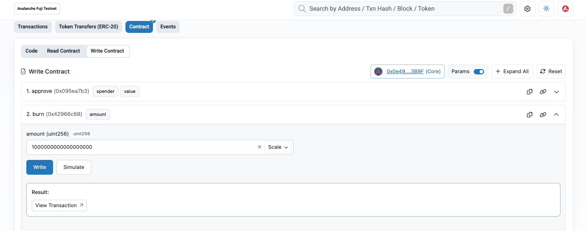

# Task 5 Avalanche RWA Token 合约实战

## 作业目标
结合本节课所学内容，选择一个现实世界资产或资产权益场景，在 Avalanche 测试网上发行一个简单的 RWA Token，完成从业务设计、合约编写到部署验证的完整流程。
本作业旨在帮助学员理解：
- 现实资产如何映射为链上 Token
- Token 的发行、转账和销毁
- 智能合约权限控制
- Avalanche 测试网部署流程
- RWA 项目中的资产证明和风险边界

**本作业仅用于技术学习和业务模拟，不涉及真实资产募集、投资建议或金融产品发行。**

## 任务要求
1. 选择一个 RWA 业务场景
学员可以从以下方向中任选一个，也可以自行设计：
- 房地产租金收益权
- 黄金或贵金属凭证
- 碳积分或碳排放额度
- 应收账款
- 艺术品份额
- 农产品仓单
- 设备租赁收益权
- 社区能源收益权
- 其他现实资产或资产权益

## 需要在作业文档中说明：
1. 该 Token 对应的现实资产是什么？
2. 谁负责资产托管或提供资产证明？
3. 一个 Token 对应多少现实资产或收益权？
4. Token 的发行、转让、销毁分别代表什么业务行为？
2. 编写 Token 合约
使用 Solidity 编写一个基于 ERC-20 标准的 Token 合约。

## 最低要求：
- 设置 Token 名称和符号
- 实现 Token 发行
- 实现 Token 销毁
- 支持 Token 转账
- 支持余额查询
- 支持总供应量查询
- 限制只有授权账户可以发行 Token
- 限制只有授权账户可以修改资产证明信息
- 为关键操作添加事件
建议使用 OpenZeppelin 合约库。

建议实现的功能包括：
``` bash
mint(address to, uint256 amount)
burn(uint256 amount)
updateAssetDocument(string calldata document)
assetDocument()
```

## 增加资产证明信息
合约中需要保存一项模拟的资产证明信息，例如：
- IPFS 文件链接
- 资产说明文档 URI
- 资产报告哈希
- 线下凭证编号
- 资产登记信息摘要
该信息不要求连接真实资产系统，但需要说明它在真实 RWA 项目中可能承担的作用。

## 部署到 Avalanche 测试网
将合约部署到 Avalanche Fuji Testnet，并提供：
- 合约地址
- 部署交易链接
- 区块浏览器链接
- 合约交互或测试截图
- 测试网网络名称和 Chain ID

##  编写测试
至少测试以下场景：
- 合约部署成功
- 初始 Token 信息正确
- 授权账户可以发行 Token
- 非授权账户不能发行 Token
- 持有人可以转账
- Token 可以被销毁
- 总供应量和账户余额变化正确
- 非授权账户不能修改资产证明信息
- 错误操作能够被合约拒绝

## 提交方式
1. Fork 课程仓库并 Clone 到本地。
2. 在 learn/ 下创建自己的目录：
learn/YourGitHubName/
3. 在自己的目录下创建：
learn/YourGitHubName/task5/
4. 将 README.md、截图和其他必要材料放入 task5 文件夹。
5. 在 README 中提供自己的代码仓库地址和相关的合约地址。
6. 不要修改其他学员的目录或公共任务说明。
7. 提交 Pull Request。
8. 等待助教审核。

## README.md 必须包含的内容
1. 学员信息
- GitHub 用户名
- 作业项目的仓库地址
2. 项目说明
- RWA 业务场景
- 现实资产或资产权益介绍
3. 合约信息
- 智能合约代码仓库地址
- 合约部署地址
4. 功能说明
说明合约实现了哪些功能，例如：
- Token 发行
- Token 销毁
- Token 转账
- 余额查询
- 总供应量查询
- 发行权限控制
- 资产证明信息更新
5. 截图材料
**至少提供以下截图：**
- 合约部署成功截图
- 测试网区块浏览器中的合约或交易截图
- Token 发行截图
- Token 转账截图
- Token 销毁截图

## 截止时间

<9月20日> 24:00:00 (UTC+8)


## 我的提交
1. 学员信息
- GitHub 
    vlbos
- 作业项目的仓库地址   https://github.com/vlbos/Avalanche-101-Bootcamp/tree/main/learn/vlbos/task5

2. 项目说明
- RWA 业务场景
本项目选择“黄金凭证”作为 RWA 模拟场景。
Gold RWA Token（GLDR）用于模拟现实世界黄金资产权益的链上 Token 化。
本项目仅用于 Solidity、ERC-20、权限控制和 Avalanche Fuji Testnet 技术学习。
GLDR 不代表真实黄金所有权，不代表真实黄金储备，也不构成投资建议、证券或金融产品。
- 现实资产或资产权益介绍

本项目模拟的现实资产为黄金。
为了便于演示，定义：
> 1 GLDR 模拟对应 1 克黄金权益。
该对应关系仅为教学模拟，不代表项目方实际持有或托管黄金。

**资产证明**
合约保存一个 `assetDocument` 字段，用于模拟资产证明文件。
示例：
`ipfs://QmExampleGoldReserveReport2026`

在真实 RWA 项目中，该文档可以对应：
* 黄金储备证明
* 第三方审计报告
* 资产登记文件
* 托管机构证明
* 资产估值报告
链上仅保存文档 URI，具体资产证明内容仍然位于链下系统。

 **资产托管与证明**
本作业没有连接真实黄金托管机构。
`ASSET_MANAGER_ROLE` 在本项目中模拟资产管理和资产证明信息维护方。
真实 RWA 项目需要由具有相应资质的托管机构、资产管理机构或其他可信主体负责资产保管和证明。

3. 合约信息
- 智能合约代码仓库地址   
https://github.com/vlbos/mycode/blob/dev/myrwa/packages/hardhat/contracts/GoldRWAToken.sol
- 合约部署地址  
0x485a159d1ab25d3443482bd9ba4501e3c9622808
4. 功能说明

**Token 信息**

| 项目         | 内容                     |
| ---------- | ---------------------- |
| Token Name | Gold RWA Token         |
| Symbol     | GLDR                   |
| Decimals   | 18                     |
| Asset      | 模拟黄金权益                 |
| Network    | Avalanche Fuji Testnet |
| Chain ID   | 43113                  |

**Token 与现实资产的映射**
本项目采用以下模拟映射：

```text
现实世界黄金权益
        ↓
资产证明文件
        ↓
授权发行
        ↓
GLDR Token
        ↓
链上转账
        ↓
Token 销毁
```
合约：`contracts/GoldRWAToken.sol`

合约实现了功能：
- Token 发行
授权账户调用 `mint()`，模拟经过资产证明后将黄金权益映射为 GLDR Token。
- Token 销毁
Token 持有人销毁 GLDR，模拟链上权益的注销。
- Token 转账
Token 持有人之间转移 GLDR，模拟链上黄金权益的转移。
- 余额查询
    balanceOf 查询
- 总供应量查询
    totalSupply 查询
- 发行权限控制
合约使用 OpenZeppelin `AccessControl`。
DEFAULT_ADMIN_ROLE负责管理角色权限。
MINTER_ROLE 只有拥有该角色的账户可以调用：

```solidity
mint()
```
- 资产证明信息更新
只有拥有该角色的账户可以调用：

```solidity
updateAssetDocument()
```

普通账户无法执行这些管理操作。
当前资产证明信息：
```text
ipfs://QmExampleGoldReserveReport2026
```
该信息仅用于教学模拟。
真实 RWA 项目中，可以使用 IPFS、链下数据库或其他存证系统保存资产证明文件，并在智能合约中保存对应 URI 或文件哈希。

5. 截图材料

- 合约部署成功截图
  
https://explorer-test.avax.network/c-chain/tx/0x408eebf2f24adf7bbfcbb80f9a99bce62a6b0dc473866024e5b1607659c30b10?tab=logs
- 测试网区块浏览器中的合约或交易截图
  !
- Token 发行截图

https://testnet.snowscan.xyz/tx/0x638715d479f31271ff036a6fe71189554a5e35f39f2f4fa3f44fbf04a97aba67#eventlog
- Token 转账截图
[alt text](transfer.png)
https://testnet.snowscan.xyz/tx/0xfd464c2610cb28de7bdb2b7adec8bb39c36933553bb52be2b6ebef589f210e98#eventlog
- Token 销毁截图
 
https://testnet.snowscan.xyz/tx/0xc2c26e2e0e08ebdafe19c572c687926e46a8a5c97757fc6a941b04ef87f247e7#eventlog
