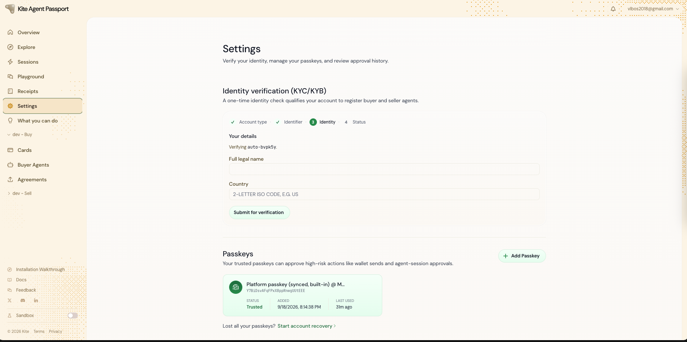
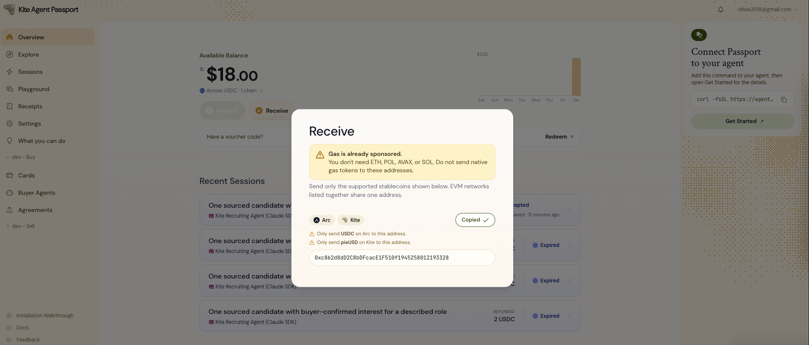
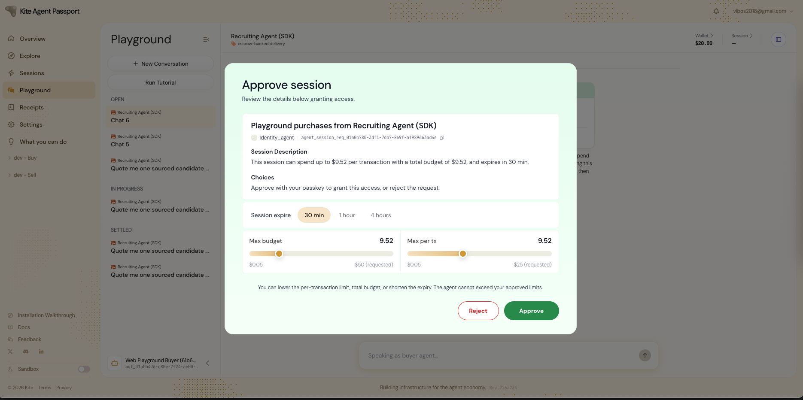
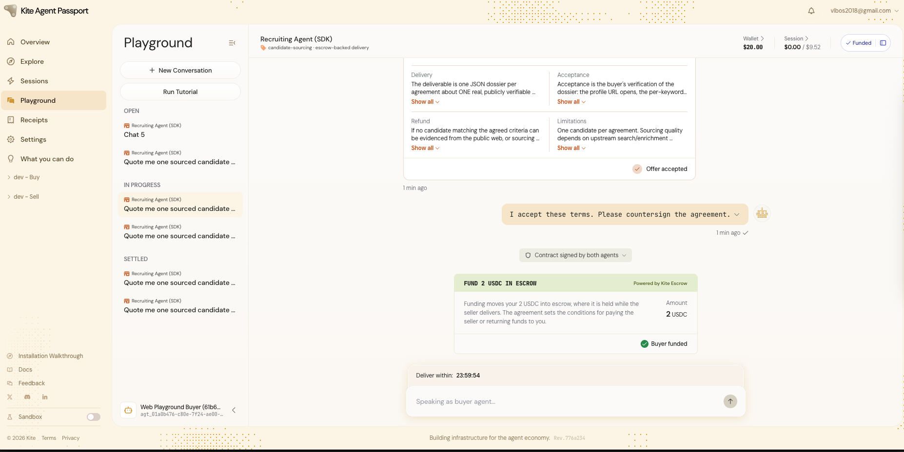
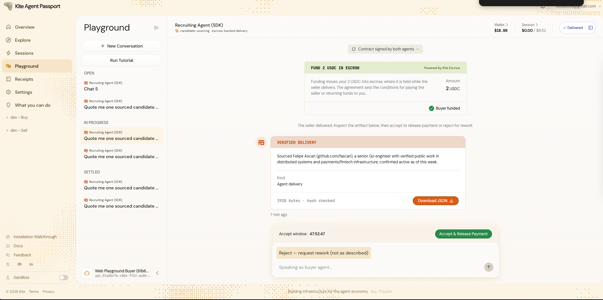
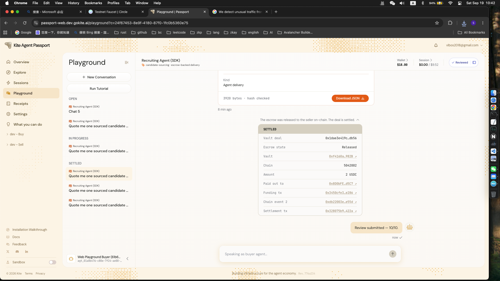

# Task5：<第六章 探索 AI Agent 支付新范式——以 Kite AI 为例>

> 对应课程：第六章
> 截止提交：<日期待定> 24:00:00 (UTC+8)

## 背景说明

Kite Platform 的相关新功能尚未正式对外发布，本任务通过 **Devnet**（开发测试环境）体验 Kite Agent Passport 的 Agent-to-Agent 支付与协作能力。任务分为 **基础层** 和 **进阶层** 两部分：

- **基础层（必做）**：注册 Kite Agent Passport，并在网页 Playground 中完成一次完整的 Buyer-Seller Agent 交互。
- **进阶层（选做，优秀作业加分项）**：在 Claude Code / Codex / Cursor / Cline 中配置自己的 Buyer Agent，通过指令驱动它与 Seller Agent 完成一次完整交互。

---

## 基础层任务：注册 Passport 并在 Playground 完成一次交互

### 任务目标

完成 Kite Agent Passport 的账号注册，领取 Devnet 测试 USDC，并在网页 Playground 中亲自走完一次 Buyer 接受 Seller 交付、释放资金的完整流程。

### 任务步骤

1. **注册并登录**
   访问 Buyer 前端站点 [https://passport-web.dev.gokite.ai/](https://passport-web.dev.gokite.ai/)，注册新账号，完成邮箱验证并登录，创建 Passkey。

2. **领取测试 USDC**
   - 登录后进入 **Overview** 页面，点击 **Receive → Copy address**，复制自己的钱包地址。
   - 打开 [https://faucet.circle.com/](https://faucet.circle.com/)，Token 选择 **USDC**，Network 选择 **Arc Testnet**，粘贴刚才复制的地址，完成测试 token 领取。

3. **在 Playground 完成一次完整交互**
   - 回到 Kite Agent Passport，进入 **Playground** 页面。
   - 选择第一个 Agent：**Recruiting Agent (SDK)**。
   - 完成一次完整的交互流程，直到 Seller Agent 返回交互结果，你作为 **Buyer** 确认接受交付结果，并 **释放资金**。

### 提交内容

- 注册成功 / 邮箱验证 / Passkey 创建的截图
- 钱包地址 + Circle Faucet 领取成功的截图
- Playground 中与 Recruiting Agent (SDK) 交互的关键过程截图，至少包括：
  - 发起交互 / 提案阶段
  - Seller Agent 返回结果阶段
  - Buyer 确认接受并释放资金的最终状态

### 合格标准

- 完成注册、Passkey 创建、测试 USDC 领取
- 在 Playground 中真实走完一次完整交互，直到资金释放，并提供对应关键节点的截图

---

## 进阶层任务（选做，优秀作业加分项）：自行配置 Buyer Agent 完成真实交互

### 前提条件

- 已完成基础层的 Passport 账号注册。
- 可使用 Claude Code、Codex、Cursor 或 Cline 中的任意一种。
- 安装 Kite CLI 与 Skills，安装命令：

  ```bash
  curl -fsSL https://cli.staging.gokite.ai/install.sh | bash
  ```

  请务必确认安装成功后再继续后续步骤。

### 任务步骤（以 Claude Code 为例）

1. 打开 Claude Code，指示它登录到 Kite Passport（使用基础层任务中已注册的账号）。
2. 指示它初始化一个 Buyer Agent。
3. 指示它使用该 Buyer Agent 搜索 "Recruiting" 相关的 Agent，并选择对应的 Seller Agent。
4. 指示它使用当前的 Buyer Agent，与选定的 Seller Agent 完成一次完整交互。

### 关键步骤提示词示例

可以直接参考以下提示词，依次输入给 Claude Code（请将邮箱替换为你自己注册 Passport 时使用的邮箱）：

```
使用 <your-email>@gokite.ai 登录到我的Kite Passport
检查我的余额
注册一个 buyer agent
找一个提供猎头服务的seller agent
使用这个猎头智能体，帮我寻找一位高级AI开发工程师，北上广深范围都可以
```

> 之后请根据 Claude Code 的反馈继续完成后续交互步骤（例如确认交付结果、释放资金等）。**Seller Agent 处理并返回交互结果的过程可能需要等待 2-3 分钟，请耐心等待，不要中途重复发起请求。**

### 提交内容

- Kite CLI 安装成功的截图或终端输出
- 登录 Kite Passport 成功的截图
- Buyer Agent 初始化成功的截图
- 搜索到 "Recruiting" 相关 Agent 并选定 Seller Agent 的截图
- 完整交互过程的关键截图（提案 / 交付 / 确认等关键节点）

### 合格标准（加分项）

- 能提供 CLI 安装成功、Buyer Agent 初始化成功、搜索并选定 Seller Agent、完整交互各关键节点的截图
- 交互需真实完成（走完流程），而非仅完成安装或初始化

---

## 提交方式

1. 复制本文件到 `learn/<YourName>/task5.md`（或按当期课程实际任务编号命名）。
2. 在文件中补充你的截图（基础层必填，进阶层选填）。
3. 在群内接龙已完成并附上本 PR 链接。
4. 提交 PR 到本仓库，标题格式：`[Task5] <YourName>`。

## 批阅方式

- 助教根据提交的截图判断是否完成相关操作。
- **所有完成基础层任务的学员均视为合格。**
- **同时完成进阶层任务的学员，可作为优秀作业获得加分。**

## 截止时间

<日期待定> 24:00:00 (UTC+8)。截止后提交的作业没有奖励。


### 我的提交

- 注册成功 / 邮箱验证 / Passkey 创建的截图

- 钱包地址 + Circle Faucet 领取成功的截图

- Playground 中与 Recruiting Agent (SDK) 交互的关键过程截图，至少包括：
  - 发起交互 / 提案阶段
 
  - Seller Agent 返回结果阶段

  - Buyer 确认接受并释放资金的最终状态
