先完成 3 个必做题，拿满基础 60 分；这是及格线。
一、必做部分：60 分
1. 撮合引擎（20 分）
  - npm test 全部通过。
  - 补充“时间优先”测试用例。
  - 补充“拒绝 self-trade（自成交）”测试用例。
2. 合约部署到 Fuji 测试网（20 分）
  - forge test 全部通过。
  - 提交 3 个已部署的合约地址。
  - 完成一笔真实的 deposit 交易。
  - 提交该交易的 tx hash。
3. 端到端演示（20 分）
  - 登录成功截图。
  - 余额显示截图。
  - 两个不同地址完成成交。
  - 完成一笔 withdraw 交易，并提交交易证明或 tx hash。
二、进阶部分：任选，最多 40 分
- 链上余额设置硬上限：8 分。
- 数据持久化到 SQLite/Postgres，重启后不丢失：10 分。
- WebSocket 私有 orders 频道：8 分。
- 支持 IOC / FOK 订单：8 分。
- 实现做市机器人，买卖两侧各挂 3 档：10 分。
- 提交 AI 安全审查报告，并修复一个真实问题：8 分。
三、最终提交物清单
- 代码仓库或提交记录。
- npm test 与 forge test 全绿的证明。
- 3 个 Fuji 合约地址。
- deposit 和 withdraw 的交易哈希。
- 登录、余额、两地址成交的截图。
- 所选进阶功能的代码、测试或演示证明。
四、推荐完成顺序
1. 跑现有的 npm test 和 forge test，记录失败项。
2. 先完成撮合引擎及两个新增测试。
3. 修复并部署合约到 Fuji，保存地址和 deposit tx hash。
4. 完成前端端到端演示及 withdraw tx hash。
5. 时间充足后再选进阶项；优先选最接近现有代码的功能。
五、提供的资源
- 课程仓库：Mini-DEX
- Avalanche 文档：build.avax.network/docs
- Fuji 水龙头：Core Testnet Faucet
- Fuji 浏览器：testnet.snowtrace.io
- Foundry：book.getfoundry.sh
- wagmi：wagmi.sh
- viem：viem.sh
- MetaMask 开发文档：docs.metamask.io/wallet
- Primit：primit.io

## 我的提交
- 代码仓库或提交记录。
https://github.com/vlbos/Mini-DEX
- npm test 与 forge test 全绿的证明。
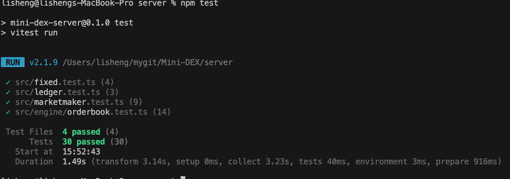 
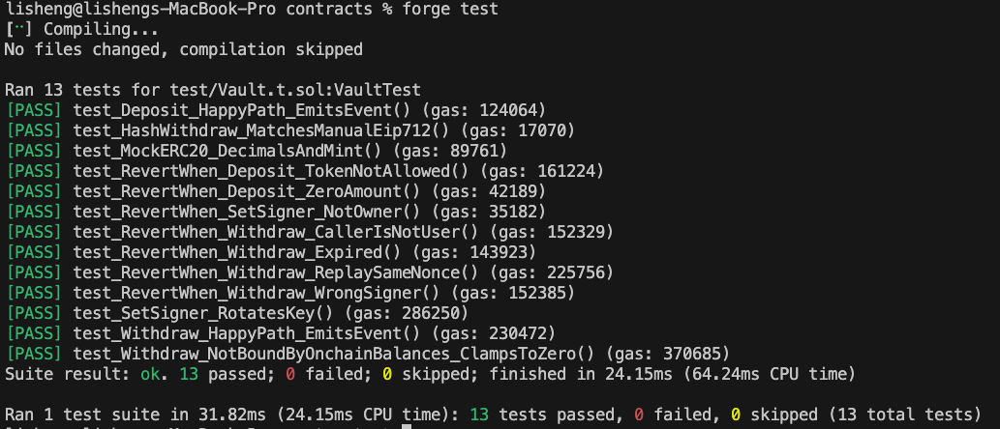
- 3 个 Fuji 合约地址。
VAULT_ADDRESS=0xB1CE41b1aB693Bb75e08Bf85E28242344B37ea4f
USDC_ADDRESS=0xf6E14859b7DDBE3AD01CB2254b3b2ca4685FcB10
WAVAX_ADDRESS=0x8f21ef8275671e357bA30aE059957530Ff5Ce7ca
- deposit 和 withdraw 的交易哈希。
**deposit**
https://testnet.snowtrace.io/tx/0xca53024dec6d3d3e1593e9f4a7db48a984bb0e504145ce3e930c6e21752ad305
**withdraw**
https://testnet.snowtrace.io/tx/0x43e2d320ef357286fb61e42fcdded77ca6e71472082feb8b7f51055e49c15b83
- 登录、余额、两地址成交的截图。
 
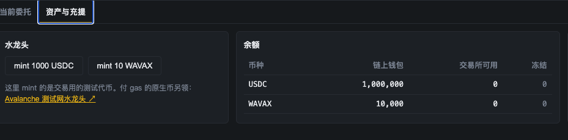 
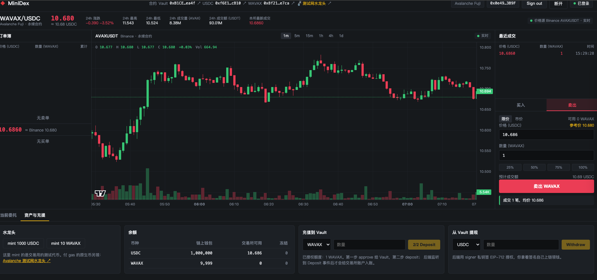  
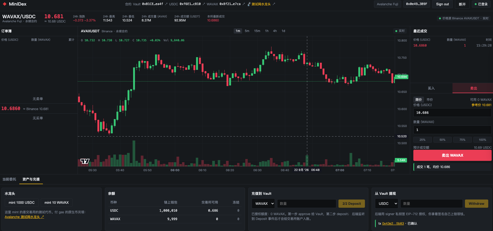

- 所选进阶功能的代码、测试或演示证明。

    - 链上余额设置硬上限。
    
    **commit hash** https://github.com/vlbos/Mini-DEX/commit/3c6e0d2ff84a1df82ad3c5648afb00bb21590a15  
    **实现代码** https://github.com/vlbos/Mini-DEX/blob/3c6e0d2ff84a1df82ad3c5648afb00bb21590a15/contracts/src/Vault.sol
    **测试代码** https://github.com/vlbos/Mini-DEX/blob/3c6e0d2ff84a1df82ad3c5648afb00bb21590a15/contracts/test/Vault.t.sol
    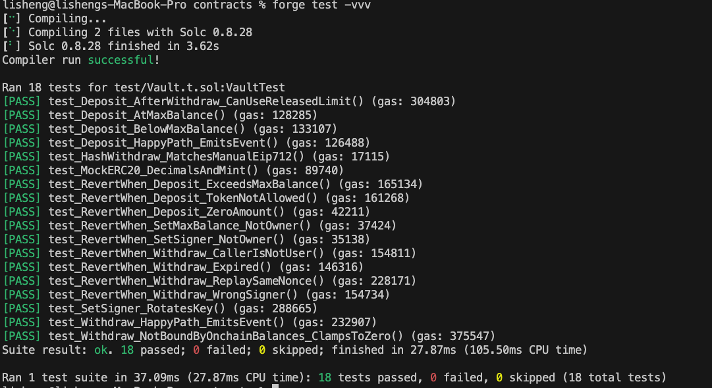

    - 数据持久化到 SQLite/Postgres，重启后不丢失。

    **commit hash** https://github.com/vlbos/Mini-DEX/commit/28fc96c9e348b18ee954e3124312133a0b94fd1c
    **实现代码** 
        * https://github.com/vlbos/Mini-DEX/blob/28fc96c9e348b18ee954e3124312133a0b94fd1c/server/src/db/database.ts
        * https://github.com/vlbos/Mini-DEX/blob/28fc96c9e348b18ee954e3124312133a0b94fd1c/server/src/db/ledgerRepository.ts
        * https://github.com/vlbos/Mini-DEX/blob/28fc96c9e348b18ee954e3124312133a0b94fd1c/server/src/db/orderRepository.ts
        * https://github.com/vlbos/Mini-DEX/blob/28fc96c9e348b18ee954e3124312133a0b94fd1c/server/src/db/tradeRepository.ts
    **修改代码**
        * https://github.com/vlbos/Mini-DEX/blob/28fc96c9e348b18ee954e3124312133a0b94fd1c/server/src/engine/orderbook.ts
        * https://github.com/vlbos/Mini-DEX/blob/28fc96c9e348b18ee954e3124312133a0b94fd1c/server/src/ledger.ts

    **测试代码** https://github.com/vlbos/Mini-DEX/blob/28fc96c9e348b18ee954e3124312133a0b94fd1c/server/test/persistence.test.ts
    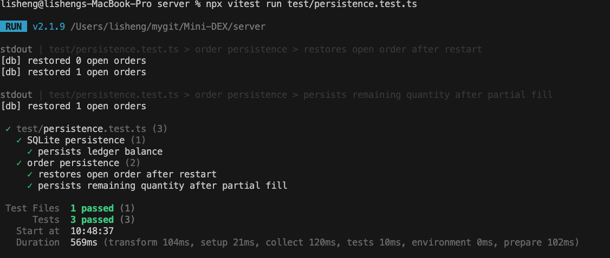

    - WebSocket 私有 orders 频道。
    **commit hash** https://github.com/vlbos/Mini-DEX/commit/954a5848a220a2456088898194e8b252bd3c1998
    **实现代码** 
       * https://github.com/vlbos/Mini-DEX/blob/954a5848a220a2456088898194e8b252bd3c1998/server/src/ws.ts
       * https://github.com/vlbos/Mini-DEX/blob/954a5848a220a2456088898194e8b252bd3c1998/server/src/routes.ts
       * https://github.com/vlbos/Mini-DEX/blob/954a5848a220a2456088898194e8b252bd3c1998/server/src/matchingService.ts
       * https://github.com/vlbos/Mini-DEX/blob/954a5848a220a2456088898194e8b252bd3c1998/server/src/index.ts

    **测试代码** 
    * https://github.com/vlbos/Mini-DEX/blob/954a5848a220a2456088898194e8b252bd3c1998/server/test/ws-private.test.ts
    * https://github.com/vlbos/Mini-DEX/blob/954a5848a220a2456088898194e8b252bd3c1998/server/test/matching-ws.integration.test.ts
    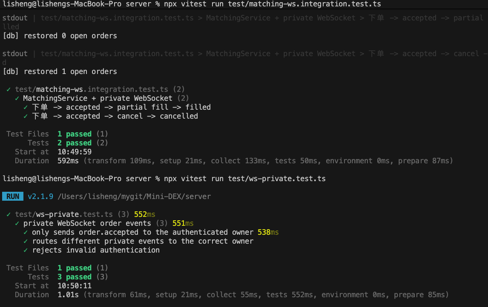

    - 支持 IOC / FOK 订单
    **commit hash** https://github.com/vlbos/Mini-DEX/commit/abe108e41a03e6ac3b70d3195336a416d331f3dc
    **实现代码** 
    * https://github.com/vlbos/Mini-DEX/blob/abe108e41a03e6ac3b70d3195336a416d331f3dc/server/src/matchingService.ts
    * https://github.com/vlbos/Mini-DEX/blob/abe108e41a03e6ac3b70d3195336a416d331f3dc/server/src/engine/orderbook.ts
    **测试代码** 
    * https://github.com/vlbos/Mini-DEX/blob/abe108e41a03e6ac3b70d3195336a416d331f3dc/server/test/matching-tif-funds.test.ts
    * https://github.com/vlbos/Mini-DEX/blob/abe108e41a03e6ac3b70d3195336a416d331f3dc/server/src/engine/orderbook.test.ts
    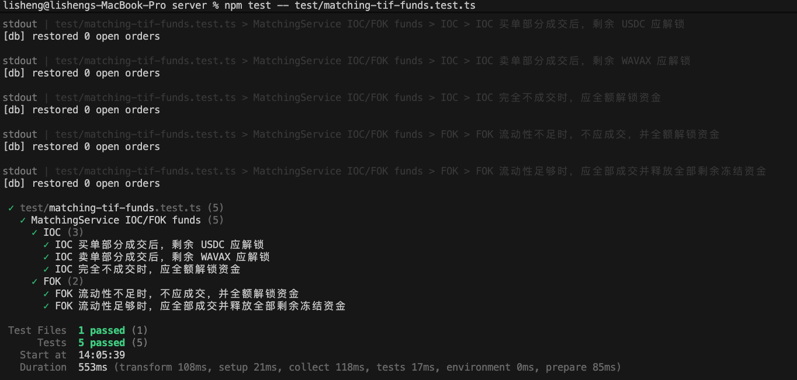

- 实现做市机器人，买卖两侧各挂 3 档
**commit hash** https://github.com/vlbos/Mini-DEX/commit/2ec12eaab92c6563a5fb1c065fa65e10e3bcb450

**实现代码** 
* https://github.com/vlbos/Mini-DEX/blob/2ec12eaab92c6563a5fb1c065fa65e10e3bcb450/server/src/marketmaker.ts
* https://github.com/vlbos/Mini-DEX/blob/2ec12eaab92c6563a5fb1c065fa65e10e3bcb450/server/src/index.ts

**测试代码** 
* https://github.com/vlbos/Mini-DEX/blob/2ec12eaab92c6563a5fb1c065fa65e10e3bcb450/server/src/marketmaker.test.ts

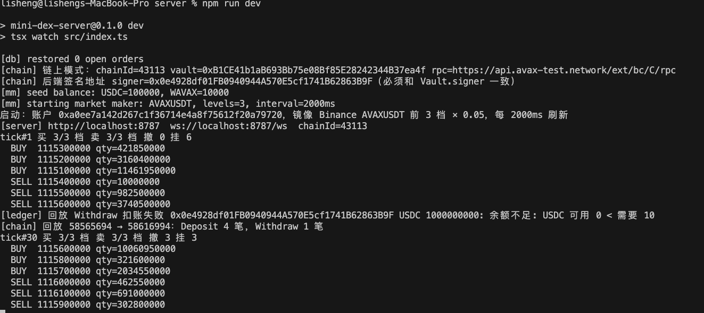 
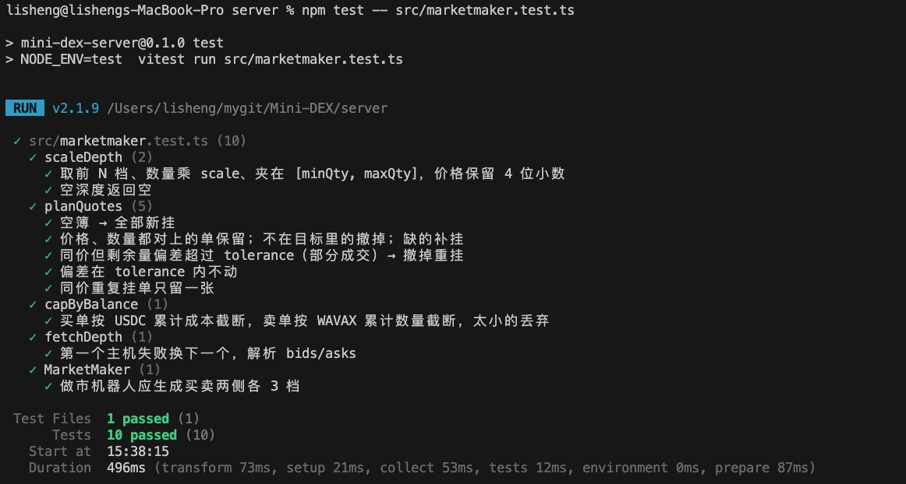 
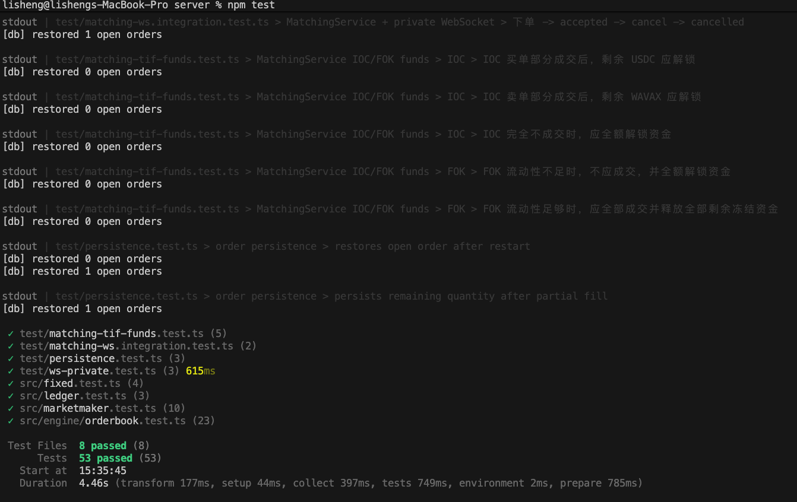