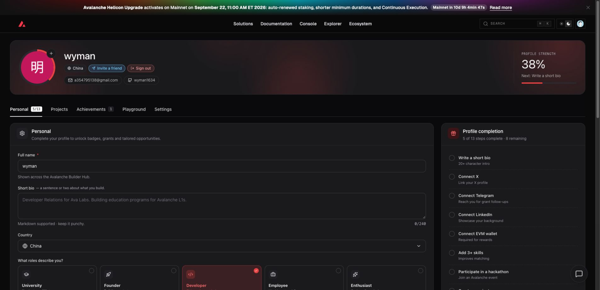
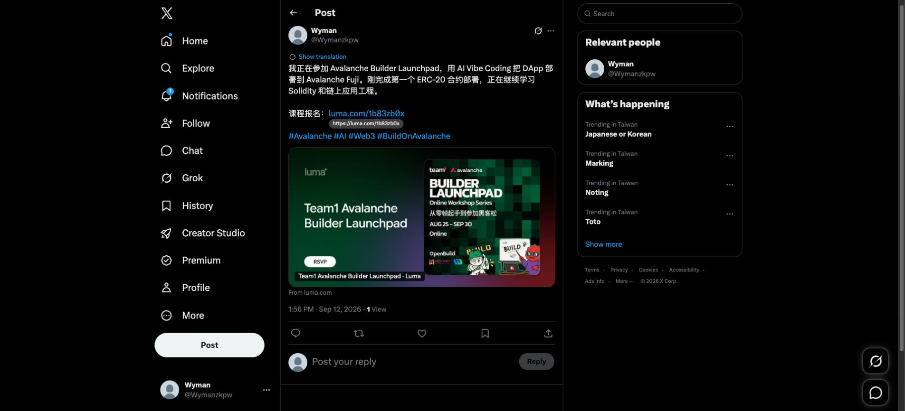

# Task 1：第一章 Avalanche 零基础入门知识

> 对应课程：第一章
> GitHub 用户名：`wyman1634`

## 任务一：注册 BuilderHub

已完成 [Avalanche Builder Hub](https://build.avax.network/?ref=ZETMV&utm_source=team1) 注册并登录。

- BuilderHub 显示名：`wyman`
- 已连接 GitHub：`wyman1634`
- 所在地区：China
- 当前状态：已登录，个人资料页可正常访问

## 任务二：转发课程报名链接

已将 [Avalanche Builder Launchpad 课程报名链接](https://luma.com/1b83zb0x) 分享至 X。

- X 账号：[@Wymanzkpw](https://x.com/Wymanzkpw)
- 分享帖子：[查看公开帖子](https://x.com/Wymanzkpw/status/2098651967325458858)
- 发布时间：2026-09-12

## 学习说明

本次注册和分享均已实际完成。Task 1 在官方奖励截止时间之后提交，因此仅作为课程完成记录，不主张逾期奖励。
