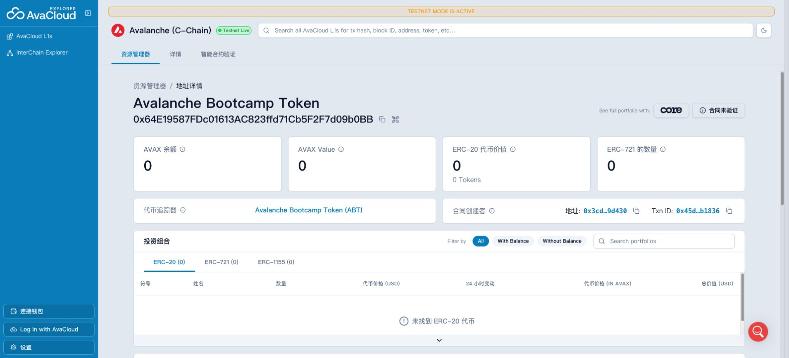

# Task 2：Vibe Coding 开发第一个 DApp

## 任务成果

使用 Scaffold-ETH 2、OpenZeppelin Contracts 5 和 Hardhat 3 构建 ERC-20 DApp，并部署到 Avalanche Fuji 测试网。

| 项目 | 内容 |
| --- | --- |
| 网络 | Avalanche Fuji Testnet（Chain ID `43113`） |
| 合约 | `AvalancheBootcampToken` |
| 代币 | Avalanche Bootcamp Token（`ABT`） |
| 初始供应量 | 1,000,000 ABT（18 位小数） |
| 合约地址 | `0x64E19587FDc01613AC823ffd71Cb5F2F7d09b0BB` |
| 部署交易 | [`0x45d684d9…b1836`](https://subnets-test.avax.network/c-chain/tx/0x45d684d9a1bf77e9558a25aa42c23dd7cdcc926e8df484bd5fe007579d8b1836) |
| 部署账户 | `0x3cd247C0ebAb3D4702dB33250dA14D91AE79d430` |
| 区块浏览器 | [Avalanche L1 Explorer](https://subnets-test.avax.network/c-chain/address/0x64E19587FDc01613AC823ffd71Cb5F2F7d09b0BB) |
| 完整源码 | [wyman1634/avalanche-erc20-dapp](https://github.com/wyman1634/avalanche-erc20-dapp) |

## 合约功能

- 部署时向部署账户铸造 1,000,000 ABT；
- 仅合约 owner 可以继续增发；
- 持币者可以销毁自己的代币；
- 支持标准 ERC-20 转账与授权；
- 前端可查看总供应量和钱包余额，并进行 owner 增发及持币转账。

## 自动化验证

```text
AvalancheBootcampToken
  ✔ assigns the metadata, ownership, and initial supply
  ✔ allows only the owner to mint
  ✔ transfers tokens between accounts
  ✔ allows holders to burn their tokens

4 passing
```

此外，`yarn lint`、`yarn next:check-types` 和 `yarn next:build` 均通过。

## 部署成功截图



## 链上核验

```text
contract code: present
name: Avalanche Bootcamp Token
symbol: ABT
decimals: 18
totalSupply: 1000000 ABT
owner: 0x3cd247C0ebAb3D4702dB33250dA14D91AE79d430
owner balance: 1000000 ABT
transaction status: success (0x1)
deployment block: 58327922
gas used: 702496
```

## 安全说明

没有使用 Scaffold-ETH 示例中的公开 Hardhat 私钥。部署使用独立 Fuji 测试账户，私钥由 Scaffold-ETH 加密保存在被 Git 忽略的 `.env` 中，加密口令只保存在本机钥匙串。
