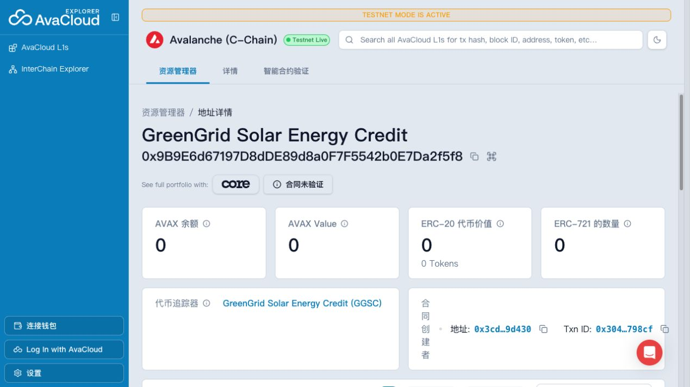
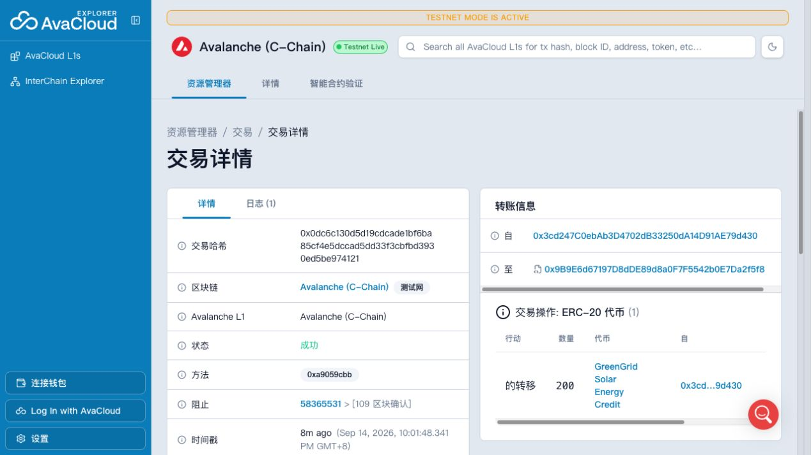
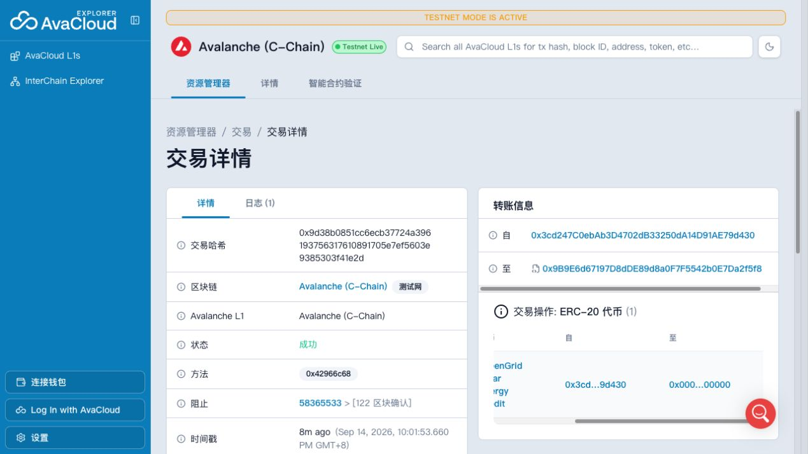

# Task 5 — GreenGrid Solar Energy Credit

## 学员信息

- GitHub 用户名：`wyman1634`
- 作业项目：[wyman1634/avalanche-erc20-dapp](https://github.com/wyman1634/avalanche-erc20-dapp)

## RWA 业务场景

本项目模拟社区太阳能电站的可再生能源凭证。`GreenGrid Solar Energy Credit`（`GGSC`）把经过计量和核验的发电量映射到 Avalanche Fuji 上：`1 GGSC` 对应 `1 kWh` 已核验的可再生电力，18 位小数允许表示不足 1 kWh 的份额。

模拟的 `GreenGrid Asset Registry` 负责保存电表记录和线下核验报告，并以 owner 身份把报告摘要写入合约的 `assetDocument`。本作业没有连接真实电表、托管人或法律登记系统，不构成真实资产发行或投资产品。

业务行为对应关系：

- 发行：授权账户确认新增发电量后 mint 等量 GGSC。
- 转让：持有人通过 ERC-20 transfer 转移可再生能源凭证所有权。
- 销毁：持有人使用环境权益后 burn 凭证，表示凭证已退休，不能再次转让或重复申领。
- 资产证明更新：owner 发布新的资产报告 URI 或哈希，合约同时发出历史可追踪的更新事件。

## 合约设计与风险边界

合约基于 OpenZeppelin Contracts 5 的 `ERC20`、`ERC20Burnable` 和 `Ownable`：

- 标准 ERC-20 转账、余额和总供应量查询；
- 初始供应量为零，只能在发电量通过核验后发行；
- 只有 owner 可以调用 `mint`；
- 每位持有人可以销毁自己的 Token；
- 只有 owner 可以调用 `updateAssetDocument`，空证明会被拒绝；
- `Transfer`、`CertificatesIssued` 和 `AssetDocumentUpdated` 事件记录关键操作。

技术合约不能独立证明线下报告真实。生产系统仍需独立审计/证明、多签或治理权限、文档长期可用性、法律协议，以及防止同一发电量被重复 Token 化的登记流程。当前 owner 密钥是明确的中心化信任边界。

## 合约与网络信息

- 网络：Avalanche Fuji Testnet
- Chain ID：`43113`
- 合约源码：[GreenGridEnergyToken.sol](https://github.com/wyman1634/avalanche-erc20-dapp/blob/feat/task5-rwa-token/packages/hardhat/contracts/GreenGridEnergyToken.sol)
- 合约地址：[`0x9b9e6d67197d8dde89d8a0f7f5542b0e7da2f5f8`](https://explorer-test.avax.network/c-chain/address/0x9b9e6d67197d8dde89d8a0f7f5542b0e7da2f5f8)
- 部署交易：[`0x3044…798cf`](https://explorer-test.avax.network/c-chain/tx/0x3044d3e41bc38072e068dddbacfe11025f3b1cfdb2dbe04aba8afe03c6b798cf)
- 区块浏览器：[Avalanche Fuji C-Chain Explorer](https://explorer-test.avax.network/c-chain)

## 测试

运行：

```bash
yarn hardhat:test
yarn hardhat:lint
yarn next:check-types
yarn next:lint
yarn next:build
```

新增的 7 组测试覆盖部署、Token 信息、零初始供应、授权发行、非授权发行失败、转账、销毁、余额与总供应量变化、资产证明更新权限、空证明，以及余额不足的错误路径。完整项目当前共有 17 个合约测试。

## Fuji 交互记录

- [Mint `1,000 GGSC`](https://explorer-test.avax.network/c-chain/tx/0xcfe4c58eb3329d1c53aa960d5a8421740e82699355b448e10114e897c4c2f01c)
- [Transfer `200 GGSC`](https://explorer-test.avax.network/c-chain/tx/0x0dc6c130d5d19cdcade1bf6ba85cf4e5dccad5dd33f3cbfbd3930ed5be974121)
- [Burn `100 GGSC`](https://explorer-test.avax.network/c-chain/tx/0x9d38b0851cc6ecb37724a396193756317610891705e7ef5603e9385303f41e2d)
- 最终状态：owner 持有 `700 GGSC`，演示接收地址持有 `200 GGSC`，总供应量为 `900 GGSC`。

## 截图

### 合约部署成功与区块浏览器



### Token 发行


### Token 转账



### Token 销毁


