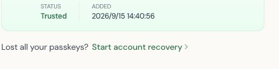
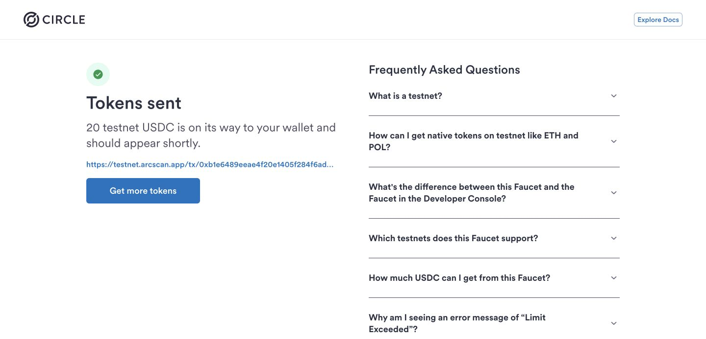
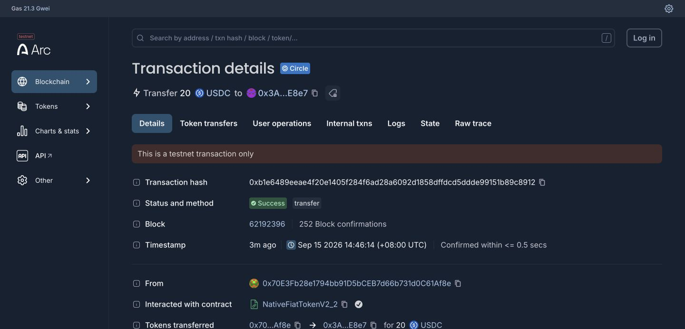
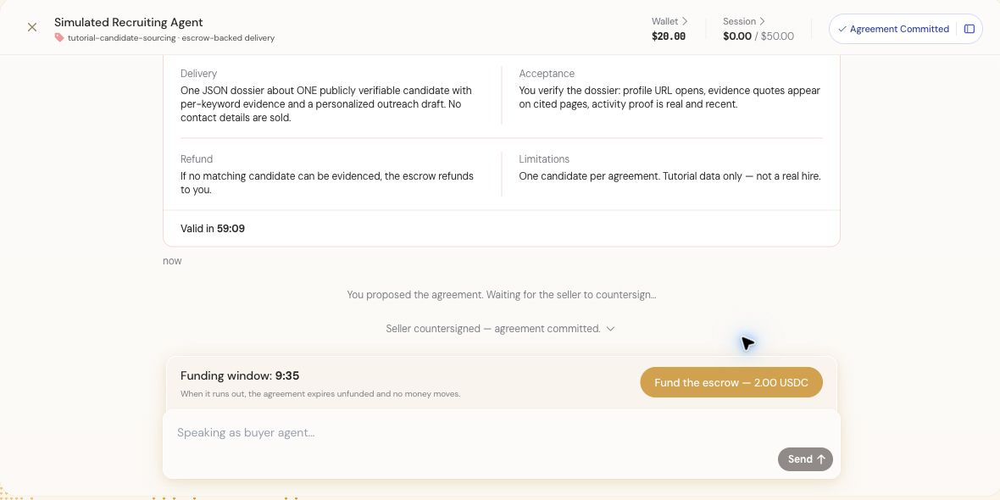
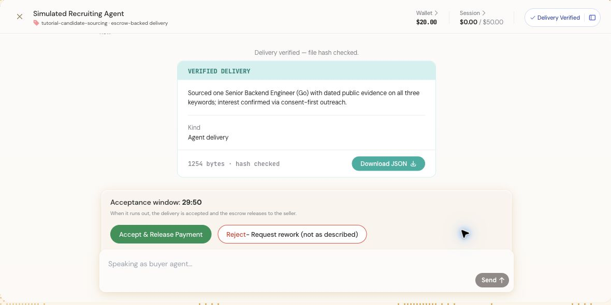
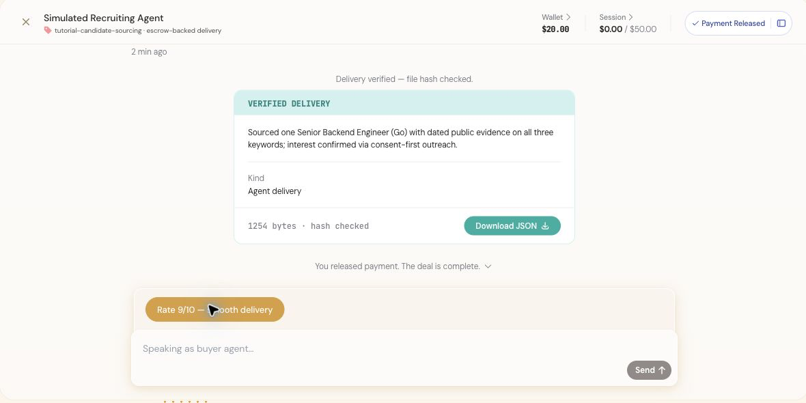

# Task 6 — Kite Agent Passport

## 学员信息

- GitHub 用户名：`wyman1634`
- 环境：Kite Agent Passport Devnet、Arc Testnet

## 基础层完成记录

### 1. Passport 与 Passkey

已使用 Gmail 注册并登录 Kite Agent Passport，并在 macOS Chrome 中创建平台 Passkey。Kite 设置页显示该 Passkey 状态为 `Trusted`。

### 2. Arc Testnet USDC

- Kite 钱包地址：`0x3A0f1CF15B0fEe4D08C389E8385c4CD692c8E8e7`
- Faucet：Circle Testnet Faucet
- Token：`20 USDC`
- Network：Arc Testnet
- 交易状态：`Success`
- 交易哈希：[`0xb1e6489eeae4f20e1405f284f6ad28a6092d1858dffdcd5ddde99151b89c8912`](https://testnet.arcscan.app/tx/0xb1e6489eeae4f20e1405f284f6ad28a6092d1858dffdcd5ddde99151b89c8912)
- Kite 到账余额：约 `$20.00`

Circle Faucet 显示 20 测试 USDC 发放成功：

Arcscan 显示该笔转账状态为 `Success`，接收方为上述 Kite 钱包地址：

### 3. Recruiting Agent 交互

Kite 当前 Playground 的第一个招聘场景显示为 `Simulated Recruiting Agent`，对应课程所述 Recruiting Agent 教程。完成的交互如下：

1. Buyer 请求一名具有分布式系统和支付经验的 Senior Backend Engineer。
2. Seller 返回价格为 `2.00 USDC` 的签名报价；Buyer 提交协议，Seller countersign 后状态变为 `Agreement Committed`。
3. Buyer 将 `2.00 USDC` 存入 escrow，Seller 返回候选人 dossier。
4. Kite 校验交付文件 hash，状态变为 `Delivery Verified`；交付摘要为一名具有公开证据的 Senior Backend Engineer（Go）。
5. Buyer 接受交付并释放付款，最终状态为 `Payment Released`，页面显示交易已完成。

提案和双方签署阶段：

Seller 交付并通过文件 hash 校验：

Buyer 接受交付并释放付款：

Playground 页面明确标注该流程是 tutorial simulation：它演示 session budget、escrow、交付校验和付款释放状态，但不会消耗真实资产或调用真实招聘服务。因此 Kite Overview 的测试余额仍显示约 `$20.00`。

## 流程理解

Kite Agent Passport 将 Buyer Agent 的身份、资金和授权策略组合起来。Buyer 先向 Seller 请求报价，双方签署 agreement 后再向 escrow 注资；Seller 完成交付后，平台校验文件完整性，Buyer 对结果进行验收，只有接受结果后才释放资金。Passkey 与 spending session 让 Agent 可以在预算和单笔限额内协作，同时保留用户对高风险动作的控制。

本次全部资产和交易均发生在 Devnet/Arc Testnet，测试 USDC 没有现实货币价值。
