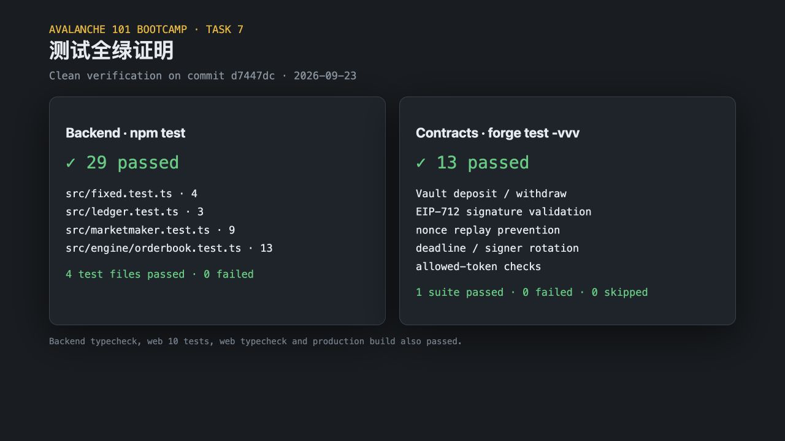
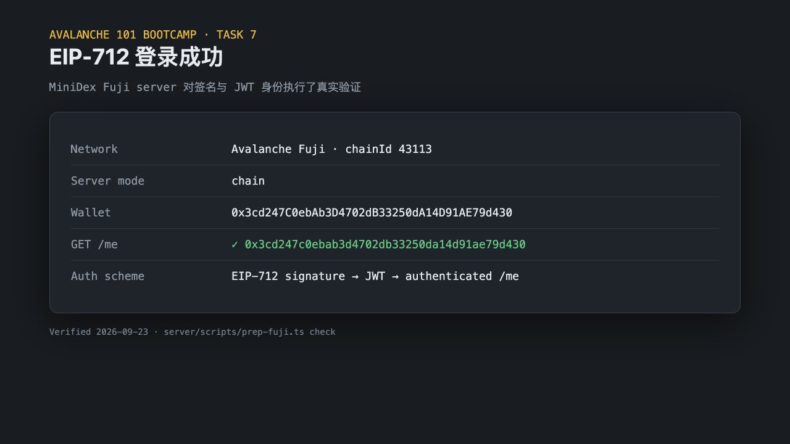
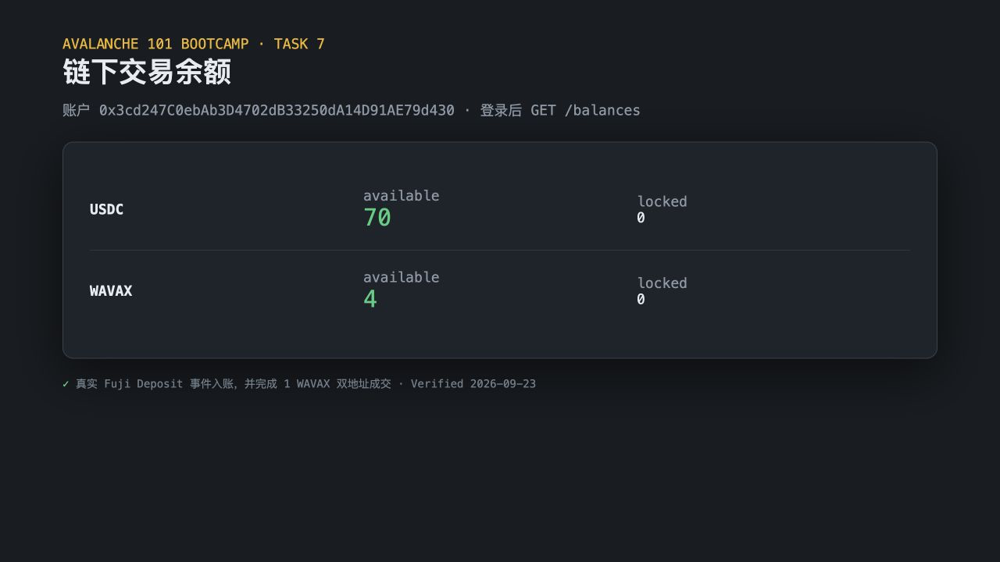
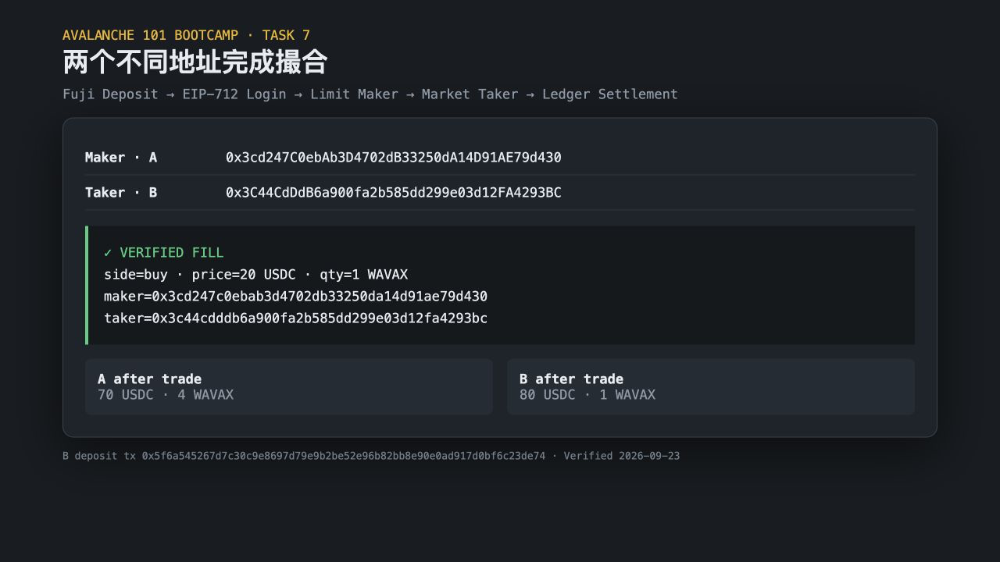
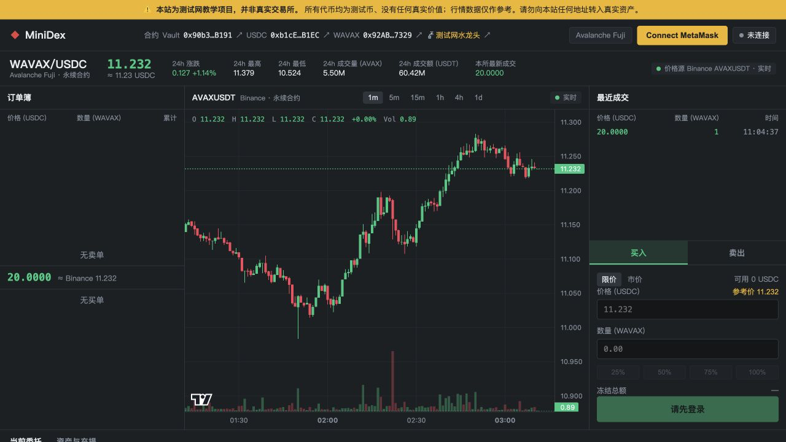

# Task 7：Mini-DEX

## 代码

- 仓库：<https://github.com/wyman1634/Mini-DEX>
- 分支：[`submission/wyman1634-task7`](https://github.com/wyman1634/Mini-DEX/tree/submission/wyman1634-task7)
- 最终提交：[`bc7391e`](https://github.com/wyman1634/Mini-DEX/commit/bc7391e45eb821be1861a7674a2f2afd5b768145)
- Fuji 双账户演示脚本：[`d7447dc`](https://github.com/wyman1634/Mini-DEX/commit/d7447dc14f21c7555aed77e37a6df672c68e4e65)
- self-trade 修复提交：[`7acfe8a`](https://github.com/wyman1634/Mini-DEX/commit/7acfe8a)

撮合引擎保留价格优先与同价 FIFO；当 maker 与 taker 地址相同时跳过该 maker，继续匹配下一位合格对手方。新增用例验证自己的挂单保持不变、同价下一位完成成交。

## 测试

- Backend：`npm test`，29/29 通过；其中 order book 13 个测试，包含时间优先与拒绝 self-trade。
- Contracts：`forge test -vvv`，13/13 通过。
- Web：10/10 通过，typecheck 与 production build 通过。

## Fuji 部署

网络：Avalanche Fuji C-Chain，chain ID `43113`。

| Contract | Address | Deployment transaction |
| --- | --- | --- |
| Vault | [`0x90b3bADC1D5b4FDCa4234038686624Cea5c1B191`](https://testnet.snowtrace.io/address/0x90b3bADC1D5b4FDCa4234038686624Cea5c1B191) | [`0xf885…d10a`](https://testnet.snowtrace.io/tx/0xf8857d74950a85551594b219df38b73d9818125a6b623404a152f880ab46d10a) |
| MockUSDC | [`0xb1cE732aE975df1Adc94035705Ece41D13f8B1EC`](https://testnet.snowtrace.io/address/0xb1cE732aE975df1Adc94035705Ece41D13f8B1EC) | [`0xa81e…5ab4`](https://testnet.snowtrace.io/tx/0xa81ec8c05aa291aa5623f4a7ceca64c222b967e46e393d5712866a22014b5ab4) |
| MockWAVAX | [`0x92AB830340679bEeD4FA7ff76451e989Bcb97329`](https://testnet.snowtrace.io/address/0x92AB830340679bEeD4FA7ff76451e989Bcb97329) | [`0x9b0f…6674`](https://testnet.snowtrace.io/tx/0x9b0f49cfddc9456fb76bdc4bad0f97273b20902838840d7b4654c606b9d26674) |

RPC 复核结果：三个地址均有非空 runtime bytecode；Vault signer 为部署账户；USDC/WAVAX symbol 与 allowlist 均正确。

## 真实 Deposit / Withdraw

- Deposit 100 USDC：[`0x8def0ed249503ae4b55c35a9c61b08a0826b9ed4565dfb1d564db729bbf35002`](https://testnet.snowtrace.io/tx/0x8def0ed249503ae4b55c35a9c61b08a0826b9ed4565dfb1d564db729bbf35002)
- Deposit 5 WAVAX：[`0xb80ff0791fe07d6cfce16832f5926414ceb28047f1b3b7dd17aab20b2dd43d42`](https://testnet.snowtrace.io/tx/0xb80ff0791fe07d6cfce16832f5926414ceb28047f1b3b7dd17aab20b2dd43d42)
- Withdraw 50 USDC：[`0xf03d794723ded7c00462bba00757d68c3bdd987263cca8ff1a2a5821cc55ddf1`](https://testnet.snowtrace.io/tx/0xf03d794723ded7c00462bba00757d68c3bdd987263cca8ff1a2a5821cc55ddf1)

所有 receipt 均为 success；提现后链上 USDC 增加 `50,000,000`（6 decimals）。

## 端到端证据

账户 A 与账户 B 均通过 EIP-712 登录。A 挂出 1 WAVAX、价格 20 USDC 的限价卖单；B 使用市价买单成交。脚本核对 fill 中 maker/taker 地址，并验证结算后 A 为 `70 USDC / 4 WAVAX`，B 为 `80 USDC / 1 WAVAX`。

### 登录成功

### 余额显示

### 两个不同地址完成成交

### MiniDex Fuji 界面与最新成交

## 进阶项：做市机器人

保留并验证仓库的 Binance AVAXUSDT 流动性镜像做市模块，可在买卖两侧持续维护多档订单；`server/src/marketmaker.test.ts` 的 9 个用例全部通过，覆盖增量撤单/挂单、价格与数量规划、配置边界及空盘口处理。

## 可复现脚本

- `server/scripts/prep-fuji.ts`：Fuji EIP-712 登录、充值、余额回放与提现。
- `server/scripts/e2e-fuji-trade.ts`：两个不同地址充值、登录、挂单、吃单并验证成交参与者与最终余额。

私钥、助记词、Keychain 密码和 JWT 均未提交；仓库只保存公开地址、交易哈希与验证截图。
